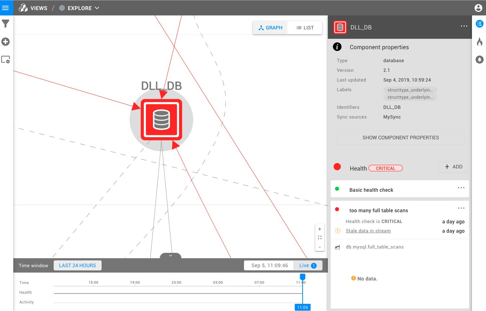

# index

Every team has a different definition of when the part of the IT landscape they are watching over is in danger. So the View health state can be used to indicate when the whole, as defined in a view, is in danger. The View can be in three states:

* Green - CLEAR


* Orange - DEVIATING


* Red - CRITICAL



To enable view health state on a view switch `View Health State Enabled` to on. This can be done in the dialog when saving a new view or editing an existing one. This is also where the view health state function is configured. Often this will be the number of components to be deviating or critical before the View health state changes.

When the View health state changes it triggers a ViewHealthStateChangedEvent. This event can be used in !Event handlers! to, for example, trigger an e-mail or Slack message.

## View health state configuration function

A view health state configuration function is a user defined script that takes user parameters and has access to a `viewSummary` variable that can be used to get summary information on the \(states of\) the components and relations in the view.

To create, update or delete a view state configuration go to "Settings -&gt; View Health State Configuration Functions".

## Scripting a view health state configuration function

A view health state configuration function receives a `viewSummery` and needs to return value from the viewHealthStates enum. `UNKNOWN, CLEAR, DIVIATING, CRITICAL`. The `viewSummary` gives access to the methods `countHealthState` and `countPropagatedHealthState`. These take a state and return the number of components on the view in that state. For example `viewSummary.countPropagatedHealthState(propagatedHealthStates.DIVIATING)`.

When using `countPropagatedHealthState` be aware that both the originating component and all relations have a propagated health state. This means that the propagated health state count of a view that shows a component that is DIVIATING, that is a dependency of one other component, will be three. Two for the components and one for the relation.

In the script example below `minCriticalHealthStates` and `minDeviatingHealthStates` are user defined parameters.

example:

```groovy
if (viewSummary.countHealthState(healthStates.CRITICAL) >= minCriticalHealthStates) {
   return viewHealthStates.CRITICAL;
} else if (viewSummary.countHealthState(healthStates.DEVIATING) >= minDeviatingHealthStates) {
   return viewHealthStates.DEVIATING;
} else {
   return viewHealthStates.CLEAR;
}
```

