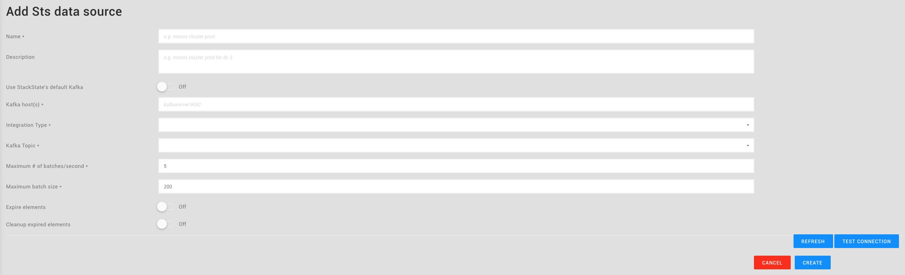
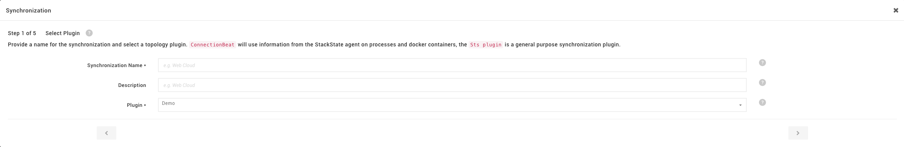
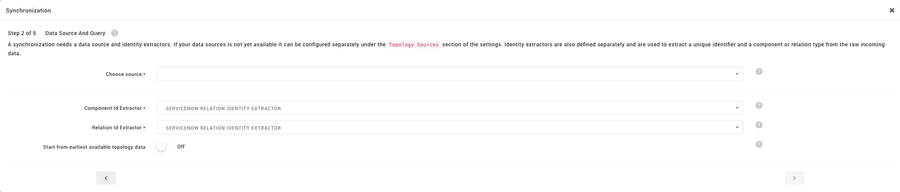
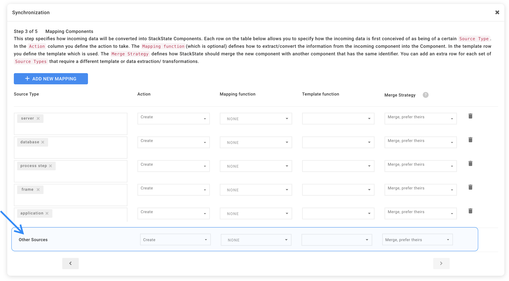
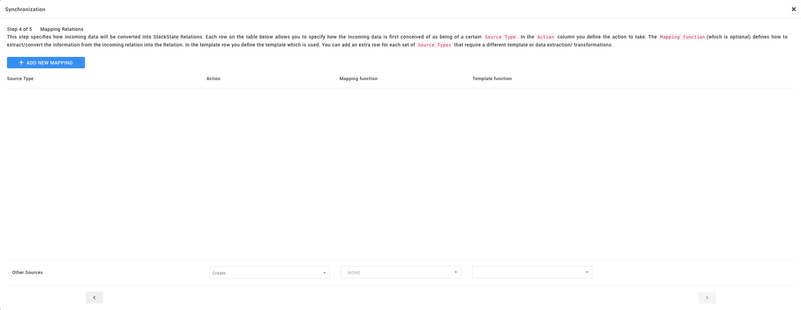
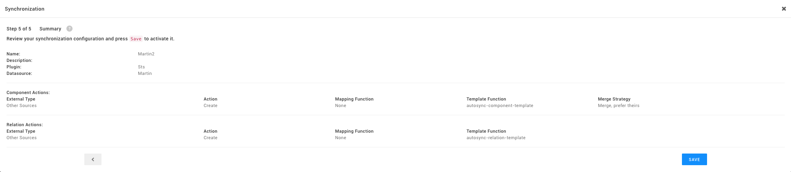

# default\_topology\_synchronization

## Overview

StackState must be configured to process incoming JSON data into topology. The easiest way to do this is to use the _auto-sync_ functionality. Auto-sync uses the same templates for all components and relations coming in via the data source. This enables new topology to be imported into StackState quickly. If you want to fully control the conversion of JSON data into topology, you can add mappings for specific component types.

## Creating a topology data source

### Configure StackState infrastructure

The first step in creating a custom topology data source is to send StackState a sample of the topology data you want to use. This creates the required infrastructure in StackState that can then be configured to suit your needs.

StackState expects topology data at the following endpoint:

`https://stackstate-server:7077/stsAgent/intake/?api_key=YOUR_API_KEY`

Use the following `curl` command to send the data:

```text
curl -v user:password -X POST -H "Content-Type: application/json" --data-ascii @topology.json "https://stackstate-server:7077/stsAgent/intake/?api_key=API_KEY"
```

This request results in HTTP status code `200 OK` if the data has been successfully processed. Example: [topology.json](https://github.com/mpvvliet/stackstate-docs/tree/0f69067c340456b272cfe50e249f4f4ee680f8d9/files/guides/topology/topology.json)

### Configure a data source

Now that the StackState infrastructure is created for our new data, you can create a new data source.

Navigate to the StackState _Settings_ section. Under _Topology Sources_, select _Sts Sources_. Click the _plus_ button to create a new data source.

The data source creation screen looks like this:



The screen contains the following fields:

* `Name`: The name of the data source.
* `Description`: A description of the data source.
* `Use StackState's default Kafka`: Use the default Kafka bus on the StackState server or a separate Kafka instance.
* `Integration Type`: Select the integration type from the dropdown. This list is populated with the type passed in the `instance` / `type` field in the source JSON data.
* `Kafka Topic`: Select a Kafka topic to retrieve data from. This list is populated based on the type and URL passed in the `instance` field in the source JSON data.

The following advanced settings are also available:

* `Maximum batch size`: Specifies the maximum number of components from a JSON file that are processed in a single batch. Used for rate limiting.
* `Maximum # of batches/second`: Specifies the maximum number of batches processed per second. Used for rate limiting.
* `Expire elements`: Set topology to elements to _expired_ if they do not appear in this data source for a configured amount of time.
* `Cleanup expired elements`: Remove _expired_ topology elements from StackState if they have been expired for a configured amount of time.

_NOTE_: if the topology data is sent in _snapshot_ mode \(see the JSON format description\), expiry and cleanup of elements is not necessary, since each snapshots represents a complete landscape instance and elements missing from the snapshot are automatically deleted.

The screen contains the following buttons:

* `Test Connection`: Verify that the target Kafka server is reachable.
* `Refresh`: Refresh the lists of integration types and topics.
* `Create`: Create the data source.
* `Cancel`: Cancel creation of the data source.

## Setting up a default synchronization

### Import the auto-sync templates

Before you can start creating a default synchronization, you will need to import the [auto-sync templates](https://github.com/mpvvliet/stackstate-docs/tree/0f69067c340456b272cfe50e249f4f4ee680f8d9/json/auto-sync-nodes.conf).

To import these templates into StackState, navigate to the _Settings_ section. Under _Import/Export_, select _Import Settings_ and select the file to upload.

### Configure the auto-sync synchronization

Navigate to the StackState _Settings_ section. Under _Topology Synchronization_, select _Synchronizations_. Click the _plus_ button to create a new synchronization.

This is the first step in the wizard:



This screen allows you to configure the name and plugin for the synchronization. The screen contains the following fields:

* `Synchronization Name`: The name of the synchronization.
* `Description`: A description of the synchronization.
* `Plugin`: Select `Sts` as the source plugin.

Click the _right arrow_ on the bottom of the screen.



This screen allows you to configure the data source and component- and relation id extractors. The screen contains the following fields:

* `Choose source`: Select the data source created in the previous step from the list.
* `Component Id Extractor`: Select the _Generic auto sync component id extractor_.
* `Relation Id Extractor`: Select the _Generic auto sync relation id extractor_.

The following advanced setting is available:

* `Start from earliest available topology data`: If turned _on_, the topology data is processed starting from the earliest available data.

Click the _right arrow_ on the bottom of the screen.



This screen allows you to configure _component_ mappings for the synchronization.

In the `Other Sources` line at the bottom of the screen, select the _Create_ action, _no_ mapping function and the _Autosync component template_.

Click the _right arrow_ on the bottom of the screen.



This screen allows you to configure _relation_ mappings for the synchronization.

In the `Other Sources` line at the bottom of the screen, select the _Create_ action, _no_ mapping function and the _Autosync relation template_.

Click the _right arrow_ on the bottom of the screen.



This screen allows you to review the settings for the synchronization. Click _Save_ to store the synchronization.

