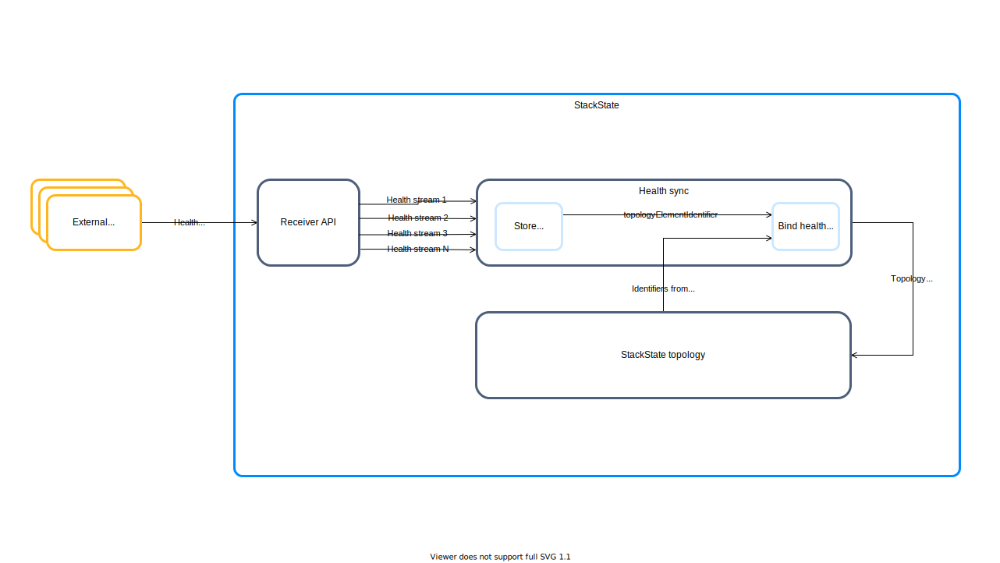

# Health synchronization

## Overview

Health synchronization allows you to add existing health checks from external monitoring systems to StackState topology elements. Health data is calculated in the external monitoring system using its own data and rules, then automatically synchronized and attached to the associated topology elements in StackState.

## Set up health synchronization

The StackState receiver API will automatically receive and process all incoming health data. No additional configuration is required in StackState to enable this, however, the health data received should match the expected JSON format.

Details on how to ingest health data can be found on the following pages:

* [Ingest health data through the StackState Receiver API](send-health-data/send-health-data.md)
* [Create an Agent check to ingest health data using the StackState Agent](../../develop/developer-guides/agent_check/how_to_develop_agent_checks.md)

## Health synchronization pipeline

The health synchronization framework works as follows:

* Health data is sent to StackState and ingested via the Receiver API.
* StackState topology elements related to the ingested health checks are identified and bound based on:
  * the [topology identifiers](../topology/sync.md#id-extraction) obtained during topology synchronization.
  * the [topologyElementIdentifier](send-health-data/send-health-data.md#common-json-object) from the ingested health payload.
* StackState keeps track of changes to both topology elements and health checks to maintain up to date information.

### Consistency models
StackState health synchronization relies on different consistency models to guarantee that the data sent from an external monitoring system matches with what StackState ingests and shows. The consistency model is specified in the `"health"` property of the [common JSON object](/configure/health/send-health-data.md#common-json-object) or as an argument in the StackState CLI when health data is sent to StackState. The supported models are: `REPEAT_SNAPSHOTS`, `REPEAT_STATES` and `TRANSACTIONAL_INCREMENTS`. 


The `REPEAT_SNAPSHOTS` consistency model works with periodic, full snapshots of all checks in an external monitoring system. StackState keeps track of the checks in each received snapshot and decides if associated external check states need to be created, updated or deleted in StackState. For example, if a check state is no longer present in a snapshot. This model offers full control over which external checks will be deleted as all decisions are inferred from the received snapshots. There is no ambiguity over the external checks that will be present in StackState.

**Use this model when:** The external monitoring system is capable of keeping the state of which elements are present in a determined time window and therefore can communicate how the full snapshot looks like. 

**JSON payload:** The [Repeat Snapshots health payload](/configure/health/send-health-data/repeat_snapshots.md) accepts specific properties to specify when a snapshot starts or stops.



The `REPEAT_STATES` consistency model works with periodic checks received from an external monitoring system. StackState keeps track of the checks and decides if associated external checks need to be created or updated in StackState. A configurable expiry mechanism is used to delete external checks that are not observed anymore. This model offers less control over data than the `REPEAT_SNAPSHOTS` model. As an expiry configuration is used to delete external checks, it might happen that elements are deleted due to barely missing the expiry timeout. This would reflect as external checks disappearing and reappearing in StackState.

**Use this model when:** The external monitoring system is not capable of collecting all checks in a determined time window, and the best effort is just to send the external checks as they are obtained.

**JSON payload:** The [Repeat States health payload](/configure/health/send-health-data/repeat_states.md) accepts specific properties to specify the expiry configuration.



The `TRANSACTIONAL_INCREMENTS` consistency model is designed to be used on streaming systems where only incremental changes are communicated to StackState. As there is no repetition of data, data consistency is upheld by ensuring that at-least-once delivery is guaranteed across the entire pipeline. To detect whether any data is missing, StackState requires that both a checkpoint and the previous checkpoint are communicated together with the `check_states`. This model requires strict control across the whole pipeline to guarantee no data loss.

**Use this model when:** The external monitoring system does not have access to the total external checks state, but only works on an event based approach. 

**JSON payload:** The metadata `repeat_interval` and `expire_interval` are not relevant for the [Transactional Increments health payload](/configure/health/send-health-data/transactional_increments.md) as there is no predefined periodicity on the data.




### Health stream and sub stream

External monitoring systems send health data to the StackState Receiver in a health stream. Each health stream contains at least one sub stream with health checks.

|  |  |
| :--- | :--- |
| **Health stream** | The Health stream uniquely identifies the health synchronization and defines the boundaries within which the health check states should be processed together. |
| **Sub stream** | Sub streams contain the health check data that are processed by StackState. When working with health data from a distributed external monitoring system, multiple sub streams can be configured, each containing health snapshots from a single location. The data in each sub stream is semi-independent, but contributes to the health check states of the complete health stream. If a single location is responsible for reporting the health check states of the health stream, the `sub_stream_id` can be omitted from the [health payload](send-health-data.md#json-property-health). StackState will assume that all the external health checks belong to a single, default sub stream. |

### Repeat Interval

Health synchronization processes the ingested health data per sub stream. The repeat interval specified in the [health payload](send-health-data.md#json-property-health) is the commitment from the external monitoring system to send complete snapshots over and over in order to keep the data up to date on StackState. This is helpful for StackState to be able to inform the user how up to date the health synchronization is running.

### Expire Interval

The expire interval can be used to configure sub streams in the health synchronization to delete data that is not sent by the external system anymore. This is helpful in case the source for a sub stream could potentially be decommissioned and StackState would not hear from it again. Without an expire interval, the previously synchronized data would be left permanently hanging.

### Check State

The health check state calculated by an external monitoring system. This contains the relevant information to attach to a topology element and to contribute to the topology element health state.

## See also

* [Add a health check based on telemetry available in StackState](../../use/health-state/add-a-health-check.md)
* [JSON health payload](/configure/health/send-health-data/send-health-data.md#json-property-health)
* [Topology synchronization](../topology/send-topology-data.md)

