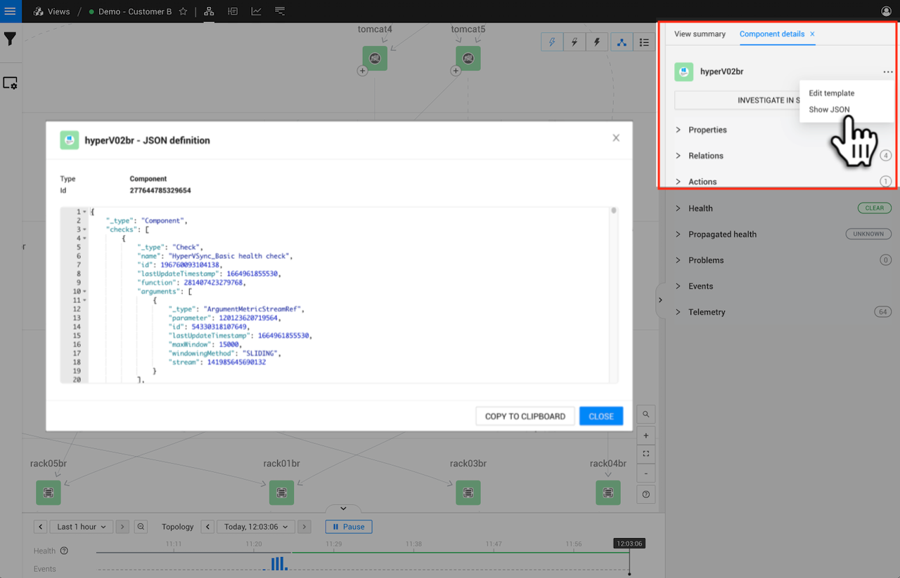

# Enable logging for functions

## Overview


Only available for Linux installations of StackState.


For debugging purposes, it may be helpful to enable logging for a StackState function. You can add logging statements to functions and then use the StackState `stac` CLI to set the logging level for an individual function instance. Log messages will be added to the StackState log file `stackstate.log`. Note that logging can't be enabled for all types of function.

## Set the logging level for a function instance

To enable logging for an instance of a function, use its ID to set a logging level in the `stac` CLI. Note that the function itself will have an ID and each instance of the function relating to a component or view in StackState will have a separate ID.


* It's only possible to enable logging for functions running on a Linux installation of StackState.
* The logging level should be set using the ID for an instance of a function, not the ID of the function itself.
* The [`stac` CLI](/setup/cli/cli-stac.md) is required to set the logging level. The logging level of a function instance can't be set using the new `sts` CLI.


1. Find the ID for the instance of the function that you want to enable logging for:
   * [Check function instance ID](enable-logging.md#check-function-instance-id)
   * [Event handler function instance ID](enable-logging.md#event-handler-function-instance-id)
   * [Monitor function instance ID](enable-logging.md#monitor-function-instance-id)
   * [Propagation function instance ID](enable-logging.md#propagation-function-instance-id)
   * [View health state configuration function instance ID](enable-logging.md#view-health-state-configuration-function-instance-id)
2. Use the [`stac` CLI](/setup/cli/cli-stac.md) to set the logging level for the ID, for example:

   ```text
   stac serverlog setlevel <id> DEBUG
   ```


## Review logging for a function

After logging has been enabled for the function instance, monitor the `stackstate.log` using the function instance ID.

```text
tail -f stackstate.log | grep <id>
```


## Add logging statements to a function

Logging statements can be added to StackState functions and monitored in the `stackstate.log` file. This is useful for debug purposes.

1. Add a log statement in the function's code. For example:
   * `log.info("message")`
   * `log.info(variable.toString())`
2. [Set a logging level](enable-logging.md#set-the-logging-level-for-a-function-instance) to enable logging for an instance of the function.

## Find the ID for a function instance

Retrieve the ID for a specific instance of a function:

* [Check function instance ID](enable-logging.md#check-function-instance-id)
* [Event handler function instance ID](enable-logging.md#event-handler-function-instance-id)
* [Monitor function instance ID](enable-logging.md#monitor-function-instance-id)
* [Propagation function instance ID](enable-logging.md#propagation-function-instance-id)
* [View health state configuration function instance ID](enable-logging.md#view-health-state-configuration-function-instance-id)

### Check function instance ID

The ID for an instance of a check or propagation function on a specific component can be found in the StackState UI. These are the IDs for the component's instance of a check function or propagation function.

1. Select a component to open detailed information about it in the right panel details tab - **Component details**.
2. Click on **...** and select **Show JSON**.
3. Find the section for `"checks"` or `"propagation"`.
4. Find the check or propagation that you want to enable logging for and copy the value from the field `id`.



* Use the ID to [enable logging](enable-logging.md#set-the-logging-level-for-a-function-instance) for the component's check or propagation functions.

### Event handler function instance ID

The ID for an instance of an event handler function can be found using the [StackState CLI](../../setup/cli/README.md). 

* To list all event handlers, run the StackState CLI command below.
* Use the `id` from the command output to [enable logging](enable-logging.md#set-the-logging-level-for-a-function-instance) for a specific event handler.



```text
stac graph list EventHandler

             id  type          name          description    owned by    manual    last updated
---------------  ------------  ------------  -------------  ----------  --------  ------------------------
114118706410878  EventHandler  demo_handler                             True      Fri Nov 13 11:32:29 2020
```

⚠️ **The StackState v5.0 release renamed the old `sts` CLI to `stac`. The old CLI is now deprecated.**

The new `sts` CLI replaces the `stac` CLI. It's advised to install the new `sts` CLI and upgrade any installed instance of the old `sts` CLI to `stac`. For details see:

* [Which version of the `sts` CLI am I running?](/setup/cli/cli-comparison.md#which-version-of-the-cli-am-i-running "StackState Self-Hosted only")
* [Install the new `sts` CLI and upgrade the old `sts` CLI to `stac`](/setup/cli/cli-sts.md#install-the-new-sts-cli "StackState Self-Hosted only")
* [Comparison between the CLIs](/setup/cli/cli-comparison.md "StackState Self-Hosted only")




```text
sts settings list --type EventHandler
```

The StackState v5.0 release renamed the old `sts` CLI to `stac` and introduced new `sts` CLI. The command(s) provided here are for use with the new `sts` CLI.

➡️ [Check which version of the `sts` CLI you are running](/setup/cli/cli-comparison.md#which-version-of-the-cli-am-i-running)



### Monitor function instance ID
The ID for an instance of a monitor function can be found using the [StackState CLI](../../setup/cli/README.md). 



```text
# get the list of monitors which contains their corresponding monitor function id
stac monitor list

             id  status    identifier                                                       name                       description    remediation hint        function id    interval (seconds)  tags
---------------  --------  ---------------------------------------------------------------  -------------------------  -------------  ------------------  ---------------  --------------------  --------
198616307478411  DISABLED  urn:stackpack:stackstate-self-health:shared:monitor:cpu-load     CPU Load                   -              -                   270175519739826                    90  []
218029603836271  ENABLED   urn:stackpack:demo-stackpack:monitor:too-many-restarts           Too many restarts          -              -                   216264360861662                     5  ['demo']
239992462327332  DISABLED  urn:stackpack:stackstate-self-health:shared:monitor:memory-load  Memory Load                -              -                   152715969986888                    90  []
 16039129972954  ENABLED   urn:stackpack:demo-stackpack:monitor:too-many-full-table-scans   Too many full table scans  -              -                   178058775719836                     5  ['demo']

```

⚠️ **The StackState v5.0 release renamed the old `sts` CLI to `stac`. The old CLI is now deprecated.** 

In a future release of StackState, the new `sts` CLI will fully replace the `stac` CLI. It's advised to install the new `sts` CLI and upgrade any installed instance of the old `sts` CLI to `stac`. For details see:

* [Which version of the `sts` CLI am I running?](/setup/cli/cli-comparison.md#which-version-of-the-cli-am-i-running "StackState Self-Hosted only")
* [Install the new `sts` CLI and upgrade the old `sts` CLI to `stac`](/setup/cli/cli-sts.md#install-the-new-sts-cli "StackState Self-Hosted only")
* [Comparison between the CLIs](/setup/cli/cli-comparison.md "StackState Self-Hosted only")




```commandline
# get the list of monitors which contains their corresponding monitor function id
sts monitor list

ID              | STATUS   | IDENTIFIER                                                      | NAME                      | FUNCTION ID     | TAGS  
16039129972954  | ENABLED  | urn:stackpack:demo-stackpack:monitor:too-many-full-table-scans  | Too many full table scans | 178058775719836 | [demo]
218029603836271 | ENABLED  | urn:stackpack:demo-stackpack:monitor:too-many-restarts          | Too many restarts         | 216264360861662 | [demo]
198616307478411 | DISABLED | urn:stackpack:stackstate-self-health:shared:monitor:cpu-load    | CPU Load                  | 270175519739826 | []    
239992462327332 | DISABLED | urn:stackpack:stackstate-self-health:shared:monitor:memory-load | Memory Load               | 152715969986888 | []
```

The StackState v5.0 release renamed the old `sts` CLI to `stac` and introduced new `sts` CLI. The command(s) provided here are for use with the new `sts` CLI.

➡️ [Check which version of the `sts` CLI you are running](/setup/cli/cli-comparison.md#which-version-of-the-cli-am-i-running)





### Propagation function instance ID

The ID for an instance of a propagation functioncan be found in the StackState UI. For details on how to do this, see the instructions for [retrieving a check function instance ID](#check-function-instance-id).

### View health state configuration function instance ID

The ID for an instance of a view health state configuration function can be found using the StackState CLI.

* Run the two StackState CLI commands below:
  1. To return the IDs of all StackState views.
  2. To retrieve the JSON for a specific view ID.
* Use the `viewHealthStateConfiguration` ID from the retrieved view JSON to [enable logging](enable-logging.md#set-the-logging-level-for-a-function-instance) for this instance of the view health state configuration function. In the example below, this would be `39710412772194`.



```text
# get IDs of all views
stac graph list QueryView

             id  type       name                       description    owned by                      manual    last updated
---------------  ---------  -------------------------  -------------  ----------------------------  --------  ------------------------
  9161801377514  QueryView  Demo - Customer A          -              urn:stackpack:demo-stackpack  False     Fri Nov 13 16:24:38 2020
199988472830315  QueryView  Demo - Customer B          -              urn:stackpack:demo-stackpack  False     Fri Nov 13 16:24:38 2020
278537340600843  QueryView  Demo - Business Dashboard  -              urn:stackpack:demo-stackpack  False     Fri Nov 13 16:24:38 2020


# get the ID of the specified view's "viewHealthStateConfiguration"
# stac graph show-node <VIEW_ID>

sts graph show-node 9161801377514

{
   "id":9161801377514,
   "lastUpdateTimestamp":1605284678082,
   "name":"Demo - Customer A",
   "groupedByDomains":true,
   "groupedByLayers":true,
   "groupedByRelations":true,
   "showIndirectRelations":true,
   "showCause":"NONE",
   "state":{
      "id":212230744931364,
      "lastUpdateTimestamp":1605284689666,
      "state":"CLEAR",
      "_type":"ViewHealthState"
   },
   "viewHealthStateConfiguration":{
      "id":39710412772194,
      "lastUpdateTimestamp":1605284678082,
      "function":28286436254116,
      "enabled":true,
      ...
```

⚠️ **The StackState v5.0 release renamed the old `sts` CLI to `stac`. The old CLI is now deprecated.**

The new `sts` CLI replaces the `stac` CLI. It is advised to install the new `sts` CLI and upgrade any installed instance of the old `sts` CLI to `stac`. For details see:

* [Which version of the `sts` CLI am I running?](/setup/cli/cli-comparison.md#which-version-of-the-cli-am-i-running "StackState Self-Hosted only")
* [Install the new `sts` CLI and upgrade the old `sts` CLI to `stac`](/setup/cli/cli-sts.md#install-the-new-sts-cli "StackState Self-Hosted only")
* [Comparison between the CLIs](/setup/cli/cli-comparison.md "StackState Self-Hosted only")




```sh
# get IDs of all views
sts settings list --type QueryView

TYPE      | ID              | IDENTIFIER | NAME                      | OWNED BY | LAST UPDATED
QueryView | 165313710240823 |            | Demo - Customer A         |          | Tue Jun 21 13:44:12 2022 CEST
QueryView | 26281716816873  |            | Demo - Customer B         |          | Tue Jun 21 13:44:12 2022 CEST
QueryView | 184368967764989 |            | Demo - Customer D         |          | Tue Jun 21 13:44:12 2022 CEST


# get the ID of the specified view's "viewHealthStateConfiguration"

sts settings describe --ids <VIEW_ID>

```

The StackState v5.0 release renamed the old `sts` CLI to `stac` and introduced new `sts` CLI. The command(s) provided here are for use with the new `sts` CLI.

➡️ [Check which version of the `sts` CLI you are running](/setup/cli/cli-comparison.md#which-version-of-the-cli-am-i-running)




## See also

* [StackState CLI](../../setup/cli/README.md)
* [Check functions](../../develop/developer-guides/custom-functions/check-functions.md)
* [Event handler functions](../../develop/developer-guides/custom-functions/event-handler-functions.md)
* [Monitor functions](../../develop/developer-guides/custom-functions/monitor-functions.md)
* [Propagation functions](../../develop/developer-guides/custom-functions/propagation-functions.md)
* [View state configuration functions](../../develop/developer-guides/custom-functions/view-health-state-configuration-functions.md)

