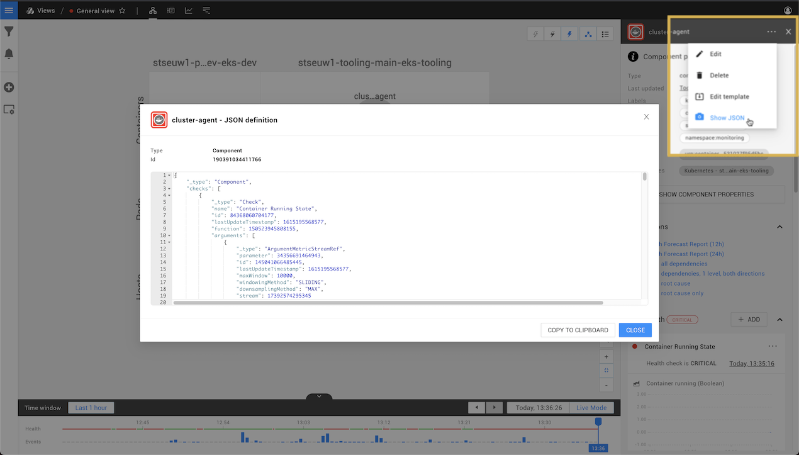

# Enable logging for functions


**This page describes StackState version 4.3.**

The StackState 4.3 version range is End of Life (EOL) and no longer supported. We encourage customers still running the 4.3 version range to upgrade to a more recent release.

Go to the [documentation for the latest StackState release](https://docs.stackstate.com/).


## Overview

For debugging purposes, it may be helpful to enable logging for a StackState function. You can add logging statements to functions and then use the StackState CLI to set the logging level for individual instances of a check function, event handler function, propagation function or view state configuration function. Log messages will be added to the StackState log file `stackstate.log`. It is not currently possible to enable logging for other function types.

## Set the logging level for a function instance

To enable logging for an instance of a function, use its ID to set a logging level in the StackState CLI. Note that the function itself will have an ID and each instance of the function relating to a component or view in StackState will have a separate ID.


The logging level should be set using the ID for an instance of a function, not the ID of the function itself.


1. Find the ID for the instance of the function that you want to enable logging for:
   * [Check IDs](enable-logging.md#check-and-propagation-ids)
   * [Event handler IDs](enable-logging.md#event-handler-ids)
   * [Propagation IDs](enable-logging.md#check-and-propagation-ids)
   * [View health state configuration IDs](enable-logging.md#view-health-state-configuration-ids)
2. Use the [StackState CLI](../../setup/installation/cli-install.md) to set the logging level for the ID, for example:

   ```text
   sts serverlog setlevel <id> DEBUG
   ```

3. Monitor the `stackstate.log` using the function instance ID.

   ```text
   tail -f stackstate.log | grep <id>
   ```

## Add logging statements to a function

Logging statements can be added to StackState functions and monitored in the `stackstate.log` file. This is useful for debug purposes.

1. Add a log statement in the function's code. For example:
   * `log.info("message")`
   * `log.info(variable.toString())`
2. [Set a logging level](enable-logging.md#set-the-logging-level-for-a-function-instance) to enable logging for an instance of the function.

## Find the ID for a function instance

Retrieve the ID for a specific instance of a function:

* [Check IDs](enable-logging.md#check-and-propagation-ids)
* [Event handler IDs](enable-logging.md#event-handler-ids)
* [Propagation IDs](enable-logging.md#check-and-propagation-ids)
* [View health state configuration IDs](enable-logging.md#view-health-state-configuration-ids)

### StackState CLI

#### Event handler IDs

The ID for an event handler can be found using the [StackState CLI](../../setup/installation/cli-install.md). This is the ID for an instance of an event handler function.

* To list all event handlers, run the StackState CLI command below.
* Use the `id` from the command output to [enable logging](enable-logging.md#set-the-logging-level-for-a-function-instance) for a specific event handler.



```text
sts graph list EventHandler
```



```text
             id  type          name          description    owned by    manual    last updated
---------------  ------------  ------------  -------------  ----------  --------  ------------------------
114118706410878  EventHandler  demo_handler                             True      Fri Nov 13 11:32:29 2020
```



#### View health state configuration IDs

The ID for a view health state configuration can be found using the [StackState CLI](../../setup/installation/cli-install.md). This is the ID for a view's instance of a view health state configuration function.

* Run the two StackState CLI commands below:
  1. To return the IDs of all StackState views.
  2. To retrieve the JSON for a specific view ID.
* Use the `viewHealthStateConfiguration` ID from the retrieved view JSON to [enable logging](enable-logging.md#set-the-logging-level-for-a-function-instance) for this instance of the view health state configuration function. In the example below, this would be `39710412772194`.



```text
# get IDs of all views
sts graph list QueryView

# get the ID of the specified view's "viewHealthStateConfiguration"
sts graph show-node <VIEW_ID>
```



```text
$ sts graph list QueryView                           
             id  type       name                       description    owned by                      manual    last updated
---------------  ---------  -------------------------  -------------  ----------------------------  --------  ------------------------
  9161801377514  QueryView  Demo - Customer A          -              urn:stackpack:demo-stackpack  False     Fri Nov 13 16:24:38 2020
199988472830315  QueryView  Demo - Customer B          -              urn:stackpack:demo-stackpack  False     Fri Nov 13 16:24:38 2020
278537340600843  QueryView  Demo - Business Dashboard  -              urn:stackpack:demo-stackpack  False     Fri Nov 13 16:24:38 2020


$ sts graph show-node 9161801377514

{
   "id":9161801377514,
   "lastUpdateTimestamp":1605284678082,
   "name":"Demo - Customer A",
   "groupedByDomains":true,
   "groupedByLayers":true,
   "groupedByRelations":true,
   "showIndirectRelations":true,
   "showCause":"NONE",
   "state":{
      "id":212230744931364,
      "lastUpdateTimestamp":1605284689666,
      "state":"CLEAR",
      "_type":"ViewHealthState"
   },
   "viewHealthStateConfiguration":{
      "id":39710412772194,
      "lastUpdateTimestamp":1605284678082,
      "function":28286436254116,
      "enabled":true,
      "arguments":[
         {
            "id":128484527572993,
            "lastUpdateTimestamp":1605284678082,
            "parameter":184761614904259,
            "value":1,
            "_type":"ArgumentLongVal"
         },
         {
            "id":229304367255010,
            "lastUpdateTimestamp":1605284678082,
            "parameter":178411912509267,
            "value":1,
            "_type":"ArgumentLongVal"
         }
      ],
      "_type":"ViewHealthStateConfiguration"
   },
   "groupingEnabled":true,
   "minimumGroupSize":4,
   "query":"(domain IN (\"customer E\") AND layer IN (\"API\", \"applications\", \"business application\", \"hypervisor\", \"databases\", \"k8s_proc\", \"lambda\", \"network devices\", \"location\", \"rack\", \"row\", \"servers\", \"services\", \"storage\"))",
   "queryVersion":"0.0.1",
   "identifier":"urn:stackpack:demo-stackpack:query-view:demo-customer-e",
   "ownedBy":"urn:stackpack:demo-stackpack",
   "eventTypes":[

   ],
   "tags":[

   ],
   "spanTypes":[

   ],
   "_type":"QueryView"
}
```



### StackState UI

#### Check and propagation IDs

The ID for a check or propagation on a specific component can be found in in the StackState UI. These are the IDs for the component's instance of a check function or propagation function.

1. Click on a component to open the component details on the right of the screen.
2. Click on **...** and select **Show JSON**.
3. Find the section for `"checks"` or `"propagation"`.
4. Find the check or propagation that you want to enable logging for and copy the value from the field `id`.



* Use the ID to [enable logging](enable-logging.md#set-the-logging-level-for-a-function-instance) for the component's check or propagation functions.

## See also

* [StackState CLI](../../setup/installation/cli-install.md)
* [Checks and check functions](../telemetry/checks_and_streams.md#checks)
* [Event handler functions](/develop/developer-guides/custom-functions/event-handler-functions.md)
* [State propagation and propagation functions](../../develop/developer-guides/custom-functions/propagation-functions.md)
* [View state configuration functions](../../develop/developer-guides/custom-functions/view-health-state-configuration-functions.md)

