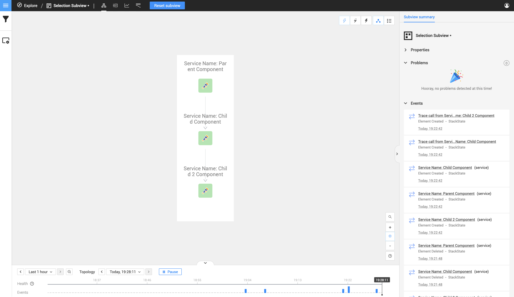
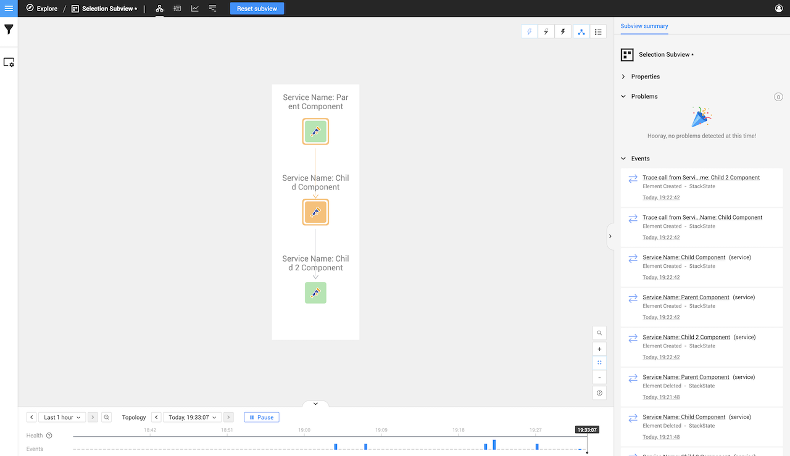
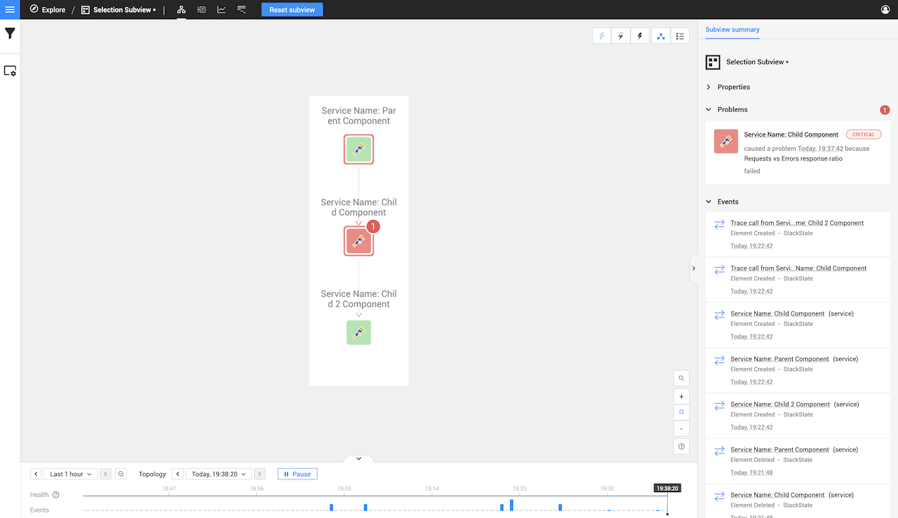
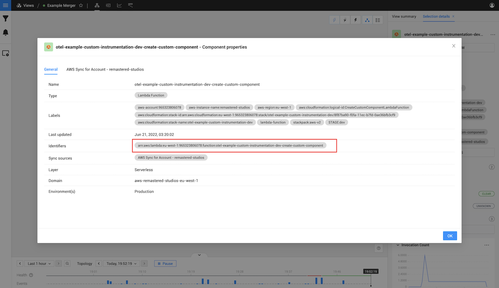
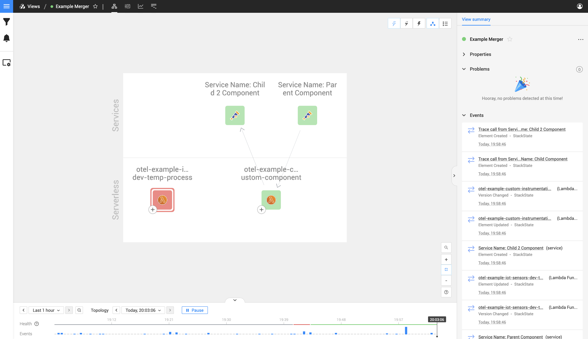
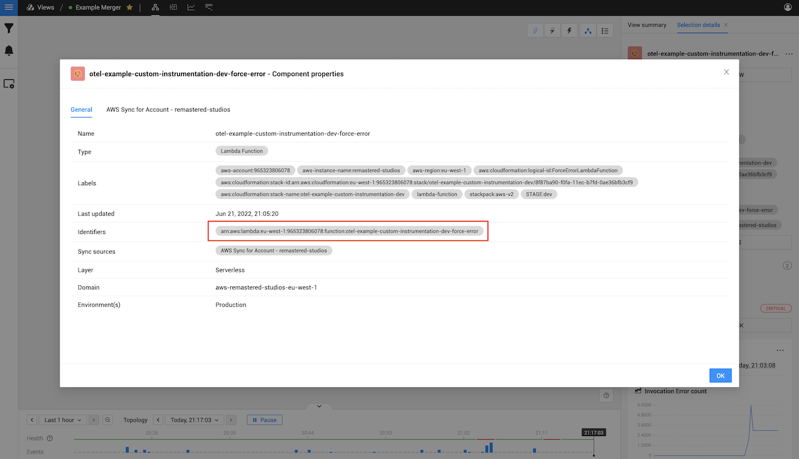
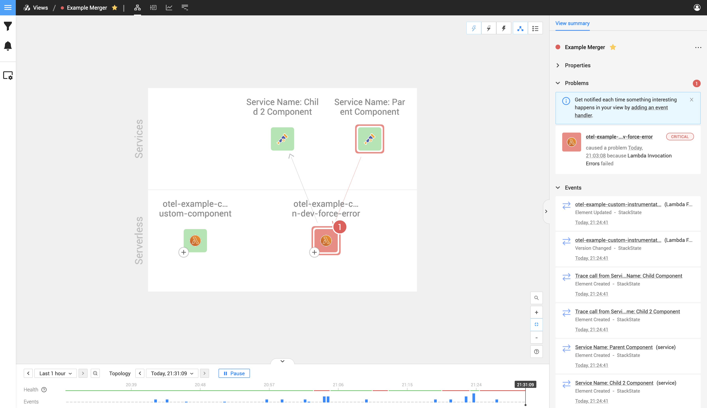

# Span health state

If you have not seen the health state span mapping `http.status_code` on the [Tracer and Span mappings]() page, head over the that page first
to understand how the health state is mapped into your span. 

You should also be familiar on how health states works within StackState, for this you can head over to the [about health state](/use/health-state/about-health-state.md) page to
learn more about what [types of health state](/use/health-state/about-health-state.md#element-health-state) there is,
what does [propagated health state](/use/health-state/about-health-state.md#propagated-health-state) mean and how it works.

The purpose of this page is to assist in knowing what happens within certain scenarios in regard to health
state and custom instrumentations.

# Health state without merging
In the following scenario we have 3 components that we created with the manual instrumentation

- First is the root span
  - Added `http.status_code` of `200`
- The second span has the parent span id of the first span
    - Added `http.status_code` of `200`
- The third span has the parent span id of the second span
    - Added `http.status_code` of `200`

As seen in this picture below, it works as expected and all three components is healthy.

Now let's change the `http.status_code` of the second span to `400`

As you can see with the image below, the second component turned into a critical state
and the health status propagate upwards to the parent component.










# Health state with merging
Now we want to test how health state works with a pre-existing components.

In the following scenario we have 3 components that we created with the manual instrumentation

- First is the root span
    - Added `http.status_code` of `200`
- The second span has the parent span id of the first span
    - Added `http.status_code` of `200`
- The third span has the parent span id of the second span
    - Added `http.status_code` of `200`

This time we included two pre-existing components into our filter so that we can see them on StackState.
The one pre-existing is in a critical state and the second one in a healthy state. 

Below is an example of those 3 components we created and the 2 pre-existing AWS components.

### Merging with the healthy component

Now let's get a `service.identifier` from the bottom right green component called `otel-example-custom-instrumentation-dev-create-custom-component`

As you can see in the image below, this component has an identifier of `arn:aws:lambda:eu-west-1:965323806078:function:otel-example-custom-instrumentation-dev-create-custom-component`

So let's merge our second span component with this AWS Lambda component by adding that identifier into our manual instrumentation for the second component.

This produces the following result:

As you can see the relations had now successfully been drawn between the components and the merged one, the health state also stayed `200` as expected
seeing that both components was `200` to start with

### Merging with the critical component

Now let's get a `service.identifier` from the bottom left red component called `otel-example-custom-instrumentation-dev-force-error` and remove the current one we use on the right.

As you can see in the image below, this component has an identifier of `arn:aws:lambda:eu-west-1:965323806078:function:otel-example-custom-instrumentation-dev-force-error`

So let's merge our second span component with this AWS Lambda component by adding that identifier into our manual instrumentation for the second component.

This produces the following result:

As you can see the deviating or critical state will always take precedence regardless of merged component states. If one of the two components that has been merged
goes into a critical/deviating state then it will be indicated as above.

The state will then be propagated up to the parent relations, so even tho your component has 200 the one you merged with had a 400 status thus that 400 will propagate upwards.

