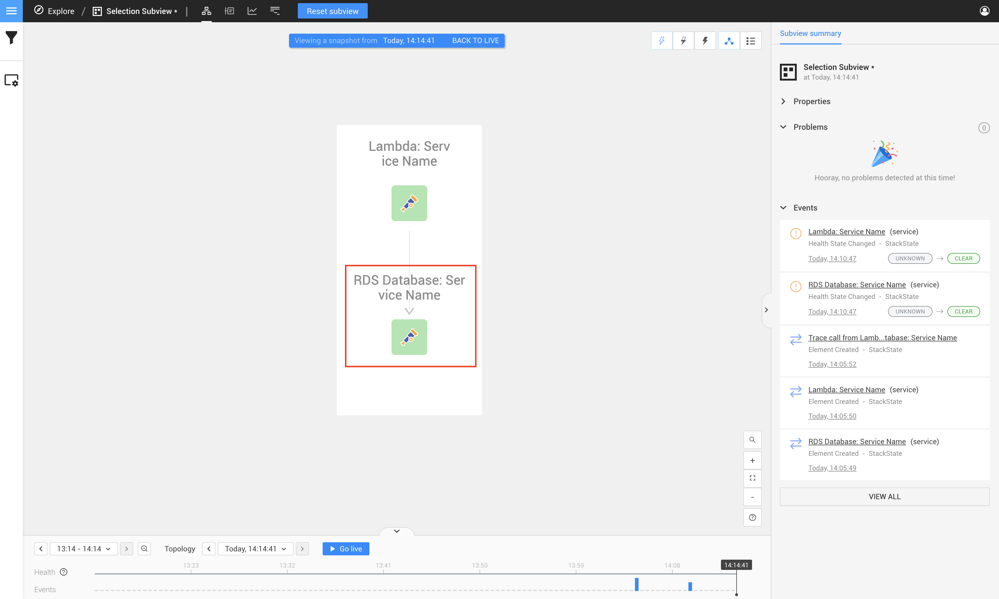

# Manual instrumentation mappings for StackState
Before we jump into the nitty-gritty of the actual code we can write for a OpenTelemetry instrumentation, let's first look
at what key-value pairs we require within our spans, and where it is found inside the StackState UI.

You will have to include the span key values when you create your spans inside the manual OpenTelemetry instrumentation.

We will get to a few code examples later on in the documentation.

## Defining a tracer name and version that StackState understands
For StackState to understand your data, a tracer name and version needs to be passed to with your instrumentation.
StackState requires the following:

- Tracer Name: `@opentelemetry/instrumentation-stackstate`
- Version: `1.0.0`

We will show how the above is implemented when we get to the code examples page. For now, it is good to know that if the above does not match what the StackState Agent is expecting then it will not be displayed on StackState. 

If you run you StackState Agent in debug mode then you should receive a message about an unknown instrumentation and the name that was passed to it

## Span mapping requirements - Summary
Below is a table with a summary of all the span keys that's required

You need to include **ALL** the keys below when creating a span as they all need to be provided before the component will appear on your StackState instance.

| ***Key***                                  |  ***Type***  | ***Required***  | ***Allowed Value*** | ***Example***                |
|:-------------------------------------------|:------------:|:---------------:|:-------------------:|:-----------------------------|
| [trace.perspective.name] (http://test.com) |   `string`   |     **yes**     |     Any string      | RDS Database: Perspective Name|
| **service.name**                           |   `string`   |     **yes**     |     Any string      | RDS Database: Service Name            |
| **service.type**                           |   `string`   |     **yes**     |     Any string      | AWS RDS                      |
| **service.identifier**                     |   `string`   |     **yes**     |     Any string      | aws:rds:database:hello-world |
| **resource.name**                          |   `string`   |     **yes**     |     Any string      | Database                     |
| **http.status_code**                       |   `number`   |     **no**      |     HTTP status     | 200                          |

## Span mapping requirements - Breakdown
### Trace Perspective Name
  - `Key`
    - trace.perspective.name
  - `Type`
    - String
  - `Example`
    - RDS Database: Perspective Name
  - `Description`
    - The `trace.perspective.name` is used to find your Span within a Trace in the Trace Perspective view.
    - The horizontal bar within a Trace will have a floating text value containing the value you used in the `trace.perspective.name` key.




**Example of where the trace.perspective.name is displayed within the Trace Perspective**

1) In your top navigation bar click on the `trace perspective` icon
2) Find the trace in the list of traces and click on it to expand the trace (There might be multiple traces, make sure you select one that contains your trace).
3) You will notice that a horizontal graph line will contain the name of your component as seen below.




### Service Name
  - `Key`
    - service.name
  - `Type`
    - String
  - `Example`
    - RDS Database: Service Name
  - `Advance Filter Example`
    - name = "RDS Database: Service Name"
  - `Description`
    - The value from `service.name` is used as a primary means to identify your component within the StackState Topology Perspective
    - It also creates a `spans.serviceName` key within your Trace Perspective to allow you to identify if the trace in the Trace Perspective matches the component in the Topology Perspective.




**Example of how you can search for your `service.name` within the `Advanced Filter` section in the Topology view**

1) When on the Topology Perspective page click on the second icon on your left navigation bar called `View Filters`
2) This will bring up the `Filter Topology` view, Click on the second button called `Advanced`
3) In the top input field you can fill in the following
   1) `name = "<YOUR service.name VALUE>"`
   2) For Example `name = "RDS Database: Service Name"`.
4) You will then see the component that was created with the trace.




**Example of where the service.name is displayed within the Topology Perspective**

1) When you view the Topology Perspective page your component should be visible with this as the primary identifier,
   as seen within the picture below.




**Example of where the service.name is displayed within the Topology Perspective within your component properties**

1) Click on your component in the StackState Topology Perspective
2) Click on the `SHOW ALL PROPERTIES` button on the right side, a popup will appear.
3) A row with the key `name` will contain the value you defined, as seen below in the image.
4) Your component will also contain a new label called service-name, this will also represent your component name.




**Example of where the service.name is displayed within the Trace Perspective**

1) In your top navigation bar click on the `trace perspective` menu item.
2) Find the trace in the list of traces and click on it to expand the trace (There might be multiple traces, make sure you select one that contains your trace).
3) Click on the `SHOW ALL PROPERTIES` button on the right side, a popup will appear.
4) A row with the key `span.serviceName` will contain the value you defined, as seen below in the image.




### Service Type
  - `Key`
    - service.type
  - `Expected`
    - String
  - `Example`
    - AWS RDS
  - `Description`
    - The `service.type` is used to identify the type of service within your span in the Trace Perspective view.




**Example of where the service.type is displayed within the Trace Perspective Span Properties view**

1) In your top navigation bar click on the `trace perspective` icon
2) Find the trace in the list of traces and click on it to expand the trace (There might be multiple traces, make sure you select one that contains your trace).
3) Click on the `SHOW ALL PROPERTIES` button on the right side, a popup will appear.
4) A row with the key `service` will contain the value you defined, as seen below in the image.




### Service Identifier ([Used for Merging Components](/configure/opentelemetry/manual-instrumentation/merging.md))
  - `Key`
    - service.identifier
  - `Expected`
    - String
  - `Example`
    - aws:rds:database:hello-world
  - `Description`
    - This value will be added to the identifier list on your component within StackState.
    - ***NB. Components with the same service identifiers will merge into one component, This allows you to merge multiple components and create relations, or merge with an existing StackState component. You can read more about this on the [merging with pre-existing components](/configure/opentelemetry/manual-instrumentation/merging.md) page***




**Example of where the service.identifier is displayed within the Topology Perspective Component Properties view**

1) Click on your component in the StackState Topology Perspective
2) Click on the `SHOW ALL PROPERTIES` button on the right side, a popup will appear.
3) The row with the key `identifiers` will contain the value you defined, as seen below in the image.
4) ***NB. It is recommended to go and read the [merging with pre-existing components](/configure/opentelemetry/manual-instrumentation/merging.md) page to know how this value can be leverage to create relations***




### Resource Name
- `Key`
    - resource.name
- `Expected`
    - String
- `Example`
    - Database
- `Description`
    - This resource name will be displayed under your trace perspective for a specific trace, allowing you to quickly identify what resource this trace is apart.
    - Best practise would be to use this value to group similar resources, thus allowing you to easily identify a span.




**Example of where the resource.name is displayed within the Trace Perspective**

1) In your top navigation bar click on the `trace perspective` menu item.
2) Find the trace in the list of traces and click on it to expand the trace (There might be multiple traces, make sure you select one that contains your trace).
3) The section on your right side will contain a row with the key `Resource`, the value displayed next to the key will be the one you defined.




### HTTP Status Code ([Health State](/configure/opentelemetry/manual-instrumentation/health.md))
  - `Key`
    - http.status_code
  - `Expected`
    - A valid HTTP status for example `200`, `400` or higher
  - `Example`
    - 200
  - `Description`
    - This controls the health state for the component in StackState. 
    - If you post a `400` or higher than the component will go into critical state
      or if you post a `200` then your component will be healthy. This allows you to control the health state of your component
    - For a more advanced breakdown head over to the [OpenTelemetry Custom Instrumentation - Health State Page](/configure/opentelemetry/manual-instrumentation/health.md) for a more in-depth explanation, 
      how health state works with merging components, and what is metrics is displayed by default with the health state and custom instrumentation.



**You will see the following color on your component if you post a `http.status_code` of `200`**

This means that your component is in a healthy state.




**You will see the following color on your component if you post a `http.status_code` of `400` or higher**

This means that your component is in a critical state.





**The http status can be found in the following location regardless of what the HTTP status actually is**

1) In your top navigation bar click on the `trace perspective` menu item.
2) Find the trace in the list of traces and click on it to expand the trace (There might be multiple traces, make sure you select one that contains your trace).
3) Click on the `SHOW ALL PROPERTIES` button on the right side, a popup will appear.
4) The row with the value `http.status_code` will contain the value you defined, as seen below in the image.



