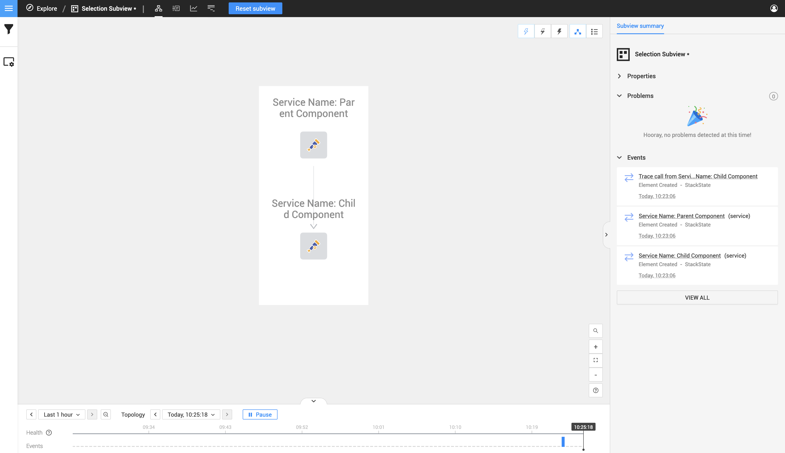
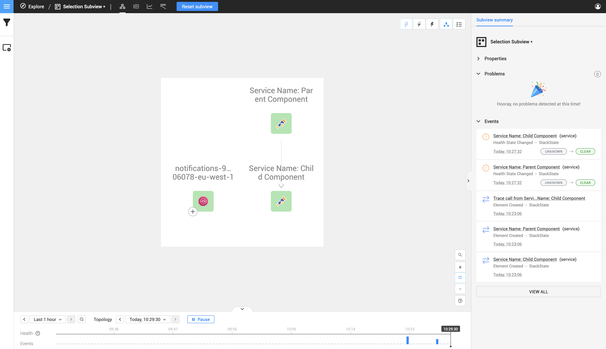

# Merging with StackState components

## What is a merged component on StackState

Lorem Ipsum

## How to merge a component

Writing manual OpenTelemetry instrumentations allows you to create custom components on the StackState topology.

Relationships are then drawn between your components based on parent and child spans, this concept needs to be understood before continuing on this page. You can read more about it on the [manual instrumentation component relations](component-relations.md) page.

The missing part from the above functionality is to allow a relationship to be created between one of your custom instrumentation components you created
and a pre-existing StackState component.

This can be achieved by creating a child span, the parent id of this child span needs to be your custom instrumentation component.

We then add a  [service identifier](mappings-for-stackstate.md#Service Identifier) into a second child component you created with the same identifier from a existing component in StackState.
Let's visually break this down below.

For this example we will create one parent span and one child span.

The parent component will contain the following values:

| Span Key               | Span Value                     |
|:-----------------------|:-------------------------------|
| trace.perspective.name | Parent Component               |
| service.name           | Service Name: Parent Component |
| service.type           | Service Type: Parent Component |
| service.identifier     | parent-component-identifier    |
| resource.name          | Resource: Parent Component     |
| http.status_code       | 200                            |

and the child component will contain the following values:

| Span Key               | Span Value                    |
|:-----------------------|:------------------------------|
| trace.perspective.name | Child Component               |
| service.name           | Service Name: Child Component |
| service.type           | Service Type: Child Component |
| service.identifier     | child-component-identifier    |
| resource.name          | Resource: Child Component    |
| http.status_code       | 200                           |

when this custom instrumentation is executed and send to StackState the topology view will receive the following components:

As you can see from the image above there is a relationship created between the parent we made and the child component.
Now let's select a pre-existing component to merge the child component with.

For this example I'm picking a SQS Queue called `notifications-965323806078-eu-west-1` that the StackState AWS StackPack created.

Below is the component next to the parent and child component.

As you can see there is atm no relationship between what I created and the pre-existing SQS component.
Now to create this relationship between two components we need to merge a component with a pre-existing relation to an existing StackState component.

What does this mean? If we take the current parent and child component within the image above you can see a relationship going down from the parent to the child, what this means is if we should merge the child with the existing
AWS SQS we selected then that relationship will point to the merged component.