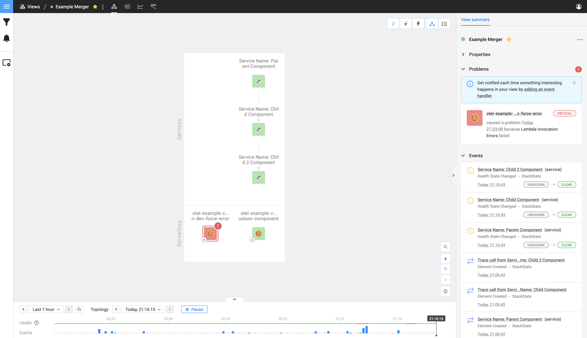

# Merging with StackState components
Merging components allows you to do any of the following things
- Add extra attributes into pre-existing StackState components.
- Create custom relations for pre-existing components. 
- Allows you to add a component relation to another propagating health in different ways (You can read more on the [span health state](/configure/opentelemetry/manual-instrumentation/health.md) page)

## Important to know when merging
When you merge your custom instrumentation with a StackState component, it might seem that your component disappeared; it did not.
The component you are merging with will inherit all the properties, health, and relations. This means that
yes, you do not see your component anymore, but that's because the component you merged with will now act as the
original component it initially appeared as, and the component you created.

## How do components merge
If two components on the StackState topology view have the same `identifier` it will merge those two components.

For example, if you select a component and click on the `SHOW ALL PROPERTIES` button on the right panel


It will open a dialog; within this dialog, you can see the identifiers. If you reuse any of these within your span, it will merge with that component.


## Merging a pre-existing component

Let's take the following example; we have three components that we create, all having the previous one as their parent span.

```text
Service Name: Parent Component
|
---> Service Name: Child Component
     |
     ---> Service Name: Child 2 Component
```

That will create the following components with relations.


Now let's add a few pre-existing Lambda functions into the picture. We are focusing on the healthy Lambda function in the bottom right corner.



If we click on that Lambda function, we will be able to see what the identifier is by using
the same `service identifier` `arn:aws:lambda:eu-west-1:965323806078:function:otel-example-custom-instrumentation-dev-create-custom-component` in our second component it will merge with that pre-existing component.


That will result in the following happening. As you can see, the component we merged now has new relations, and those relations
are the same ones our component had as the merged component inherited the same relations


