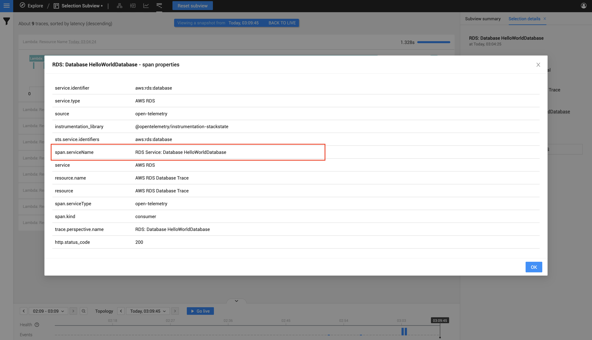
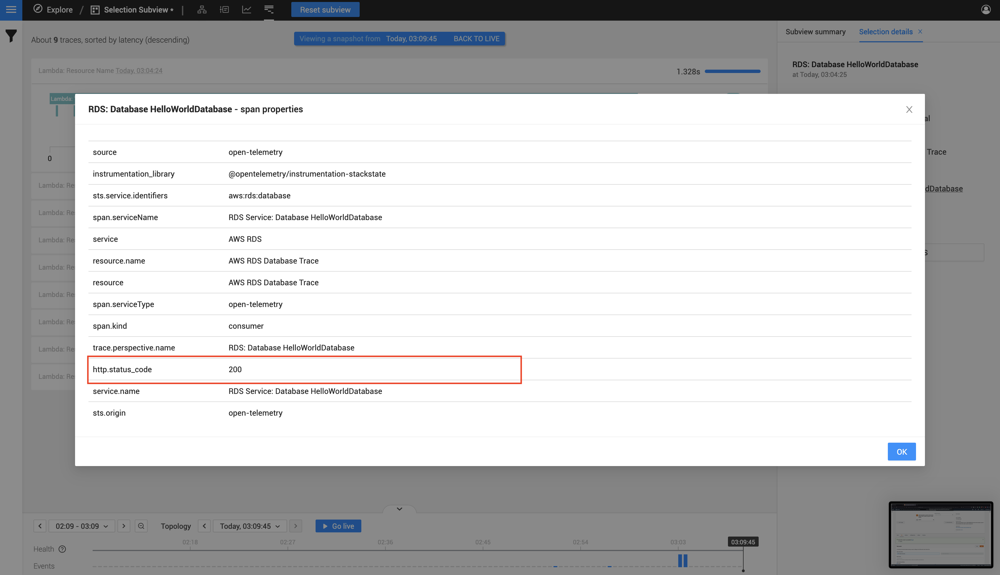

# Manual instrumentation mappings for StackState
Before we jump into the nitty-gritty of the actual code we can write for a OpenTelemetry instrumentation, let's first look
at what key-value pairs we require within our spans, and where it is found inside the StackState UI.

You will have to include the span key values when you create your spans inside the manual OpenTelemetry instrumentation.

We will get to a few code examples later on in the documentation.

## Defining a tracer name and version that StackState understands
For StackState to understand your data, a tracer name and version needs to be passed to with your instrumentation.
StackState requires the following:

- Tracer Name: `@opentelemetry/instrumentation-stackstate`
- Version: `1.0.0`

We will show how the above is implemented when we get to the code examples page. For now, it is good to know that is the above does not match what the StackState Agent is expecting then it will not be displayed on StackState. 

If you run you StackState Agent in debug mode then you should receive a message about an unknown instrumentation and the name that was passed to it

## Summary of the span key-value requirements
Below is a table with a summary of all the span keys that's required

You need to include **ALL** the keys below when creating a span as they all need to be provided before the component will appear on your StackState instance.

| ***Key***              | ***Type*** | ***Allowed Values***                   | ***Example***                |
|:-----------------------|:-----------|:---------------------------------------|:-----------------------------|
| trace.perspective.name | string     | Any string                             | AWS RDS: Hello World Database|
| service.name           | string     | Any string                             | AWS RDS: Database            |
| resource.name          | string     | Any string                             | Database                     |
| service.type           | string     | Any string                             | AWS RDS                      |
| service.identifier     | string     | Any string                             | aws:rds:database:hello-world |
| http.status_code       | number     | 200, 400 or higher (HTML Status Codes) | 200                          |

## Span key-value requirements breakdown

### Trace Perspective Name
  - `Key`
    - trace.perspective.name
  - `Expected`
    - This field can be any string value
  - `Example`
    - AWS RDS: Hello World Database
  - `Description`
    - This is the core name of your component and trace in StackState. This will be used as the main identifier to spot your component in the Topology Perspective or on the horizontal lines within the Trace Perspective view within a trace.




**Example of where the trace.perspective.name is displayed within the Topology Perspective**

1) When you view the Topology Perspective page your component should be visible with this as the primary identifier,
as seen within the picture below.




**Example of where the trace.perspective.name is displayed within the Topology Perspective within your component properties**

1) Click on your component in the StackState Topology Perspective
2) Click on the `SHOW ALL PROPERTIES` button on the right side, a popup will appear.
3) A row with the key `name` will contain the value you defined, as seen below in the image.
4) Your component will also contain a new label called service-name, this will also represent your component name.




**Example of where the trace.perspective.name is displayed within the Trace Perspective**

1) In your top navigation bar click on the `trace perspective` icon
2) Find the trace in the list of traces and click on it to expand the trace (There might be multiple traces, make sure you select one that contains your trace).
3) You will notice that a horizontal graph line will contain the name of your component as seen below.




### Service Name
  - `Key`
    - service.name
  - `Expected`
    - This field can be any string value
  - `Example`
    - AWS RDS: Database
  - `Description`
    - The service name property will be a unique value attached to your span within your trace in the Trace Perspective.




**Example of where the service.name is displayed within the Trace Perspective**

1) In your top navigation bar click on the `trace perspective` menu item.
2) Find the trace in the list of traces and click on it to expand the trace (There might be multiple traces, make sure you select one that contains your trace).
3) Click on the `SHOW ALL PROPERTIES` button on the right side, a popup will appear.
4) A row with the key `span.serviceName` will contain the value you defined, as seen below in the image.




### Service Type
  - `Key`
    - service.type
  - `Expected`
    - This field can be any string value
  - `Example`
    - AWS RDS
  - `Description`
    - This will be the service displayed under your trace perspective for a specific trace.




**Example of where the service.type is displayed within the Trace Perspective Span Properties view**

1) In your top navigation bar click on the `trace perspective` icon
2) Find the trace in the list of traces and click on it to expand the trace (There might be multiple traces, make sure you select one that contains your trace).
3) Click on the `SHOW ALL PROPERTIES` button on the right side, a popup will appear.
4) A row with the key `service` will contain the value you defined, as seen below in the image.




### Service Identifier
  - `Key`
    - service.identifier
  - `Expected value`
    - This field can be any string value, do note if you use an identifier that is already on your StackState UI please read more on [merging with existing StackState components]() as you component will merge with a pre-existing StackState component.
  - `Example value`
    - aws:rds:database
  - `Description`
    - This will be the identifier for you component on the StackState UI. This is the primary component for merging or allowing merger of StackState component with yours. To read more about [what merging components]() in StackState is, or [how to merge my manual instrumentation with a StackState component]()




**This identifier can be found in the following location**

1) Click on your component in the StackState Topology Perspective
2) Click on the `SHOW ALL PROPERTIES` button on the right side, a popup will appear.
3) The column row with the value 'identifiers' will contain the value you defined, as seen below in the image.




### Resource Name
- `Key`
    - resource.name
- `Expected`
    - This field can be any string value
- `Example`
    - Database
- `Description`
    - This will be the resource.name will be displayed under your trace perspective for a specific trace.




**Example of where the resource.name is displayed within the Trace Perspective**

1) In your top navigation bar click on the `trace perspective` menu item.
2) Find the trace in the list of traces and click on it to expand the trace (There might be multiple traces, make sure you select one that contains your trace).
3) The section on your right side will contain a row with the key `Resource`, the value displayed next to the key will be the one you defined.




### HTTP Status Code
  - `Key`
    - http.status_code
  - `Expected value`
    - A valid HTTP status for example `200` or `400` and higher
  - `Example value`
    - 200
  - `Description`
    - ***Health State*** - This controls the health state for the component in StackState. 
    - If you post a `400` or higher than the component will go into critical state
      or if you post a `200` then your component will be healthy. This allows you to control the health state of your component



**You will see the following color on your component if you post a http.status_code of 200**




**You will see the following color on your component if you post a http.status_code of 400 or higher>**





**The http status can be found in the following location regardless of what the HTTP status actually is**

1) In your top navigation bar click on the `trace perspective` icon
2) Find the trace in the list of traces and click on it to expand the trace.
3) Click on the `SHOW ALL PROPERTIES` button on the right side, a popup will appear.
4) The column row with the value 'http.status_code' will contain the value you defined, as seen below in the image.



