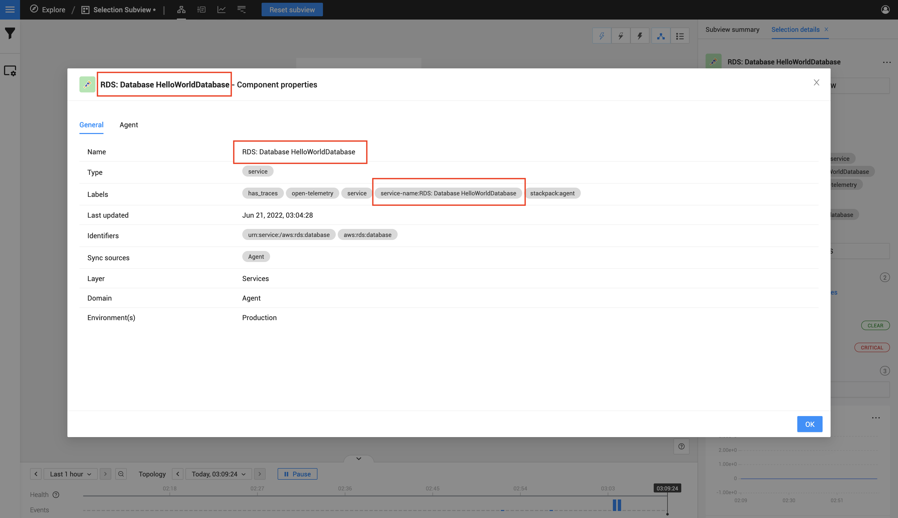
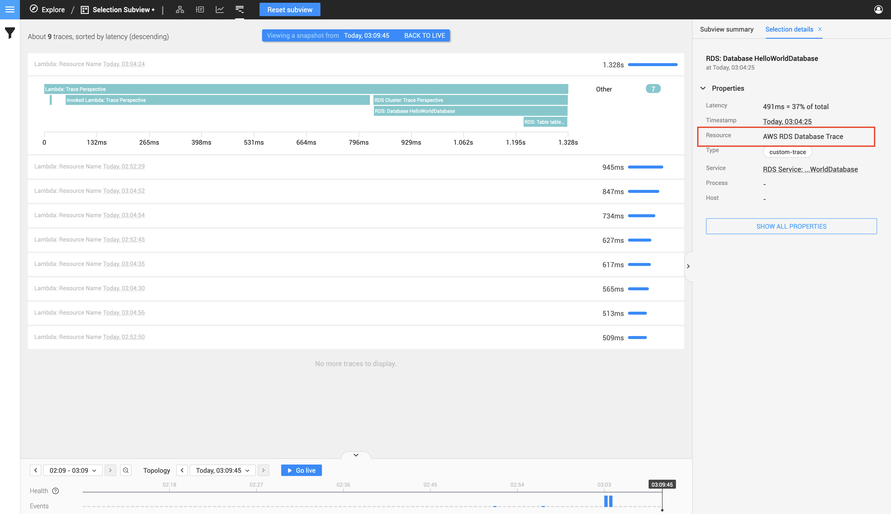
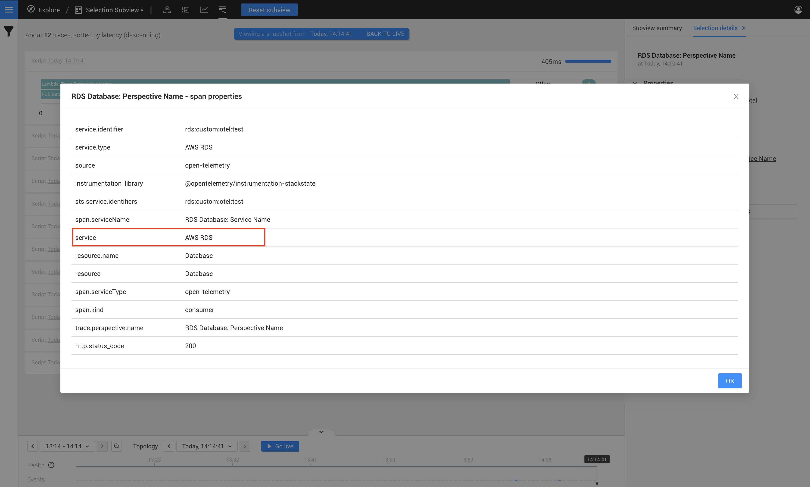

# Manual instrumentation mappings for StackState
Before we jump into the nitty-gritty of the actual code we can write for a OpenTelemetry instrumentation, let's first look
at what key-value pairs we require within our spans, and where it is found inside the StackState UI.

You will have to include the Span key values when you create your Spans inside the OpenTelemetry manual instrumentation API.

# OpenTelemetry API requirements
Your data will not appear in StackState if the following two requirements is no satisfied.
1) [Tracer name and version requirement](#Defining a tracer name and version)
2) [Span key-value requirements](#Summary of the Span key and value requirements)

## Defining a tracer name and version
For StackState to understand your data a tracer name and version needs to be passed to with your instrumentation.
StackState requires the following:
- Tracer Name: `@opentelemetry/instrumentation-stackstate`
- Version: `1.0.0`

The above might not make a lot of sense atm but good to know about, when we show code examples then this will make a bit more sense.

## Summary of the Span key and value requirements
Below is a table with all the span keys that's required, you can click on the link in the link column to see a picture and
more descriptive example.

| Required Span Key      | Example                           | Link                                              |
|:-----------------------|:----------------------------------|:--------------------------------------------------|
| trace.perspective.name | RDS: Database Hello-World         | [Trace Perspective Name](#Trace Perspective Name) |
| service.name           | RDS Service: Database Hello-World | [Service Name](#Service Name)                     |
| resource.name          | AWS RDS Database Trace            | [Resource Name](#Resource Name)                   |
| service.type           | AWS RDS                           | [Service Type](#Service Type)                     |
| service.identifier     | aws:rds:database                  | [Service identifier](#Service identifier)         |
| http.status_code       | 200                               | [HTTP Status Code (Health State)](#HTTP Status Code)           |

## Span key and value requirements

- ### Trace Perspective Name
  - `Key`
    - trace.perspective.name
  - `Expected value`
    - This field can be any string value
  - `Example value`
    - RDS: Database Hello-World
  - `Description`
    - This is the primary name of the trace within StackState. This value will be used to visually identify your StackState component and Trace.




**The trace perspective name can be found in the following location**

1) On the main component screen, Your new component will be labeled with this name.




**The trace perspective name can be found in the following location**

1) Click on your component in the StackState Topology view
2) Click on the `SHOW ALL PROPERTIES` button on the right side, a popup will appear.
3) The column row with the value 'name' will contain the value you defined, as seen below in the image.
4) Your component will also contain a label called service-name, this will also represent your component name.




**The trace perspective name can be found in the following location**

1) In your top navigation bar click on the `trace perspective` icon
2) Find the trace in the list of traces and click on it to expand the trace.
3) You will notice that the an graph line will contain the name of your component




---

- ### Service Name
    - `Key`
      - service.name
    - `Expected value`
      - This field can be any string value
    - `Example value`
      - RDS: Database Hello-World
    - `Description`
      - This will be the resource displayed under your trace perspective for a specific trace.




1) In your top navigation bar click on the `trace perspective` icon
2) Find the trace in the list of traces and click on it to expand the trace.
3) Click on the `SHOW ALL PROPERTIES` button on the right side, a popup will appear.
4) The column row with the value 'span.serviceName' will contain the value you defined, as seen below in the image.




---

- ### Resource Name
    - `Key`
      - resource.name
    - `Expected value`
      - This field can be any string value
    - `Example value`
      - AWS RDS Database Trace
    - `Description`
      - This will be the resource displayed under your trace perspective for a specific trace.




**The resource name can be found in the following location**

1) In your top navigation bar click on the `trace perspective` icon
2) Find the trace in the list of traces and click on it to expand the trace.
3) The section on your right side will contain a column row with the value 'Resource', that contain the value you defined, as seen below in the image.




---

- ### Service Type
    - `Key`
      - service.type
    - `Expected value`
      - This field can be any string value
    - `Example value`
      - AWS RDS
    - `Description`
      - This will be the service displayed under your trace perspective for a specific trace.




**The service type can be found in the following location**

1) In your top navigation bar click on the `trace perspective` icon
2) Find the trace in the list of traces and click on it to expand the trace.
3) Click on the `SHOW ALL PROPERTIES` button on the right side, a popup will appear.
4) The column row with the value 'service' will contain the value you defined, as seen below in the image.




---

- ### Service Identifier
    - `Key`
      - service.identifier
    - `Expected value`
      - This field can be any string value, do note if you use an identifier that is already on your StackState UI please read more on [merging with existing StackState components]() as you component will merge with a pre-existing StackState component.
    - `Example value`
      - aws:rds:database
    - `Description`
      - This will be the identifier for you component on the StackState UI. This is the primary component for merging or allowing merger of StackState component with yours. To read more about [what merging components]() in StackState is, or [how to merge my manual instrumentation with a StackState component]()




**This identifier can be found in the following location**

1) Click on your component in the StackState Topology view
2) Click on the `SHOW ALL PROPERTIES` button on the right side, a popup will appear.
3) The column row with the value 'identifiers' will contain the value you defined, as seen below in the image.




----

- ### HTTP Status Code
    - `Key`
      - http.status_code
    - `Expected value`
      - A valid HTTP status for example `200` or `400` and higher
    - `Example value`
      - 200
    - `Description`
      - ***Health State*** - This controls the health state for the component in StackState. 
      - If you post a `400` or higher than the component will go into critical state
        or if you post a `200` then your component will be healthy. This allows you to control the health state of your component



**You will see the following color on your component if you post a http.status_code of 200**




**You will see the following color on your component if you post a http.status_code of 400 or higher>**





**The http status can be found in the following location regardless of what the HTTP status actually is**

1) In your top navigation bar click on the `trace perspective` icon
2) Find the trace in the list of traces and click on it to expand the trace.
3) Click on the `SHOW ALL PROPERTIES` button on the right side, a popup will appear.
4) The column row with the value 'http.status_code' will contain the value you defined, as seen below in the image.



