# Permissions \(RBAC\)

## Permissions in StackState

Permissions in StackState are twofold: System permissions and View permissions. These two sets of permissions are prepared to allow administrators to take control over actions that users can perform inside StackState, as well as adjusting users' UI to their roles. This means that StackState can present a completely different interface and feature set according to the user's active role. UI elements that users don't have access to are simply not displayed in their UI.

Please note that permissions are stored in StackGraph, so performing an upgrade with clear all data will also remove permission setup. Because permissions exist in StackGraph, in order to completely remove the user it needs to be removed from LDAP and from StackGraph manually.

## Views permissions and system permissions

Views permissions are a set of permissions that allow for CRUD operations with Views in StackState. System permissions are scoping user capabilities like access to settings, query execution or scripting.

## Predefined Admin and Guest roles

StackState comes with two predefined roles - Admin and Guest. Admin is a power user that has all permissions and access to all views. On the other hand, the Guest user is fairly limited, as you can see below:

```text
subject           permission            resource
----------------  --------------------  ----------
stackstate-guest  read-settings         system
stackstate-guest  access-explore        system
stackstate-guest  perform-custom-query  system
stackstate-guest  read-permissions      system
stackstate-guest  update-visualization  system
stackstate-guest  access-view           everything
```

## List of all permissions in StackState

| Permission | Purpose |
| :--- | :--- |
| create-views | Permission to create views |
| access-analytics | Permission to access the Analytics page |
| execute-scripts | Permission to execute a query in the Analytics page |
| read-settings | Permission to access the Settings page |
| update-settings | Permission to update settings |
| import-settings | Permission to import settings |
| export-settings | Permission to export settings |
| manage-topology-elements | Permission to create / update / delete topology elements |
| access-explore | Permission to access the Explore page |
| update-visualization | Permission to change visualization settings |
| perform-custom-query | Permission to access the topology filter |
| read-permissions | Permission to list all granted permissions across the entire system via the CLI |
| update-permissions | Permission to grant/revoke permissions or modify subjects |
| manage-stackpacks | Permission to install / upgrade / uninstall StackPacks |
| save-view | Permission to save views |
| access-view | Permission to access a specific view \(when granted on a view\) or all views \(when granted on the `everything` subject\) |
| delete-view | Permission to delete views |
| execute-component-actions | Permission to execute component actions |
| manage-telemetry-streams | Permission to edit or create new streams for components via the UI |
| access-log-data | Permission to access StackState logs via the CLI |
| access-topic-data | Permission to access StackState receiver data via the CLI |
| execute-component-templates | Permission to invoke a component template API extension \(**internal use only**\) |
| execute-node-sync | Permission to reset or delete a synchronization |
| access-admin-api | Permission to access the administrator API |

## UI elements and permissions

### Pages permissions

1. Analytics page - requires `access-analytics` permission. Without this permission, Analytics section is hidden in the UI, and it is not accessible via URL.
2. StackPacks page - requires `manage-stackpacks` system permission. Without this permission, StackPacks section is hidden in the UI and it is not accessible via URL.
3. Settings page - requires `read-settings` system permission. Without this permission, Settings section is hidden in the UI and it is not accessible via URL.
4. Explore Mode page - requires `access-explore` system permission. Without this permission, Explore Mode section is hidden in the UI and it is not accessible via URL.
5. Saved views page - Requires `access-view` permission and a resource. It is possible to grant access for specific views by adding `accesss-view` permission with a specific view id or, as it is for Admin role, with `Everything` resource that is allowing to see all views.
6. Import Settings Page - requires `import-settings` system permission. Without this permission, Import Settings is removed from Settings Menu.
7. Export Settings page - requires `export-settings` system permission. Without this permission, Export Settings is removed from Settings Menu.
8. Admin API - requires `access-admin-api` system permission. Without this permission, Admin API is removed from Settings Menu.

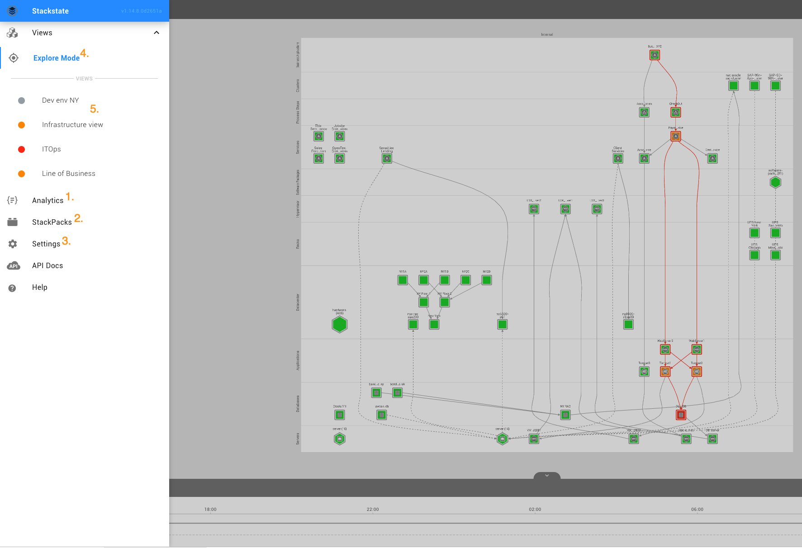 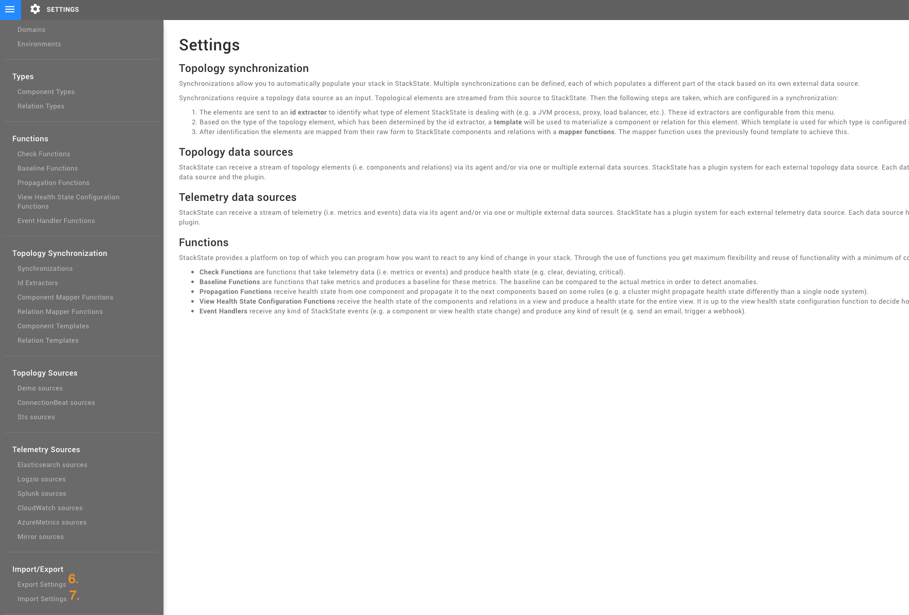

### Navigation Bar permissions

1. Create a view - requires `create-views` system permission. If not granted, save buttons are not present for the user.  
2. Save as... - requires `save-view` permission. It's dependant on `Everything` or the specific view permissions.
3. Edit a view - requires `save-view` permission. It's dependant on `Everything` or the specific view permissions.
4. Delete a view - requires `delete-view` permission. It's dependant on `Everything` or the specific view permissions.
5. Sidebar access - requires `save-view`, `delete-view` or both of them to access these options in the sidebar.

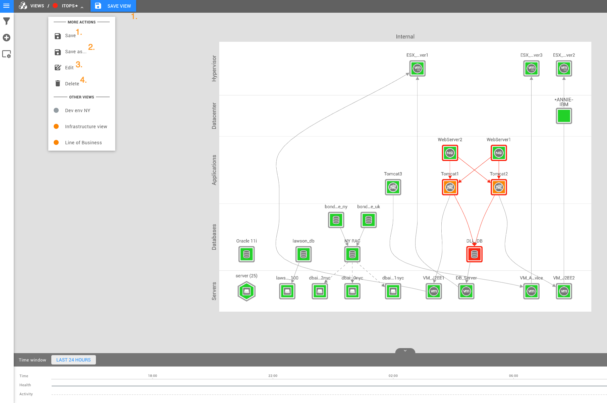 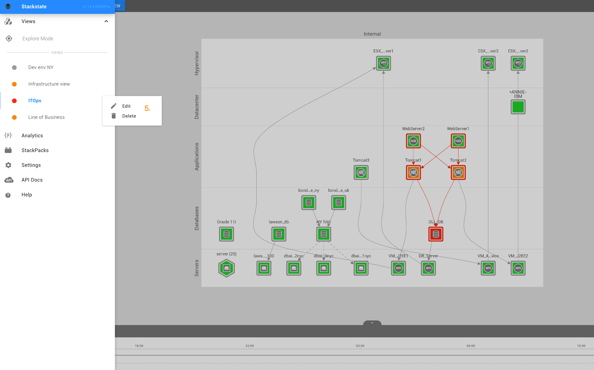

### Topology capabilities permissions

1. Basic and Advanced filtering - `perform-custom-query` is required to access filtering tools. Filtering options are hidden for users without this permission.
2. Component pane - requires system permissions: `manage-topology-elements`, `perform-custom-query`, and `read-settings`. Component pane is hidden for users without this set of permissions.
3. Visualization Settings - requires `update-visualization` system permission. Visualization settings are hidden for users without this permission.

|  |  |  |
| :---: | :---: | :---: |
| 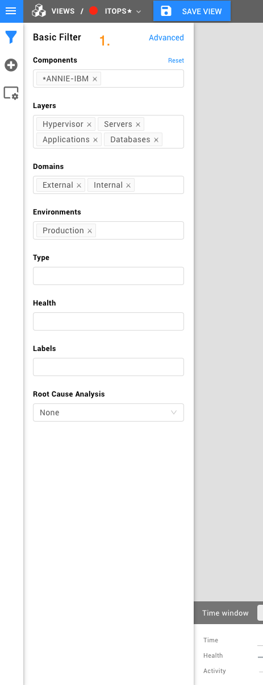 | 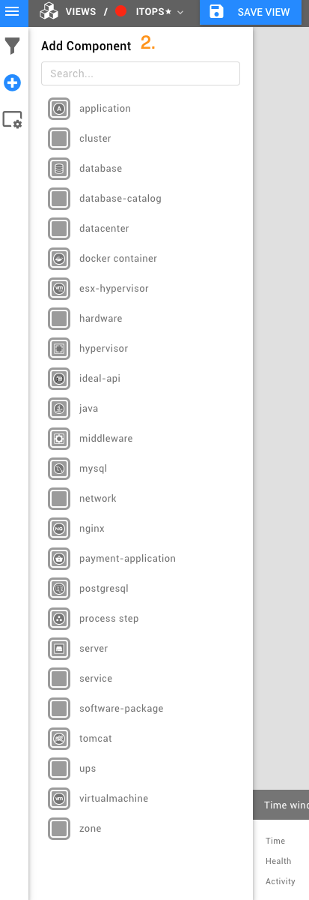 | 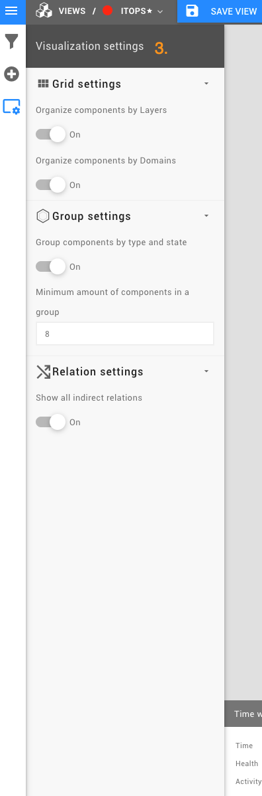 |

### Topology views permissions

1. Drag and drop components - requires `manage-topology-elements` system permission.
2. Access to a node actions menu - requires `execute-component-actions` permission.  
3. Create relations between topology elements - requires system permissions: `manage-topology-elements`, `perform-custom-query`, and `read-settings`.

 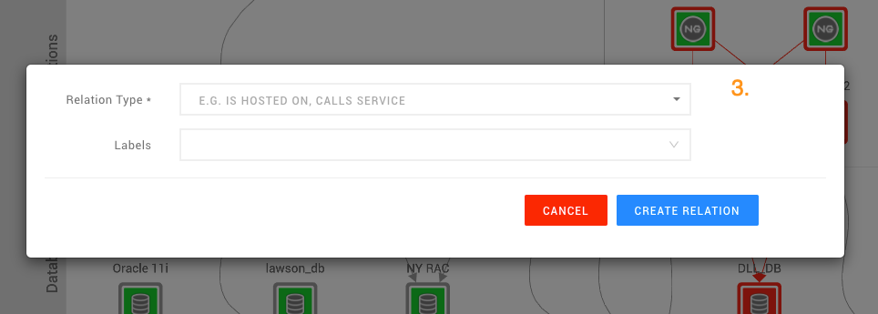

### Analytics Page permissions

1. Executing scripts - requires `execute scripts` system permission. **Execute** button will not be present for users without this permission.

|  |  |  |
| :---: | :---: | :---: |
|  | 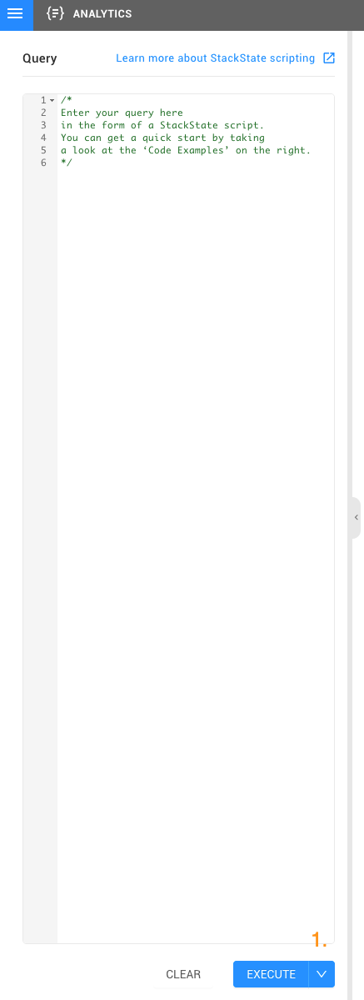 |  |

### Element Details permissions

1. Data streams actions - requires `manage-topology-elements` system permission. Without this permission only "Inspect" action is available.
2. Add data streams - requires `manage-topology-elements` system permission. Without this permission, user cannot see the **Add** button.
3. Health check - requires `manage-topology-elements` system permission. Without this permission, user cannot see any actions.
4. Add health check - requires `manage-topology-elements` system permission. Without that permission, user cannot see the **Add** button.
5. Delete element - requires `manage-topology-elements` system permission. **Delete** button is not present if the user does not have this permission.
6. Edit element \(also edit element template\) - requires `manage-topology-elements`, `perform-custom-query`, and `read-settings` system permissions.

|  |  |
| :---: | :---: |
| 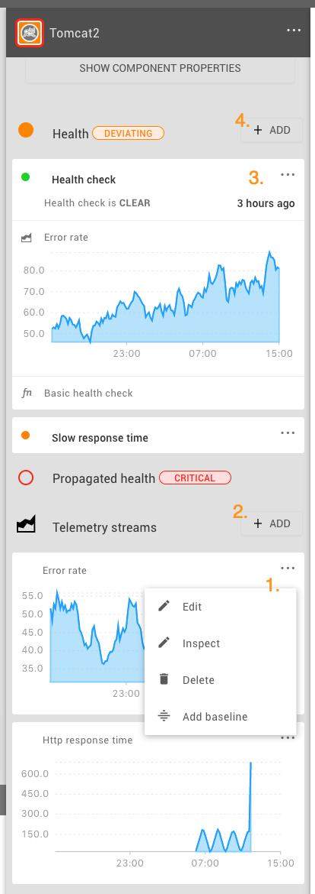 | 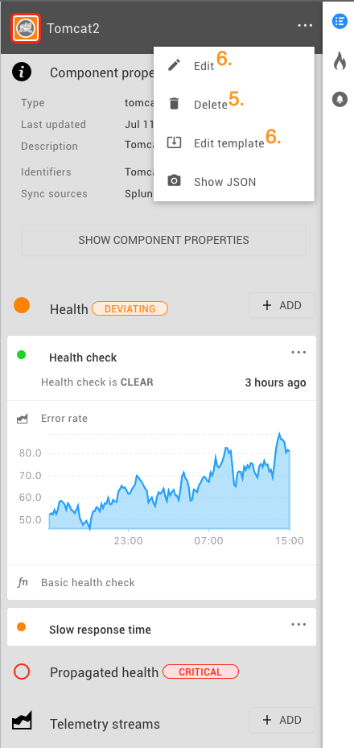 |

### Settings permissions

Below capabilities are shared across all settings pages.

1. Add New capability - requires `update-settings` system permission. It unlocks **Add...** buttons on all Settings Pages.
2. Edit capability - requires `update-settings` system permission. Three dots menu \(kebab menu\) is not displayed for the users without that permission.
3. Delete capability - requires `update-settings` system permission. Delete option is not displayed for the users without this permission.
4. Export capability - requires `export-settings` system permission. Checkboxes are not available for the user without this permission.
5. Delete and Reset synchronization capabilities - requires `execute-node-sync` system permission.

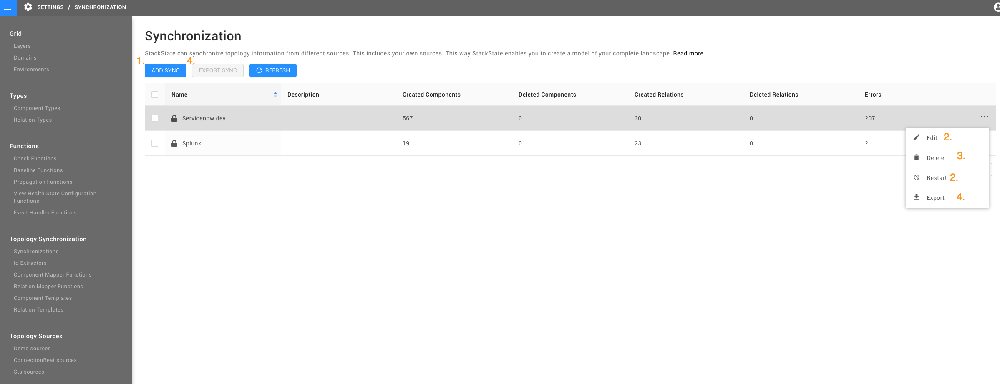

## Examples

Important note: all permissions in StackState are case sensitive.

List all permissions:

```text
sts permission list
```

Provide a subject with permission to open a view:

```text
sts permission grant [subject-handle] access-view [view-name]
```

Revoke permissions for a subject to open a view:

```text
sts permission revoke [subject-handle] access-view [view-name]
```

Provide a subject with system permission to check StackState settings:

```text
sts permission grant [subject-handle] read-settings system
```

Provide a subject with system permission to create \(save\) views:

```text
sts permission grant [subject-handle] create-views system
```

UI of a user without any permissions:

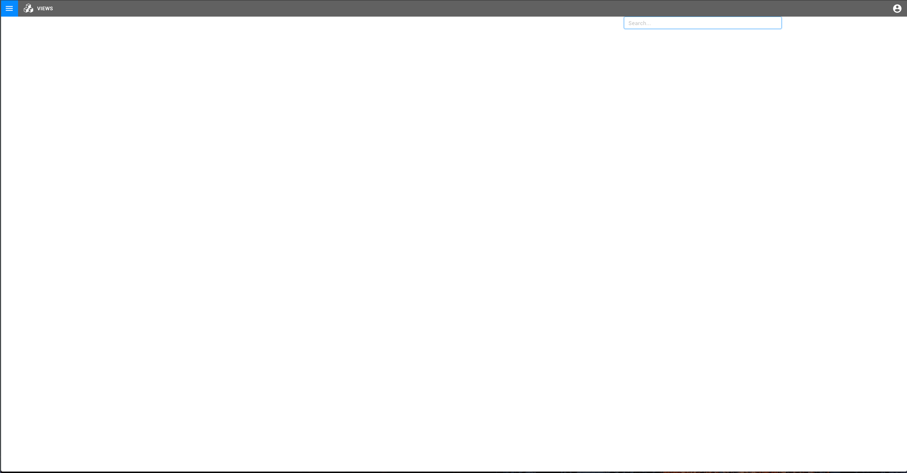

