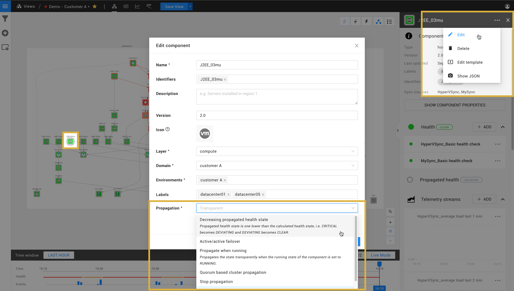

# State propagation

Propagation defines how a propagated state flows from one component to the next. Propagation always flows from dependencies to dependent components and relations. Note that this is the opposite direction of the relation arrows in the graph.

A propagated state is returned one of the following health states:

* `UNKNOWN`
* `DEVIATING`
* `FLAPPING`
* `CRITICAL`
* `CLEAR`

# Propagation method

## Transparent propagation (default)

By default, the propagation method for components and relations is set to transparent propagation. The propagated state for a component or relation is determined by taking the maximum of the propagated state of all its dependencies and its own state. For example:

| Dependency state | Component state | Propagated state |
|:---|:---|:---|
| CRITICAL | DEVIATING | CRITICAL |
| CLEAR | CRITICAL | CRITICAL |
| DEVIATING | CLEAR | DEVIATING |

## Edit the propagation method

In some situations transparent propagation is undesirable. Different propagation functions can be installed as part of a StackPack or you can write your own custom propagation functions. The desired propagation function to use for a component or relation can be set in its edit dialogue.



For example:

- **Cluster propagation**: When a component is a cluster component, a `CRITICAL` state should typically only propagate when the cluster quorum is in danger.

## Create a custom propagation functions

It is possible to write your own custom propagation functions to determine the new propagated state of an element \(component or relation\). A propagation function can take multiple parameters as input and produces a new propagated state as output. The propagation function has access to the component itself, the component's dependencies and the transparent state that has already been calculated for the element.


### parameters

The propagation function script takes system and user defined parameters. System parameters are predefined parameters passed automatically to the script:

* `transparentState` - the precomputed transparent state if returned from the script will lead to transparent propagation
* `component` - the id of the current component


### Async and synchronous functions

Propagation functions can be run as either async (default) or synchronous.

* With Async set to **On** you will be run as [async](#async-propagation-functions)

* With Async set to **Off** the function will be run as [synchronous](#synchronous-propagation-functions).

#### Async propagation functions

Running as an async function will all you to make an HTTP request. This allows you to use [StackState script APIs](../develop/scripting/script-apis) in the function body and gives you access to parts of the topology/telemetry not available in the context of the propagation.


The async script APIs provide super-human level of flexibility and even allow querying standalone services, therefore during propagation function development it is important to keep performance aspects in mind. Consider extreme cases where the propagation function is executed on all components and properly assess system impact. StackState comes with a number of StackPacks with tuned propagating functions. Changes to those functions are possible, but may impact the stability of the system.


#### Synchronous propagation functions

Running the function as synchronous places limitations on both the capability of what the functions can achieve and the number of functions that can be run in parallel, but allows access to `stateChangesRepository` information.


#### Example: 'Hello world' propagation function

The simplest possible function that can be written is given below:

```text
    return DEVIATING
```

This function will always return `DEVIATING` propagated state.

#### Example: Propagate DEVIATING state if the component is not in a running state

It is possible to implement more complicated logic in the propagation function. The example of the script that propagates the DEVIATING state in case if component is not running:

```text
Component
  .withId(componentId)
  .fullComponent()
  .then { component ->
    if (component.runState.runState != "RUNNING") {
      return DEVIATING
    } else {    
      return transparentState
    }
  }
```

This code works as follows:

* The `componentId` is passed as long and it has to be resolved using using `Component.withId(componentId)` combinator.
* The `.fullComponent()` returns component in Json-style representation the same as the one that can be obtained from `Show Json` component menu or using [topology query](https://github.com/StackVista/stackstate-docs/tree/e642f99b5f9f4a7b201b558ae44375317f5974c5/develop/scripting/script-apis/topology/README.md) in analytics.
* `then { component -> ... }` is an async lambda function where the main logic for the propagation function resides.

  The `component` is the component variable which has properties that can be accessed using `.<property name>` notations. e.g. `.type` returns component type id.

* The logic above checks if component has specific type and not in running state then it will propagate `DEVIATING` state.

It is possible to add user logging from the script for debug purposes, e.g `log.info("message")`. The logs will appear in `stackstate.log`.

### The old style propagation function \(deprecated\)

The old style function is written using sync apis. The function takes the following parameters:

| Parameter | Description |
| :--- | :--- |
| element | reference to current component |
| stateChangesRepository | the state change helper class, see the detailed methods below |
| transparentState | the transparent state value |
| log | script logger |

StackState makes available several elements to define propagation logic. Available functions are listed below.

<table>
  <thead>
    <tr>
      <th style="text-align:left">Function</th>
      <th style="text-align:left">Description</th>
    </tr>
  </thead>
  <tbody>
    <tr>
      <td style="text-align:left"><code>element.name</code>
      </td>
      <td style="text-align:left">returns the name of the current <code>element</code>.</td>
    </tr>
    <tr>
      <td style="text-align:left"><code>element.type</code>
      </td>
      <td style="text-align:left">returns the type of the current <code>element</code>.</td>
    </tr>
    <tr>
      <td style="text-align:left"><code>element.version</code>
      </td>
      <td style="text-align:left">returns a component version, Optional.</td>
    </tr>
    <tr>
      <td style="text-align:left"><code>element.isComponent()</code>
      </td>
      <td style="text-align:left">returns <code>true</code> when <code>element</code> is a component, false
        in case of a relation.</td>
    </tr>
    <tr>
      <td style="text-align:left"><code>element.getDependencies()</code>
      </td>
      <td style="text-align:left">when the <code>element</code> is a component the command returns a set of
        the outgoing relations and when <code>element</code> is relation the command
        returns a set of components.</td>
    </tr>
    <tr>
      <td style="text-align:left"><code>element.getDependencies().size()</code>
      </td>
      <td style="text-align:left">returns the number of dependencies.</td>
    </tr>
    <tr>
      <td style="text-align:left">
        <p><code>stateChangesRepository</code>
        </p>
        <p><code>.getPropagatedHealthStateCount(&lt;set of elements&gt;, &lt;health state&gt;)</code>
        </p>
      </td>
      <td style="text-align:left">returns the number of elements in the set that have a certain health state.
        Health state can be <code>CRITICAL</code> for example.</td>
    </tr>
    <tr>
      <td style="text-align:left">
        <p><code>stateChangesRepository</code>
        </p>
        <p><code>.getHighestPropagatedHealthStateFromElements(&lt;set of elements&gt;)</code>
        </p>
      </td>
      <td style="text-align:left">return the highest propagated health state based on the given set of elements.</td>
    </tr>
    <tr>
      <td style="text-align:left">
        <p><code>stateChangesRepository.getState(element)</code>
        </p>
        <p><code>.getHealthState().intValue</code>
        </p>
      </td>
      <td style="text-align:left">return <code>element</code>&apos;s health state.</td>
    </tr>
    <tr>
      <td style="text-align:left">
        <p><code>stateChangesRepository.getState(element)</code>
        </p>
        <p><code>.getPropagatedHealthState().getIntValue()</code>
        </p>
      </td>
      <td style="text-align:left">return <code>element</code>&apos;s propagated health state.</td>
    </tr>
    <tr>
      <td style="text-align:left"><code>element.runState()</code>
      </td>
      <td style="text-align:left">return the <code>element</code>&apos;s run state</td>
    </tr>
  </tbody>
</table>
