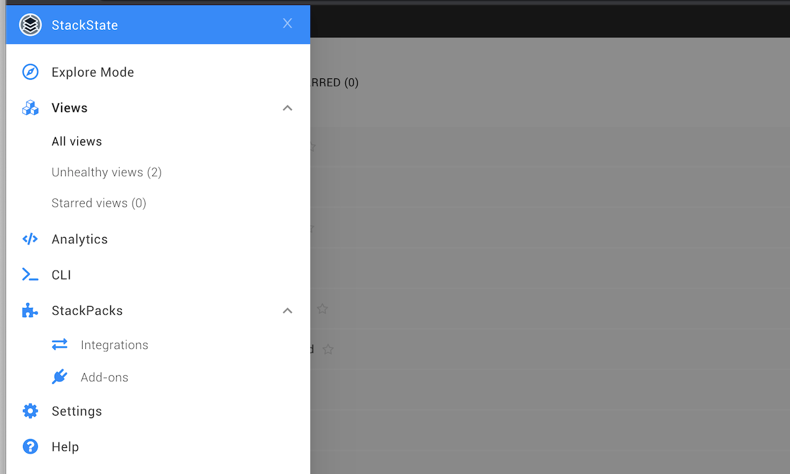

# Permissions

## Overview

Permissions in StackState allow Administrators to manage the actions that each user or user group can perform inside StackState and the information that will be shown in their StackState UI. Only the feature set relevant to each user's active role will be presented. The actions, information and pages that a user does not have access to are simply not displayed in their StackState UI.


Permissions are stored in StackGraph. This means that:

* If you perform an upgrade with "clear all data", permission setup will also be removed.
* To completely remove a user, they must also be manually removed from StackGraph.


There are two types of permission in StackState:

* [System permissions](rbac_permissions.md#system-permissions) - Scope user capabilities, such as access to settings, query execution and scripting.
* [View permissions](rbac_permissions.md#view-permissions) - Allow for CRUD operations on StackState Views.

## Predefined roles

StackState comes with four predefined roles:

* **Administrators** \(`stackstate-admin`\): Have access to all views and have all permissions, except for the platform management permission `access-admin-api`.
* **Platform Administrators** \(`stackstate-platform-admin`\): Have platform management permissions and have access to all views.
* **Power Users** \(`stackstate-power-user`\): This role is typically granted to users that need to configure StackState for their team\(s\), but will not manage the entire StackState installation. Power users have all Administrator permissions _except_ for:
  * `execute-restricted-scripts`
  * `update-permissions`
  * `upload-stackpacks`
  * **Guests** \(`stackstate-guest`\): Have read access, as you can see below when we use the StackState CLI to show granted permissions for the role:

    ```text
      $ sts permission show stackstate-guest
      subject           permission                 resource
      ----------------  -------------------------  ----------
      stackstate-guest  access-cli                 system
      stackstate-guest  access-explore             system
      stackstate-guest  perform-custom-query       system
      stackstate-guest  read-permissions           system
      stackstate-guest  update-visualization       system
      stackstate-guest  manage-star-view           system
      stackstate-guest  execute-component-actions  system
      stackstate-guest  access-view                everything
    ```

### Default and custom role names

The default pre-defined role names \(`stackstate-admin`, `stackstate-platform-admin`, `stackstate-power-user`, `stackstate-guest`\) are always available. Additional custom role names can be added that have the same permissions. Below is an example of how to do this for both Kubernetes and Linux installations.



Include this YAML snippet in an `authentication.yaml` when customizing the authentication configuration to extend the default role names with these custom role names.

```yaml
stackstate:
  authentication:
    roles:
      guest: ["custom-guest-role"]
      powerUser: ["custom-power-user-role"]
      admin: ["custom-admin-role"]
      platformAdmin: ["custom-platform-admin-role"]
```

To use it in for your StackState installation \(or already running instance, note that it will restart the API\):

```text
helm upgrade \
  --install \
  --namespace stackstate \
  --values values.yaml \
  --values authentication.yaml \
stackstate \
stackstate/stackstate
```



To extend the default role names with custom role names:

1. Edit the existing keys in the `authorization` section of the configuration file `application_stackstate.conf`.
2. Add custom roles using the syntax `xxxGroups = ${stackstate.authorization.xxxGroups} ["custom-role"]` as shown in the example below.

   ```javascript
   authorization {
    guestGroups = ${stackstate.authorization.guestGroups} ["custom-guest-role"]
    powerUserGroups = ${stackstate.authorization.powerUserGroups} ["custom-power-user-role"]
    adminGroups = ${stackstate.authorization.adminGroups} ["custom-admin-role"]
    platformAdminGroups = ${stackstate.authorization.platformAdminGroups} ["custom-platform-admin-role"]
   }
   ```

3. Restart StackState for changes to take effect.

   The list of roles will be extended to include the new, custom roles. The default roles will remain available \(stackstate-admin, stackstate-platform-admin, stackstate-guest and stackstate-power-user\).



## All permissions in StackState

There are two types of permission in StackState:

* [System permissions](rbac_permissions.md#system-permissions) - Scope user capabilities, such as access to settings, query execution and scripting.
* [View permissions](rbac_permissions.md#view-permissions) - Allow for CRUD operations on StackState Views.

### System permissions

System permissions scope user capabilities, such as access to settings, query execution and scripting. They are set system wide.

See also the full list of [view permissions](rbac_permissions.md#view-permissions).

| Permission | Purpose | Guest | Power user | Admin | Platform Admin |
| :--- | :--- | :---: | :---: | :---: | :---: |
| `access-cli` | Access the CLI page. This provides the API key to use for authentication with the StackState CLI. | ✅ | ✅ | ✅ | ✅ |
| `access-explore` | Access the Explore page. | ✅ | ✅ | ✅ | - |
| `execute-component-actions` | Execute component actions. | ✅ | ✅ | ✅ | - |
| `manage-star-view` | Add and remove stars from saved views. | ✅ | ✅ | ✅ | ✅ |
| `perform-custom-query` | Access the topology filter. | ✅ | ✅ | ✅ | - |
| `read-permissions` | List all granted permissions across the entire system via the CLI. | ✅ | ✅ | ✅ | - |
| `update-visualization` | Change visualization settings. | ✅ | ✅ | ✅ | - |
| `access-analytics` | Access the Analytics page. | - | ✅ | ✅ | - |
| `access-admin-api` | Access the administrator API. | - | - | - | ✅ |
| `access-log-data` | Access StackState logs via the CLI. | - | ✅ | ✅ | ✅ |
| `access-synchronization-data` | Access StackState synchronization status and data via the CLI. | - | ✅ | ✅ | - |
| `access-topic-data` | Access StackState receiver data via the CLI. | - | ✅ | ✅ | - |
| `create-views` | Create views. | - | ✅ | ✅ | - |
| `execute-component-templates` | Invoke a component template API extension \(internal use only\). | - | ✅ | ✅ | - |
| `execute-node-sync` | Reset or delete a synchronization. | - | ✅ | ✅ | - |
| `execute-scripts` | Execute a query in the StackState UI Analytics environment. The `execute-restricted-scripts` permission is also required to execute scripts using the HTTP script API. | - | ✅ | ✅ | - |
| `import-settings` | Import settings. | - | ✅ | ✅ | - |
| `export-settings` | Export settings. | - | ✅ | ✅ | - |
| `manage-annotations` | Persist and fetch Anomaly annotations in StackState. | - | ✅ | ✅ | - |
| `manage-event-handlers` | Create or edit event handlers. | - | ✅ | ✅ | - |
| `manage-telemetry-streams` | Create or edit new streams for components via the UI. | - | ✅ | ✅ | - |
| `manage-topology-elements` | Create/update/delete topology elements. | - | ✅ | ✅ | - |
| `manage-stackpacks` | Install/upgrade/uninstall StackPacks. | - | ✅ | ✅ | - |
| `read-settings` | Access the Settings page. | - | ✅ | ✅ | - |
| `update-settings` | Update settings. | - | ✅ | ✅ | - |
| `execute-restricted-scripts` | Execute scripts using the [HTTP script API](../../../develop/reference/scripting/script-apis/http.md) in the StackState UI analytics environment. Also requires execute-scripts. | - | - | ✅ | - |
| `update-permissions` | Grant/revoke permissions or modify subjects. | - | - | ✅ | - |
| `upload-stackpacks` | Upload new \(versions of\) StackPacks. | - | - | ✅ | - |

### View permissions

View permissions allow for CRUD operations on StackState Views. They can be set for a specific view or all views \(`everything`\).

See also the full list of [system permissions](rbac_permissions.md#system-permissions).

| Permission | Purpose | Guest | Power user | Admin | Platform Admin |
| :--- | :--- | :---: | :---: | :---: | :---: |
| `access-view` | Access a specific view \(when granted on a view\) or all views \(when granted on `everything`\). | ✅  `everything` | ✅  `everything` | ✅  `everything` | ✅  `everything` |
| `delete-view` | Delete a specific view \(when granted on a view\) or all views \(when granted on `everything`\). | - | ✅  `everything` | ✅  `everything` | - |
| `save-view` | Update a specific view \(when granted on a view\) or all views \(when granted on `everything`\). | - | ✅  `everything` | ✅  `everything` | - |

## Permissions by action

### Page access

The permissions in the table below are required to access specific pages in the StackState UI. Without these permissions, the associated page will be hidden in the StackState UI and will not be accessible via its URL.



| Page | Description | Permission | Guest | Power user | Admin | Platform admin |
| :--- | :--- | :--- | :---: | :---: | :---: | :---: |
| **Explore Mode** | | `access-explore` | ✅ | ✅ | ✅ | - |
| **Views** | Access can be granted either for a specific view using the view ID or for all views using the `everything` resource. For details, see the [view management permissions](rbac_permissions.md#view-management).  | `access-view` | ✅  `everything` | ✅  `everything` | ✅  `everything` | ✅  `everything` |
| **Analytics** | For details, see the [analytics environment permissions](rbac_permissions.md#analytics-environment). | `access-analytics` | - | ✅ | ✅ | - |
| **CLI** | The CLI page provides the API key to use for authentication with the StackState CLI. | `access-cli` | ✅ | ✅ | ✅ | ✅ |
| **StackPacks** |  | `manage-stackpacks` | - | ✅ | ✅ | - |
| **Settings** | For details, see the [settings page permissions](rbac_permissions.md#settings-page). | `read-settings` | - | ✅ | ✅ | - |
| **Settings** &gt; **Export Settings** | Also requires `read-settings`. Without this permission, Export Settings is removed from Settings Menu. For details, see the [settings page permissions](rbac_permissions.md#settings-page). | `export-settings` | - | ✅ | ✅ | - |
| **Settings** &gt; **Import Settings** | Also requires `read-settings`.  Without this permission, Import Settings is removed from Settings Menu. For details, see the [settings page permissions](rbac_permissions.md#settings-page). | `import-settings` | - | ✅ | ✅ | - |

See the full list of [permissions for pre-defined roles](rbac_permissions.md#all-permissions-in-stackstate) \(above\).

### Topology

The permissions listed below are required to work with topology in StackState:

| Action | Permission | Guest | Power user | Admin | Platform admin |
| :--- | :--- | :---: | :---: | :---: | :---: |
| Access and edit the view visualization settings. If not granted, the visualization settings button will be hidden. | `update-visualization` | ✅ | ✅ | ✅ | - |
| Basic and Advanced filtering. If not granted, filtering options will be hidden. | `perform-custom-query` | ✅ | ✅ | ✅ | - |
| Execute actions from the component context menu. | `execute-component-actions` | ✅ | ✅ | ✅ | - |
| Drag and drop components. | `manage-topology-elements` | - | ✅ | ✅ | - |
| Add components button. Create relations between topology elements. | `manage-topology-elements` and `perform-custom-query` and `read-settings` | - | ✅ | ✅ | - |

See the full list of [permissions for pre-defined roles](rbac_permissions.md#all-permissions-in-stackstate) \(above\).

### Component/relation details

The permissions listed below are required to carry out specific actions in the component or relation details pane.

| Action | Permission | Guest | Power user | Admin | Platform admin |
| :--- | :--- | :---: | :---: | :---: | :---: |
| **Telemetry streams** Add a new telemetry stream. Without this permission, only the **Inspect** action is available in the **...** menu and the **ADD** button is hidden. | `manage-topology-elements` | - | ✅ | ✅ | - |
| **Health checks** Add a new StackState health check. Edit / delete an existing health check. Without this permission, the **...** menu and the **ADD** button are hidden. | `manage-topology-elements` | - | ✅ | ✅ | - |
| **Elements** Delete an element or element template. | `manage-topology-elements` | - | ✅ | ✅ | - |
| **Elements** Edit an element or element template. | `manage-topology-elements` and `perform-custom-query` and `read-settings` | - | ✅ | ✅ | - |

See the full list of [permissions for pre-defined roles](rbac_permissions.md#all-permissions-in-stackstate) \(above\).

### View management

The permissions listed below can be set to access and work with views:

| Action | Permission | Guest | Power user | Admin | Platform admin |
| :--- | :--- | :---: | :---: | :---: | :---: |
| Access a specific view or all views \(`everything`\). Example: [Grant permissions to open a view](rbac_permissions.md#allow-a-user-to-open-a-view). | `access-view` | ✅  `everything` | ✅  `everything` | ✅  `everything` | ✅  `everything` |
| Add and remove stars from all views. | `manage-star-view` | ✅ | ✅ | ✅ | ✅ | 
| Access and edit the view visualization settings. If not granted, the **visualization settings** button will be hidden. | `update-visualization` | ✅ | ✅ | ✅ | - |
| Add or edit event handlers. If not granted, the **ADD NEW EVENT HANDLER** button will not be available, however, users will be able to view details of existing event handlers. Example: [Grant permissions to add and edit event handlers](rbac_permissions.md#allow-a-user-to-add-or-edit-event-handlers). | `manage-event-handlers` | - | ✅ | ✅ | - |
| Create views. Example: [Grant permissions to create views](rbac_permissions.md#allow-a-user-to-create-save-views). | `create-views` | - | ✅ | ✅ | - |
| Save updates to a view. For a specific view or all views \(`everything`\). | `save-view` | - | ✅  `everything` | ✅  `everything` | - |
| Delete a view. For a specific view or all views \(`everything`\). | `delete-view` | - | ✅  `everything` | ✅  `everything` | - |

See the full list of [permissions for pre-defined roles](rbac_permissions.md#all-permissions-in-stackstate) \(above\).

### Analytics environment

The permissions listed below are required to access and execute scripts in the StackState UI analytics environment:

| Action | Permission | Guest | Power user | Admin | Platform admin |
| :--- | :--- | :---: | :---: | :---: | :---: |
| Access the **Analytics** page in the StackState UI. Without this permission, the analytics environment will be hidden in the StackState UI, and it will not be accessible via its URL. | `access-analytics` | - | ✅ | ✅ | - |
| Execute scripts in the StackState UI analytics environment. Without this permission, the **Execute** button will not be available. Also requires `access-analytics`. | `execute-scripts` | - | ✅ | ✅ | - |
| Execute scripts that use the [HTTP script API](../../../develop/reference/scripting/script-apis/http.md). Also requires `access-analytics` and `execute-scripts`. | `execute-restricted-scripts` | - | - | ✅ | - |

See the full list of [permissions for pre-defined roles](rbac_permissions.md#all-permissions-in-stackstate) \(above\).

### Settings page

The permissions listed below are required to access and manage settings in the StackState UI:

| Action | Permission | Guest | Power user | Admin | Platform admin |
| :--- | :--- | :---: | :---: | :---: | :---: |
| Access the **Settings** page in the StackState UI. Without this permission, the settings section will be hidden in the StackState UI main menu, and it will not be accessible via its URL. | `read-settings` | - | ✅ | ✅ | - |
| Add / Edit / Delete capabilities. This permission unlocks the **...** menu and the **ADD** buttons on all Settings Pages. | `update-settings` | - | ✅ | ✅ | - |
| Export capability. Without this permission, checkboxes are not available on the settings page. | `export-settings` | - | ✅ | ✅ | - |
| Delete and Reset synchronization capabilities. | `execute-node-sync` | - | ✅ | ✅ | - |

See the full list of [permissions for pre-defined roles](rbac_permissions.md#all-permissions-in-stackstate) \(above\).

### Platform Management

The permissions listed below are required to access and manage StackState platform:

| Action | Permission | Guest | Power user | Admin | Platform Admin |
| :--- | :--- | :---: | :---: | :---: | :---: |
| `access-admin-api` | Access the administrator API. | - | - | - | ✅ |
| `access-log-data` | Access StackState logs via the CLI. | - | ✅ | ✅ | ✅ |

See the full list of [permissions for pre-defined roles](rbac_permissions.md#all-permissions-in-stackstate) \(above\).

## Example CLI commands


**Important note:** All permissions in StackState are case sensitive.


### List all permissions

List all permissions:

```text
sts permission list
```

### Show granted permissions

Show the permissions granted to a specific role.

```text
sts permission show [role-name]
```

### Grant permissions

#### Allow a user to open a view

Provide a subject with permission to open a view:

```text
sts permission grant [subject-handle] access-view [view-name]
```

#### Allow a user to create \(save\) views

Provide a subject with the system permission to create \(save\) views:

```text
sts permission grant [subject-handle] create-views system
```

#### Allow a user to check StackState settings

Provide a subject with the system permission to check StackState settings:

```text
sts permission grant [subject-handle] read-settings system
```

#### Allow a user to add or edit event handlers

Provide a subject with the system permission to add new event handlers and edit existing event handlers:

```text
sts permission grant [subject-handle] manage-event-handlers system
```

### Revoke permissions

Revoke permissions for a subject to open a view:

```text
sts permission revoke [subject-handle] access-view [view-name]
```

## StackState UI with no permissions

Below is an example of how the StackState UI would look for a user without any permissions:


