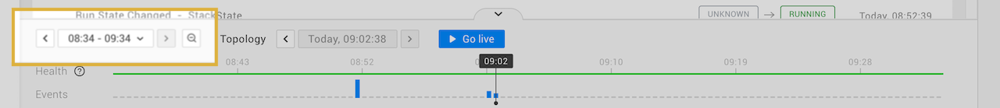

# Set custom default telemetry interval

## Overview

The telemetry interval specifies the time window for which events, metrics and traces are available in the StackState perspectives. It runs from left to right on the timeline at the bottom of the StackState UI. By default, the telemetry interval active when opening a [view](/use/stackstate-ui/views/about_views.md) or [explore mode](/use/stackstate-ui/explore_mode.md) is set to a relative time period, showing telemetry data from the last hour. If required, you can configure StackState to use a different telemetry interval.



## Customise the default telemetry interval

You can configure the default telemetry interval used in StackState with the parameter `defaultTimeRange`. The configured value will then be applied automatically when a view or explore mode is opened.

Note that once a telemetry interval value is specified by a user in the StackState UI, this will override the default telemetry interval and be applied to each subsequent view that is opened.

The default telemetry interval can be set to any of the following values:
- `LAST_5_MINUTES`
- `LAST_15_MINUTES`
- `LAST_30_MINUTES`
- `LAST_1_HOUR` (default value)
- `LAST_3_HOURS`
- `LAST_6_HOURS`
- `LAST_12_HOURS`
- `LAST_24_HOURS`
- `LAST_2_DAYS`
- `LAST_7_DAYS`
- `LAST_30_DAYS`
 
Specifying any other value will be ignored and converted to the default value (`LAST_1_HOUR`).



To set a custom default telemetry interval, add the following to the `values.yaml` file used to deploy StackState:
```yaml
stackstate:
  components:
    api:
      config: |
         stackstate.webUIConfig.defaultTimeRange = <newvalue>

```


Set a custom default telemetry interval in `/etc/application_stackstate.conf` using the parameter `stackstate.webUIConfig.defaultTimeRange`.

```yaml
stackstate {
  webUIConfig {
    defaultTimeRange = "LAST_1_HOUR"
  }
}
```



## See also

* [Timeline - telemetry interval](/use/stackstate-ui/timeline-time-travel.md#telemetry-interval)