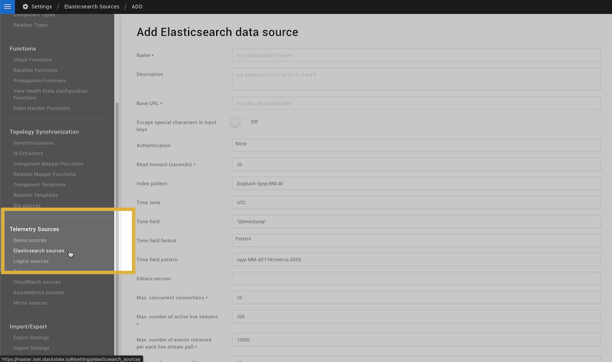

# Elasticsearch


**This page describes StackState version 4.4.**

Go to the [documentation for the latest StackState release](https://docs.stackstate.com/configure/telemetry/data-sources/elasticsearch).


## Overview

StackState can be configured to pull data from your own Elasticsearch instance. The collected metrics or events data can then be added as a telemetry stream directly to a component or included as part of an integration, topology synchronisation or component/relation template.

## Pull telemetry from a custom Elasticsearch instance

### Prerequisites

To connect StackState to your Elasticsearch instance and retrieve telemetry data you will need to have:

* A running Elasticsearch instance reachable from StackState.
* An Elasticsearch index to retrieve.
* A time field with a timestamp in the Elasticsearch data.

### Add an Elasticsearch data source to StackState

An Elasticsearch data source should be added in StackState for each Elasticsearch index that you want to work with. Default settings that should work with most instances of Elasticsearch are already included, so you will only need to add details of your Elasticsearch instance and the index to be retrieved.

To add an Elasticsearch data source:

1. In the StackState UI, go to **Settings** &gt; **Telemetry Sources** &gt; **Elasticsearch sources**.
2. Click on **ADD ELASTICSEARCH DATA SOURCE**.
3. Enter the required settings:
   * **Name** - the name to identify the Elasticsearch data source in StackState.
   * **Base URL** - the URL of the REST API of your Elasticsearch instance \(default port 9200\). Note that this must be reachable by StackState.
   * **Index pattern** - the Elasticsearch index to retrieve. It is possible to specify a pattern if the index is sliced by time. See [how to find the Elasticsearch index pattern](elasticsearch.md#find-the-elasticsearch-index-pattern).
   * **Time zone** - the timezone of the timestamps stored in the Elasticsearch documents.  This is required to ensure data is correctly processed by StackState.
   * **Time field** - the field in the Elasticsearch documents that contains the timestamp of the event/metric.
   * **Time field format** - the format of the value in the specified **Time field**. See [how to find the Elasticsearch time field format](elasticsearch.md#find-the-elasticsearch-time-field-format).
   * A number of additional settings can be tweaked in non-standard use-cases. See the [advanced settings](elasticsearch.md#advanced-settings).
4. Click **TEST CONNECTION** to confirm that StackState can connect to Elasticsearch at the configured Base URL.
5. Click **CREATE** to save the Elasticsearch data source settings.
   * The new Elasticsearch data source will be listed on the **Elasticsearch sources** page and available as a data source when adding telemetry to components and relations.



#### Find the Elasticsearch index pattern

You can find the index pattern used in an Elasticsearch instance with the command `curl <elasticsearch_node>:<port>/_cat/indices?v`.

In the example below, the index pattern would be `[sts_internal_events-]yyyy.MM.dd`.

```text
curl localhost:9200/_cat/indices?v

> health status index                          uuid                   pri rep docs.count docs.deleted store.size pri.store.size
> green  open   sts_internal_events-2020.10.04 KhhFdcOFR5StiWC3zAMEJg   1   0      48262            0     18.6mb         18.6mb
> green  open   sts_internal_events-2020.10.05 SiycHLkORrGe0tCUWbby2w   1   0      47456            0     18.7mb         18.7mb
> green  open   sts_internal_events-2020.10.06 INYPKojcSMWnyyjMQvTEow   1   0      40890            0     16.4mb         16.4mb
> green  open   sts_internal_events-2020.10.07 AagKIOInRaetkeQF8TO_rA   1   0      47125            0     18.3mb         18.3mb
```

#### Find the Elasticsearch time field format

The **Time field format** specified in the StackState Elasticsearch data source settings should fit the date format used in the Elasticsearch index that will be retrieved. Follow the instructions below to find the Elasticsearch index date format and then use this to identify the correct time field format.

**Find the date format used in the Elasticsearch index**

You can find the date format used in a specific Elasticsearch index with the command `curl <elasticsearch_node>:<port>/<index_name>/_mapping?pretty`. This returns the index mapping, which includes the format of any date values.

In the example below, the date format would be `date`.

```text
curl localhost:9200/my_es_index/_mapping?pretty

> {
>   my_es_index {
>       mappings {
>           ...
>           "properties" : {
>               "@timestamp" : {
>                   "type" : "date"
>               },
>           }
>           ...
>       }
>   }
> }
```

**Find the correct time field format**

To find the correct time field format to specify in the StackState Elasticsearch data source settings, look up the date format from your Elasticsearch index in the [Elasticsearch built in formats \(elastic.co\)](https://www.elastic.co/guide/en/elasticsearch/reference/current/mapping-date-format.html). You may need to adjust the format provided to fit your implementation, for example:

* `yyyy-MM-dd` for the date format `date`.
* `yyyy-MM-dd’T’HH:mm:ss[.SSS]ZZZZZ` for a timestamp pattern with millis that can have 1, 2 or 3 digits.

### Work with Elasticsearch data in StackState

Elasticsearch data sources can be used to add telemetry streams to components and relations in StackState. This can be done manually by [adding a telemetry stream](../../../use/metrics-and-events/add-telemetry-to-element.md) directly to an element or as part of an integration or topology synchronization, for details see how to [add telemetry during topology synchronization](../telemetry_synchronized_topology.md).

## Advanced settings

### Error management

To reduce noise resulting from intermittent failure of the data source, StackState can be configured to only emit errors after they exist for a specified time.

* **Propagate errors only after \(minutes\)** - the time after which errors should be reported. 

### Kibana

Elasticsearch can optionally be accessed through Kibana. To do this, the following settings must be provided:

* **Base URL** - the URL of the REST API endpoint provided by Kibana. Note that this must be reachable by StackState.
* **Kibana version** - the Kibana version used. This is required for XSS mitigation.

### Timeouts

The timeout settings can be tweaked when dealing with exceptionally large result sets or a slower Elasticsearch cluster:

* **Read timeout \(seconds\)** - the timeout when retrieving data directly from Elasticsearch.
* **Request timeout ui \(seconds\)** - the timeout when retrieving Elasticsearch data through the StackState API.

### Wildcards

Wildcards can be slow in Elasticsearch. By default, StackState will escape wildcards used in telemetry query values. If required, this behavior can be disabled.

* **Support wildcards in values** - when enabled, StackState will include wildcards \(`*`\) in telemetry query values. Note that wildcards can be used to filter for partial matches, it is not possible to use a full wildcard. At least one other character must be specified in the filter value.

## See also

* [Add a telemetry stream to a component or relation](../../../use/metrics-and-events/add-telemetry-to-element.md)
* [Add telemetry during topology synchronization](../telemetry_synchronized_topology.md)

