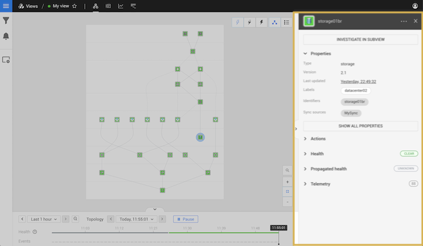
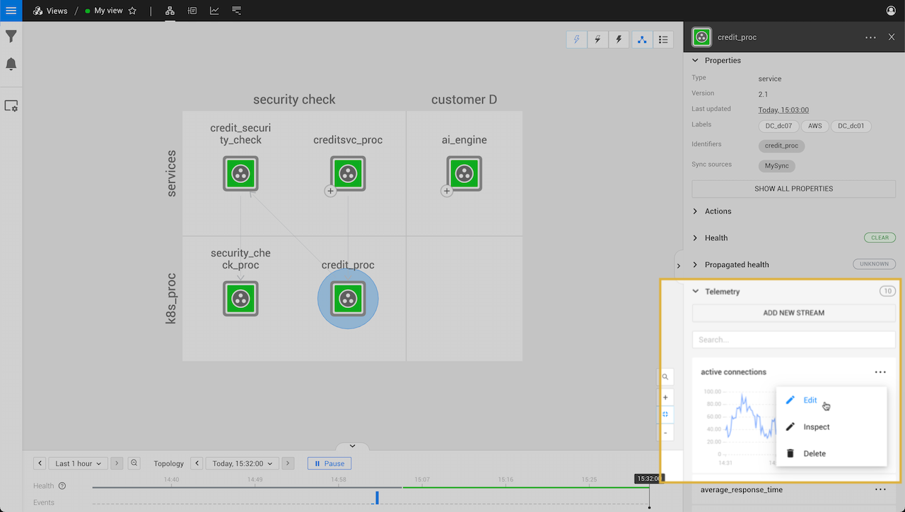

# Set telemetry stream priority

The Priority field allows for ordering component's Telemetry streams in the right-hand component pane. There are four levels of priority for Telemetry streams in StackState: `High`, `Medium`, `Low`, and `None`. Streams that have a higher priority level are presented at the top of the Telemetry stream section. By default, all streams have priority set to `none`. To change priorities assigned to specific streams, follow the instruction below:

## 1. Open the Component Details pane

Locate the component that you want to edit Telemetry streams for. Click on the component to open the Component Details pane on the right of the screen - see the screenshot below:

Here you can access the details of the component, such as Properties, Health status, and Telemetry.

## 2. Choose Telemetry Streams to prioritize

Components can have multiple Telemetry streams. They are presented in a column, so not all of them are visible at first. Let's say that instead of `BytesReceivedRate`, you want to see `PacketsReceivedRate` right after the `basic_health` stream. Click on the kebab menu in the upper right corner of the `basic_health` stream and choose the **Edit** option:

## 3. Set priorities for selected streams

In the `basic_health` stream edit screen, you can set the Priority field to `High`, as this one should be presented at the top. Click **Save** and confirm the change:

Now navigate to the `PacketsReceivedRate` stream and open the stream editing screen. Here you can set the Priority field to `Medium`:

All streams have their priority set to `None` by default, so the `PacketsReceivedRate` stream is presented above them, and below the `basic_health` stream, which is set to `High` priority.

