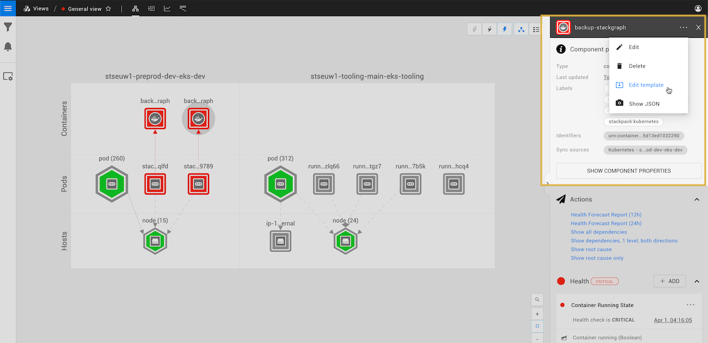
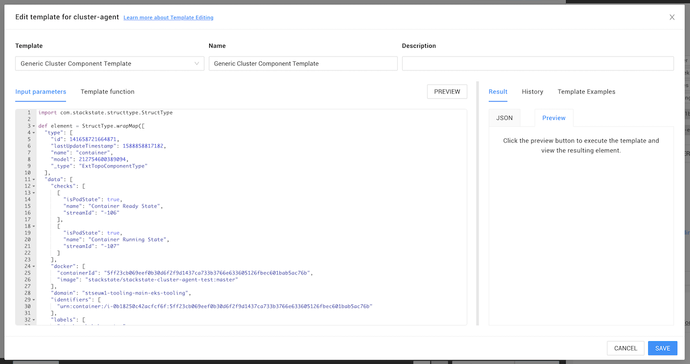

# Add telemetry during topology synchronization


## Overview

Topology that is imported to StackState using a StackPack or other integration is described as synchronized topology. Synchronized topology data arriving in StackState from external systems is normalized using a template. The template defines how a topology element should be built in StackState, such as the layer it should belong to, the health checks that should be added and any telemetry streams that should be attached to it.

The StackPacks shipped with StackState already include templates with the relevant telemetry streams for each imported element type. If you create your own integrations or have additional telemetry streams that you would like to link with imported components, you can edit the template used during synchronization to automatically add these to imported topology.

## Add telemetry streams to the synchronization template

If you want to add a telemetry stream to all topology elements imported by a specific integration, you can edit its template function to include the additional telemetry stream.

### Edit a template function with the template editor

The StackState template editor allows you to customize how StackState builds topology elements from imported topology data. You can open the template editor in the StackState UI component details pane.


Note that you are editing the template for the synchronization that imported the element, not the template for this specific element. Changes saved here will be applied to all future synchronizations for all elements built using this template.


1. Click on an element to open the **Component details** on the right of the screen.
2. Click on **...** and select **Edit template**.
3. The template editor will open for the template that was used to create the selected element. Three sets of information are displayed:
   * **input parameters** - the raw data imported for a specific element.
   * **template function** - the template function used by the synchronization that imported the element. When an element is imported, the synchronization will run the template function with input parameters. This outputs a [structured JSON string](../../develop/reference/stj/using_stj.md), which is used to build the **Component properties** you see on the right-hand side of the StackState UI.
   * **Result** - Click **PREVIEW** to see the output of the template function when it runs with the specified input parameters. You can choose to view the result either in JSON format or as it will appear in the StackState UI **Component properties**.
4. You can edit the template function to change how the topology element is built in StackState, for example to [add a telemetry stream to every element imported with this template](telemetry_synchronized_topology.md#add-a-telemetry-stream-to-a-template-function).






Note that you are editing the template for the synchronization that imported the element, not the template for this specific element. Changes saved here will be applied to all future synchronizations for all elements built using this template.


### Add a telemetry stream to a template function

The telemetry streams attached to topology elements during synchronization are configured in the template function as `streams: []`. To add a telemetry stream to a component the fields described below are required. The most important part of the stream configuration is the `query`, this represents the conditions used to filter the stream:

| Field | Allowed values | Description |
| :--- | :--- | :--- |
| `_type` | MetricStream EventStream | The type of Data Stream. |
| `name` |  | A name for the Data Stream. |
| `query._type` | MetricTelemetryQuery EventTelemetryQuery | The type of the Query |
| `query.conditions` |  | A collection of `"key", "value"` attributes used to filter the stream. The keys are defined by the data source and the value can be any string, numeric or boolean. |
| `query.metricField` |  | Metric streams only. The metric to observe in the stream. |
| `query.aggregation` | MEAN PERCENTILE\_25 PERCENTILE\_50 PERCENTILE\_75 PERCENTILE\_90 PERCENTILE\_95 PERCENTILE\_98 PERCENTILE\_99 MAX MIN SUM SUM\_NO\_ZEROS EVENT\_COUNT\_NO\_ZEROS | Metric streams only. The function to apply to aggregate the data. |
| `datasource` |  | The data source where to connect to fetch the data. |
| `datatype` | METRICS EVENTS | The kind of data received on the stream. |

For example, a CloudWatch metric stream:

```text
{
    ...
    "streams": [
    {
      "_type": "MetricStream",
      "name": "Invocation Duration",
      "query": {
        "conditions": [
            {"key": "Namespace","value": "AWS/Lambda"},
            {"key": "Resource","value": "{{ element.data.FunctionName }}"},
            {"key": "Region","value": "{{ element.data.Location.AwsRegion }}"}
        ],
        "_type": "MetricTelemetryQuery",
        "metricField": "Duration",
        "id": -27,
        "aggregation": "MEAN"
      },
      "dataSource": {{ resolve "DataSource" "CloudWatchSource" }},
      "id": -13,
      "dataType": "METRICS"
    }
    ]
}
```

## See also

* [Add a single telemetry stream to a single component](../../use/metrics-and-events/add-telemetry-to-element.md)
* [Reference guide: StackState template JSON](../../develop/reference/stj/)
* [Browse telemetry streams](../../use/metrics-and-events/browse-telemetry.md)
* [Create a StackPack with a custom template](../../develop/developer-guides/stackpack/)

