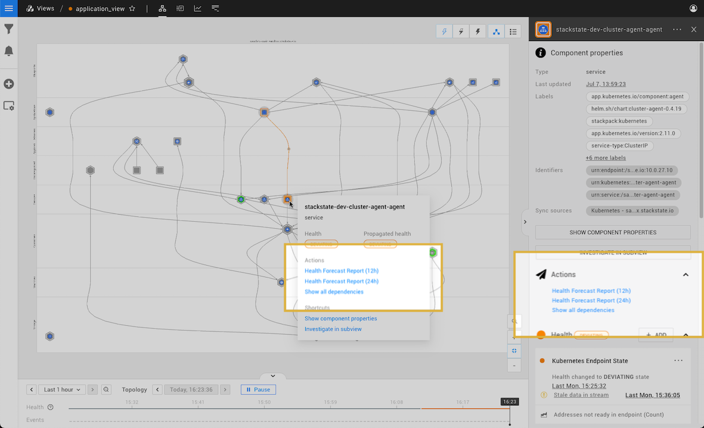

# Component actions


**This page describes StackState v4.4.x.**

The StackState 4.4 version range is End of Life (EOL) and no longer supported. We encourage customers still running the 4.4 version range to upgrade to a more recent release.

Go to the [documentation for the latest StackState release](https://docs.stackstate.com/configure/topology/component_actions).


Component Actions in StackState provide an ability to act based on various events and inputs provided by StackState monitoring capabilities. This functionality provides users with configurable Actions that can be executed from the component context menu or the component details pane in the [Topology Perspective](../../use/stackstate-ui/perspectives/topology-perspective.md).

Component Actions can be configured within StackState Settings or can be predefined in a StackPack.

## What is a Component Action?

A Component Action is a script that can be executed for components bound to that script with an [STQL query](../../develop/reference/stql_reference.md). A Component Action consists of a unique name that is case-sensitive, an STQL bind that selects components, and a script that determines the action's behavior. There are also optional fields for providing a description and an Identifier.

## Component Actions in use

Component Actions allow for a wide range of operations on components, for example:

* Repair actions - restart AWS EC2 instance when StackState reports that instance crashed.
* Navigation actions - Navigate to the AWS Management Console of a component showing erratic behavior.
* Reporting actions - Show a report that predicts the next 24 hours of CPU usage of a Kubernetes pod.

## How to get Component Actions

There are two ways of getting Component Actions in StackState:

1. Import of Actions predefined in a StackPack
2. Configure a new custom Action in the Settings page

Components Actions imported with a StackPack appear as locked items in the StackState UI page **Settings** &gt; **Actions** &gt; **Component Actions**. Editing a locked component action will unlock it, but this may prevent the StackPack from correct upgrades in the future. To restore the locked status of a Component Action, reinstall the StackPack that imported it.

Find out [how to configure Component Actions](../../develop/developer-guides/custom-functions/component-actions.md).

