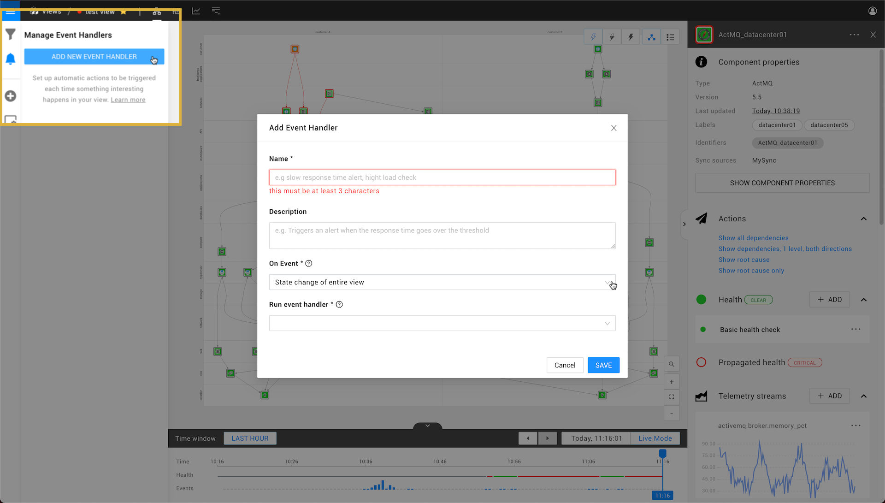
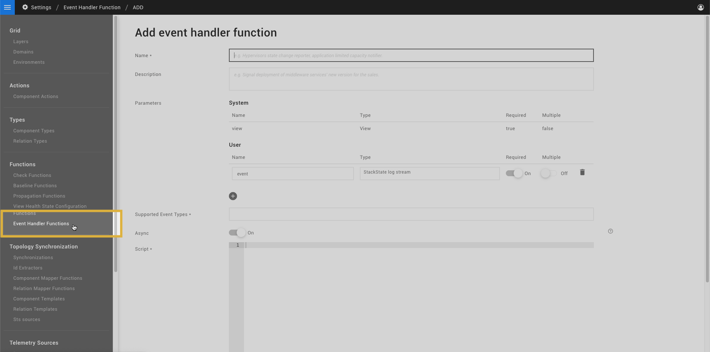

# Event handlers

## Overview

Event handlers can be attached to a StackState view to [send event notifications](../../use/health-state-and-event-notifications/send-event-notifications.md) and trigger actions in response to health state change events or problem events generated within the view.

To generate an event notification or trigger an action, the event handler will run an [event handler function](event-handlers.md#event-handler-functions). This is set in the StackState UI **Events Settings** &gt; **ADD NEW EVENT HANDLER** dialogue as **Run event handler**.

## Event handler functions

Event handlers listen to events generated within a view. When the configured event type is generated, the event handler function is run to [send an event notification](../../use/health-state-and-event-notifications/send-event-notifications.md) or trigger an action in a system outside of StackState. For example, an event handler handler function could send an email or make a POST to a webhook URL. A number of default event handler functions are included out of the box with StackState, or you can [create your own custom event handler functions](event-handlers.md#create-a-custom-event-handler-function).

### Health state change events

StackState ships with the following event handler functions that respond to health state change events:

| Event handler function | Description |
| :--- | :--- |
| **Slack** | Sends a message with detailed content on the trigger event and possible root cause to the configured Slack webhook URL. See [how to create a Slack webhook \(slack.com\)](https://api.slack.com/messaging/webhooks). |
| **Email** | Sends details of a health state change event using the [configured SMTP server](configure-email-event-notifications.md). |
| **HTTP webhook POST** | Sends an HTTP webhook POST request to the specified URL. |
| **SMS** | Sends details of a health state change event using MessageBird. |


Some of the event handler functions above will be installed as part of a StackPack. A full list of the event handler functions available in your StackState instance can be found in the StackState UI, go to **Settings** &gt; **Functions** &gt; **Event Handler Functions**


### Problem events

To run an event handler in response to problem events generated in a view, you will need to create a custom event handler function.

## Create a custom event handler function

You can write your own custom event handler functions that react to state change events and use a plugin to send an event notification to a system outside of StackState. To add a custom event handler function:

1. Go to **Settings** &gt; **Functions** &gt; **Event Handler Functions**.
2. Click **ADD EVENT HANDLER FUNCTION**. 
3. Enter the required settings:
   * **Name** - A name to identify the event handler function.
   * **Description** - Optional. A description of the event handler function.
   * **Parameters** - Parameters that are made available to the event handler function script. For details, see the section on [parameters](event-handlers.md#parameters) below.
   * **Supported Event Types** - The type of event\(s\) that the event handler can respond to. For details, see the section on [supported event types](event-handlers.md#supported-event-types) below.
   * **Async** - Event handler functions can be written as async \(default\) or synchronous:
        - Select **On** for Slack, SMS or HTTP webhook event handlers. The function will have access to all functionality from the StackState script API and more functions will be allowed to run in parallel.
        - Select **Off** for event handlers that generate email, SMS or HTTP webhook event notifications. The function will run as synchronous.
   * **Script** - The script run by the function. For details, see the sections below on:
        - [Async functions](#async-functions-default).
        - [Synchronous functions](#synchronous-functions-async-off).
        - How to [add logging to a function](event-handlers.md#logging).
   * **Identifier** - Optional. A unique identifier \(URN\) for the event handler function.
4. Click **CREATE** to save the event handler function. 
   * The new event handler function will be listed on the **Event Handler Functions** page and available in the **Run event handler** drop-down when you [add an event handler](../../use/health-state-and-event-notifications/send-event-notifications.md#add-an-event-handler-to-a-view) that listens to one of the configured **Supported Event Types**.

## Parameters

An event handler function takes system and user defined parameters. System parameters are predefined parameters passed automatically to the script.

* The **view** system parameter is passed to every event handler function and provides details of the view the event handler is in. 
* An **event** user parameter is also required, these are the events that the event handler function will listens to.
* You can also add your own user parameters, these can then be entered in the **Add event handler** dialogue when you add an event handler to a view.

For details of the properties that can be retrieved from the default **view** and **event** properties, see [properties for async functions](event-handlers.md#properties-for-async-functions) and  [properties for synchronous functions](event-handlers.md#properties-for-synchronous-functions) below.

## Supported event types

One or more supported event types can be added for each event handler function. The supported event types are used to determine which event handler functions can be selected for each trigger event type when you [add an event handler to a view](../../use/health-state-and-event-notifications/send-event-notifications.md#add-an-event-handler-to-a-view). For example, an event handler function with no supported event types will not be included in the **Run event handler** list of the **Add event handler** dialogue for any trigger event type.

One or more of the following events can be selected:

* **State change of entire view** - For functions that will react to a `ViewHealthStateChangedEvent`. These events are generated when the health state of the entire view changes.
* **State change of an element** - For functions that will react to a `HealthStateChangedEvent`. These events are generated when an element's own health state changes.
* **Propagated state change of an element** - For functions that will react to a `PropagatedHealthStateChangedEvent`. These events are generated when the propagated health state of an element changes.
* **Problem changed events** - For functions that will react to `ProblemCreatedEvent`, `ProblemUpdatedEvent`, `ProblemSubsumedEvent` or `ProblemResolvedEvent`. These events are generated for changes to [problems](/use/problem-investigation/problem_identification.md) in the view.

## Logging

You can add logging statements to an event handler function for debug purposes, for example, with `log.info("message")`. Logs will appear in `stackstate.log`. Read how to [enable logging for functions](../logging/enable-logging.md).    

## Async functions \(default\)

With Async set to **On**, the event handler function will be run as async.

An async event handler function has access to the [StackState script APIs](../../develop/reference/scripting/script-apis/). This allows the function to make an HTTP request with a custom header using the [HTTP script API](../../develop/reference/scripting/script-apis/http.md) and gives access to the whole topology/telemetry. 

The **Slack** event handler function shipped with StackState will run as an async function. This allows the event notifications sent to Slack to include extensive details about the event that triggered it, such as links to relevant data and a possible root cause. You could also use the Http script API to send an SMS or webhook post.

### Properties for async functions

The properties described below can be retrieved from the default parameters in an async event handler function.

**View** properties return details of the view the event handler is in. Note that parameter name `view` or `scope` can be used, or an alias.

* `view.name` - returns the view name.
* `view.description` - returns the view description.
* `view.query` -  returns an STQL query of the view.
* `view.identifier` - returns the globally unique URN value that identifies the view.

**Event** properties return details of a received event and vary for the different event types:

* [HealthStateChangedEvent](#healthstatechangedevent-properties)
* [ViewHealthStateChangedEvent](#viewhealthstatechangedevent-properties)
* [PropagatedHealthStateChangedEvent](#propagatedhealthstatechangedevent-properties)
* [ProblemCreatedEvent](#problemcreatedevent-properties) 
* [ProblemUpdatedEvent](#problemupdatedevent-properties) 
* [ProblemSubsumedEvent](#problemsubsumedevent-properties) 
* [ProblemResolvedEvent](#problemresolvedevent-properties) 

#### HealthStateChangedEvent properties

The properties listed below return details of a HealthStateChangedEvent. Note that the default parameter name is`event`, this can be modified if you choose.

* `event.triggeredTimestamp` - returns the time  \(epoch in ms\) at which the state change occurred. 
* `event.causeId` - returns the UUID of the event that triggered the health state change. 
* `event.newState` - returns the current state of the element.
* `event.oldState` - returns the previous state of the element.
* `event.stackElement` - returns the node ID of the element that has changed its state.

#### ViewHealthStateChangedEvent properties

The properties listed below return details of a ViewHealthStateChangedEvent. Note that the default parameter name is`event`, this can be modified if you choose.

* `event.triggeredTimestamp` - returns the time  \(epoch in ms\) at which the state change occurred. 
* `event.causeId` - returns the UUID of the event that triggered the health state change. 
* `event.newState` - returns the current state of the element.
* `event.oldState` - returns the previous state of the element.
* `event.viewHealthState` - returns the node ID of the health state object for the view that changed its state.

#### PropagatedHealthStateChangedEvent properties

The properties listed below return details of a PropagatedHealthStateChangedEvent. Note that the default parameter name is`event`, this can be modified if you choose.

* `event.triggeredTimestamp` - returns the time  \(epoch in ms\) at which the state change occurred. 
* `event.causeId` - returns the UUID of the event that triggered the health state change. 
* `event.stateChanges` -returns the chain of elements through which the health state change propagated.

#### ProblemCreatedEvent properties

The properties listed below return details of a ProblemCreatedEvent. Note that the default parameter name is`event`, this can be modified if you choose.

* `event.triggeredTimestamp` - returns the time  \(epoch in ms\) at which the event was generated. 
* `event.identifier` - returns the unique event identifier.
* `event.problemId` - returns the (node) ID of the problem.
* `event.rootCause` - returns the node ID of the root cause component.

#### ProblemUpdatedEvent properties

The properties listed below return details of a ProblemUpdatedEvent. Note that the default parameter name is`event`, this can be modified if you choose.

* `event.triggeredTimestamp` - returns the time  \(epoch in ms\) at which the event was generated.
* `event.identifier` - returns the unique event identifier.
* `event.problemId` - returns the (node) ID of the problem.
* `event.rootCause` - returns the node ID of the root cause component.

#### ProblemSubsumedEvent properties

The properties listed below return details of a ProblemSubsumedEvent. Note that the default parameter name is`event`, this can be modified if you choose.

* `event.triggeredTimestamp` - returns the time  \(epoch in ms\) at which the event was generated.
* `event.identifier` - returns the unique event identifier.
* `event.problemId` - returns the (node) ID of the problem.
* `event.nodes` - returns the list of node ids of all the components that were related to the problem before it was subsumed.

#### ProblemResolvedEvent properties

The properties listed below return details of a ProblemResolvedEvent. Note that the default parameter name is`event`, this can be modified if you choose.

* `event.triggeredTimestamp` - returns the time  \(epoch in ms\) at which the event was generated.
* `event.identifier` - returns the unique event identifier.
* `event.problemId` - returns the (node) ID of the problem.
* `event.nodes` - returns the list of node ids of all the components (usually just one) that were related to the problem before it was resolved.
* `event.superProblemIds` - returns the list of problem IDs that now contain the subsumed problem.

## Synchronous functions \(async Off\)


Synchronous functions will be deprecated in a future release of StackState. It is advised to choose the [default async function](#async-functions-default) type when writing a new event handler function. 


With Async set to **Off** the function will be run as synchronous.

Event handler functions developed prior to StackState v4.2 and email event handler functions run as synchronous functions. Compared to async functions, synchronous functions are limited in both the capability of what they can achieve and the number of functions that can run in parallel.

Synchronous event handler functions use plugins to interact with external systems, see [plugins](event-handlers.md#plugins-for-synchronous-functions) below for further details. 

### Properties for synchronous functions

The properties described below can be retrieved from the default synchronous event handler function parameters.

**View** properties return details of the view the event handler is in. Note that parameter name `view` or `scope` can be used, or an alias.

* `view.getName` - returns the name of the view.
* `view.getDescription` - returns the view description.
* `view.getQuery` - returns an STQL query of the view.
* `view.getIdentifier` - returns the globally unique URN value that identifies the view.

**Event** properties return details of a received event and vary for the different event types. Note that the default parameter name is`event`, this can be modified if you choose.

* `event.getCauseId` - returns the UUID of the event that triggered the health state change.
* `event.getTriggeredTimestamp` - returns the time \(epoch in ms\) at which the state change occurred. 
* `event.getNewStateRef` - returns an object representing the current state of the element. For HealthStateChangedEvents and  ViewHealthStateChangedEvents.
* `event.getOldStateRef` - returns an object representing the previous state of the element. For HealthStateChangedEvents and  ViewHealthStateChangedEvents.
* `event.getStateChanges` - returns the chain of elements through which the health state change propagated. For PropagatedHealthStateChangedEvents only.

### Plugins for synchronous functions

Synchronous event handler functions use plugins to send notifications to external systems. The following plugins are available for use in custom event handler functions:

| Plugin | Description |  |
| :--- | :--- | :--- |
| email | Sends an email using the [configured SMTP server](configure-email-event-notifications.md). `emailPlugin.sendEmail(to, subject, "body")` |  |
| HTTP webhook |Sends an HTTP POST request with the specified content to a URL. `webhookPlugin.sendMessage(url, "json")` |  |
| SMS | Sends an SMS using MessageBird with the specified token. `smsPlugin.sendSMSMessage(token, "to", "message")` |  |

## See also

* [Enable logging for functions](../logging/enable-logging.md)
* [Send event notifications when a health state changes](../../use/health-state-and-event-notifications/send-event-notifications.md)
* [StackState script APIs](../../develop/reference/scripting/script-apis/)
* [How to create a Slack webhook \(slack.com\)](https://api.slack.com/messaging/webhooks)

