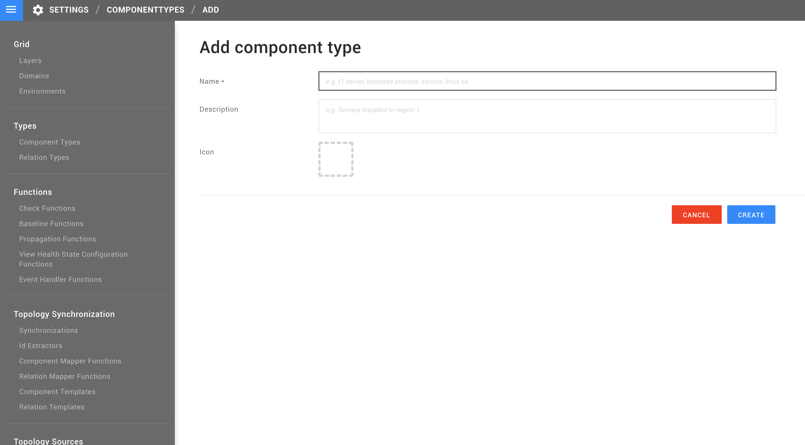
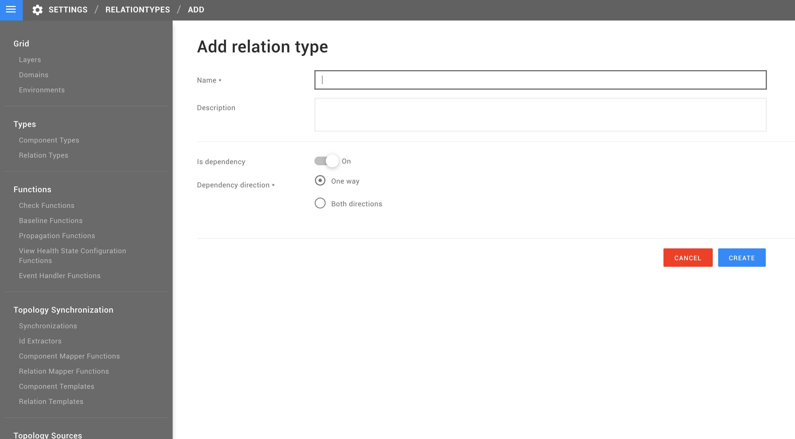
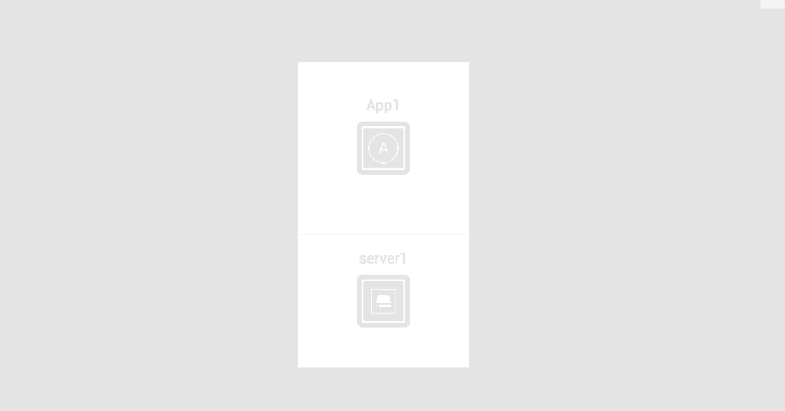

# Create a topology manually

StackState automatically creates a topology based on real-time data sources. _There is typically no need to create a topology manually_. There may be a few exceptions:

* Business processes are typically not discoverable and may therefore be placed on top of the topology manually.
* When developing an automatic topology synchronization, creating a topology manually at first and then exporting the results is a good first step.

## Manual Topology StackPack

If there is no automated data source available, your StackState instance you may not contain any of the building blocks needed to create a manual topology, such as layers, domains, environments, component types, relation types, etc.. You can create all those elements yourself, but if you want some sane defaults you can install the `Manual Topology StackPack`.

You can find the `Manual Topology StackPack` in the `StackPacks` section under the StackState menu. To install it, you just need to press the `INSTALL` button on a new instance of the StackPack.

## How to create components

First you need to define a component type. Go to `Settings -> Component Types -> Add Component Types`. From there you can define your own component types - the granularity is up to you. The component type consists of a `Name` field, a `Description` field \(optional\), and an Icon.

When all required information is provided for the component type, click CREATE, and proceed to the Explore Mode or to one of the views. Follow to the left side pane menu and locate big plus \(`+`\) sign described as Component Types. It opens a full list of the component types - it should contain the one you created. Click on it and provide all information required for the new component.

## How to create relations between components

Relations, like components, have predefined types that relation can belong to. Go to Settings -&gt; Relation Types -&gt; Add Relation Type. From there you need to provide input for a relation field `Name` and switch between dependency types for this relation.

Now you can navigate to the View that you want to use your relation on and drag-and-drop one component onto another to create a relation between them. Now pick your relation from the dropdown menu and that is it!

## How to export/import manual topology

See [manual topology backup/restore](../../setup/data-management/backup_restore/manual_topology_backup.md).

