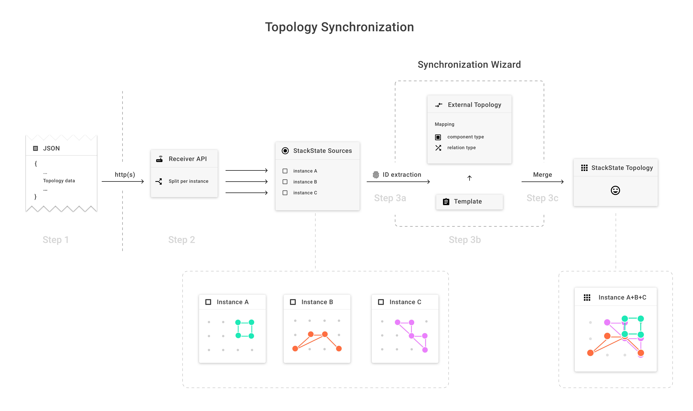

# Configure synchronizations


**This page describes StackState version 4.4.**

Go to the [documentation for the latest StackState release](https://docs.stackstate.com/).


## Overview

Synchronization allows you to automatically synchronize the topology of your stack to StackState based on information from such diverse systems as discovery tools, service registries, container management tools and CMDBs.

A synchronization is defined by a data source and a number of mappings from the external system topology data into StackState topology elements. The following image gives an overview of a synchronization pipeline:



## Synchronization pipeline

Broadly speaking, the synchronization framework makes two models to turn external data into StackState internal components and relations.

* The **External Topology model** interprets data and turns it into a graph as the data looks outside of StackState. 
* The **StackState Topology model** is a graph of components as viewed in StackState. 

A synchronization pipeline takes data through these two models using configurable scripts. The concepts in the pipeline are explained in depth below.

### Data source

The data source configures the plugin to connect to a specific instance of an external system. The Plugins section of the documentation contains more details on configurations of specific plugins. It is possible to define several synchronizations for the same data source.

### Id Extraction

`https://<my_instance>/#/settings/idextractors`

To turn external data into 'External Topology', we use id extraction. The goal of this step is to take the external data and produce the following information:

* A 'type' for the component/relation for differentiation later on
* An 'externalId'. An identifier with which the element is uniquely identifiable in the

  external source

* Multiple 'identifiers'. A set of identifiers that identify the object internally in StackState.

StackState comes with some default identity extractor functions, which should be suitable for most cases.

### Mapping

Next up is mapping. It specifies the transformation of external system topological data into StackState domain. Mapping is defined by model element type name that is coming from external system, mapping functions and mapping functions parameters.

* _Model Element Type Name_ - identifier of external element type, e.g. linux, hypervisor, java
* _Mapper Function_ - Mapper function that knows how to process the data of _Model Element Type_
* _Parameters_ - values for mapper function parameters, e.g. selecting template function that knows how to create specific StackState objects
* _Merge Strategy_ - indicates the merge strategy applied in case several components form a single entity

## Merge Strategy

The merge strategy is applied when multiple components get synchronized which have the same 'identifier'. At this point StackState has to decide what data to put into the resulting component, this is what the merge strategy configures. One of the following 4 options can be chosen:

* _Use Mine only_ - Discard the other components, use just the result of the current mapping
* _Use Theirs always_ - Discard the result of this mapping, go with the result of the other merged components
* _Merge, prefer mine_ - Merge fields that are mergable, if not take the data from this mapping
* _Merge, prefer theirs_ - Merge fields that are mergable, if not take the data from the other components

Mergable fields in the component are set fields \(like streams and checks\) and optional fields \(like version, description\). Mandatory fields \(like name, layer\) cannot be merged, for these always one has to be picked based on Mine/Theirs configuration.

## Mapping Functions

Mapping functions are defined by a groovy script and the input parameters that groovy script requires. The goal of a mapper function is to process topology data from an external system and prepare parameters for a template function. A mapper function is thus likely to be plugin specific.

There are two parameters that are specific to a mapper function:

* `ExtTopoComponent` or `ExtTopoRelation` - these are required, system parameters. Every Mapper Function must define one of these. They are used internally by StackState and cannot be changed using the API. They indicate the type of element \(component or relation\) that the mapper function supports.
* `TemplateLambda` - this is an optional parameter that specifies the template functions that must be used with a mapper function.

For example, below is a simple mapper function script:

```text
     def params = [
         'name': element.getExternalId(),
         'description': element.getData().getString("description").get()
     ];

     context.runTemplate(template, params)
```

### Create a mapper function

Mapping functions can be created from the **Settings** page in the StackState UI.

## Template functions

Template functions are defined by a JSON template and input parameters required by the template to render elements of StackState topology - mainly components or relations. When executed template functions substitutes all handlebar parameter references with values of input parameters. Template functions must define all parameters that template body refers to.

Template functions are used in cooperation with Mapping functions to create StackState topology elements. Mapper function parse topological data of external system and prepares input parameters for Template function.

### Create template functions from existing components and relations

An easy way to create template functions is to create them based on existing component or relation. This option is available in context menu of Component or Relations details as _+ Add as template_. After adding component or relation as template, its template function will appear in the Templates list in the Templates pane.

### Manually create a template function

Below are some examples templates to create components. Note that a template is not limited to rendering only components and relations. It can render JSON for any StackState domain object that is supported by restapi, for example a Domain, Layer, Check or Stream. and also not only single object, but several multiple objects with one template.

* A simple template that creates a component. Its template function must define the parameters with the following names: `name`, `description`, `componentTypeId`, `layerId`, `domainId` and `environmentId`.

  ```text
          [{
            "_type": "Component",
            "checks": [],
            "streams": [],
            "labels": [],
            "name": "{{ name }}",
            "description": "{{ description }}",
            "type" : {{ componentTypeId }},
            "layer": {{ layerId }},
            "domain": {{ domainId }},
            "environments": [{{ environmentId }}]
          }]
  ```

* A template to create a relation between the components `{{ sourceId }}` and `{{ targetId }}`. Its template Function must define parameters with the following names: `name`, `description`, `relationTypeId`, `sourceId` and `targetId`.

  ```text
         [{
           "_type": "Relation",
           "checks": [],
           "streams": [],
           "labels": [],
           "name": "{{ name }}",
           "description": "{{ description }}",
           "type": {{ relationTypeId }},
           "source": {{ sourceId }},
           "target": {{ targetId }}
         }]
  ```

