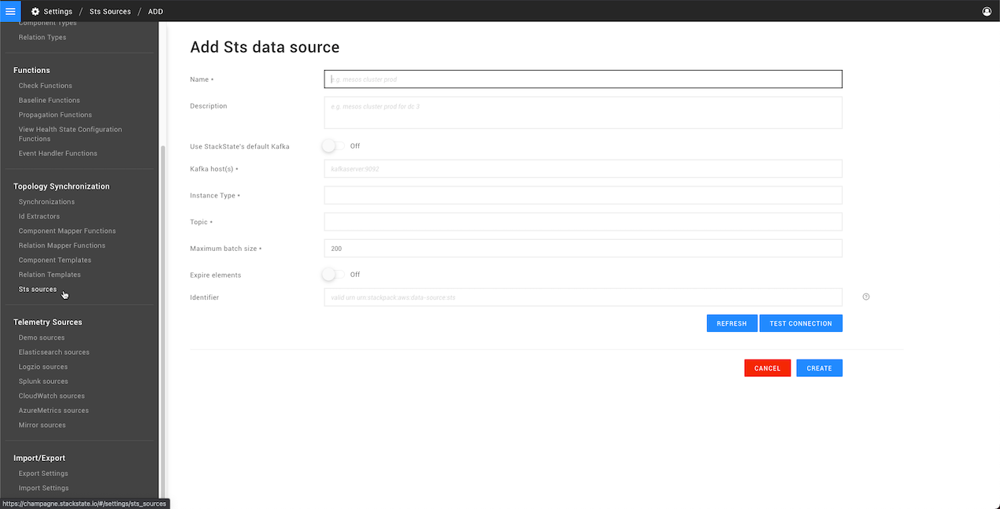

# Topology sources

## Overview

Topology sources are used to get data from the Kafka bus, which receives the data from the StackState topology API. They can be configured from the StackState UI page **Settings** &gt; **Topology Synchronization** &gt; **Sts sources**. Each configured topology data source is listed here, together with its connection status and settings. You can also edit, delete and export topology data sources from this list.

## Add a new topology data source

To add a new topology data source, click **ADD STS DATA SOURCE** from the screen **Settings** &gt; **Topology Synchronization** &gt; **Sts sources** and enter the required configuration.

The screen contains the following fields:

| Field | Description |
| :--- | :--- |
| **Name** | The name of the data source. |
| **Description** | Optional. A description of the data source. |
| **Use StackState's default Kafka** | Select to use either the default Kafka bus on the StackState server or a separate Kafka instance. |
| **Kafka host\(s\)** | Required if StackState's default Kafka is not used. |
| **Instance type** | The integration type. Select from the dropdown list. This list is populated with the `type` passed in the `instance` field in the [source JSON data](topology_synchronization.md#topology-json-format). |
| **Topic** | The Kafka topic to retrieve data from. Select from the dropdown list. This list is populated based on the `type` and `url` passed in the `instance` field in the [source topology JSON](topology_synchronization.md#topology-json-format). |
| **Maximum batch size** | The maximum number of components from a JSON file that are processed in a single batch. Used for rate limiting. |
| **Expire elements** | When enabled, topology elements will be set to `expired` if they do not appear in this data source for a configured amount of time. Expired elements will be automatically removed. |
| **Expire after \(minutes\)** | When **Expire elements** is enabled, this is the timeout period after which elements should be expired. |
| **Identifier** | Optional. A valid URN. |


**Snapshot mode**

When topology data is sent in snapshot mode, it is not necessary to expire elements. Each snapshot represents a complete landscape instance and elements missing from the snapshot will be automatically deleted.

See the [Topology JSON format description](topology_synchronization.md#topology-json-format) for details.


## See also

* [Topoology synchronization](topology_synchronization.md)
* [Topology JSON format](topology_synchronization.md#topology-json-format)

