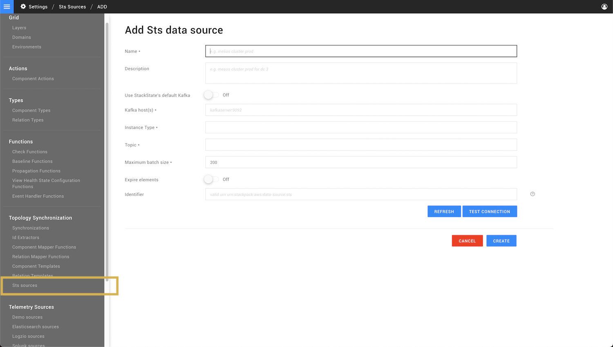

# Topology sources

## Overview

Topology sources are used to get data from the Kafka bus, which receives the data from the StackState topology API. They can be configured by power users and StackState administrators in the StackState UI page **Settings** > **Topology Synchronization** > **Sts sources**.

On this screen, each configured topology data source reports its connection status and settings. You can also edit, delete and export the configured 

## Add new topology data source

To add a new topology data source, click **ADD STS DATA SOURCE** from the screen **Settings** > **Topology Synchronization** > **Sts sources** and enter the required configuration.

The screen contains the following fields:

| Field | Description |
| :--- | :--- |
| **Name** | The name of the data source. |
| **Description** | Optional. A description of the data source. | 
| **Use StackState's default Kafka** | Use the default Kafka bus on the StackState server or a separate Kafka instance. | 
| **Kafka host(s)** | Required if StackState's default Kafka is not used. |
| **Instance type** | The integration type. Select from the dropdown list. | 
| **Topic** | The Kafka topic to retrieve data from. Select from the dropdown list, which is populated based on the selected `instance type`. | 
| **Maximum batch size** | The maximum number of components from a JSON file that are processed in a single batch. Used for rate limiting. | 
| **Expire elements** | When enabled, topology elements will be set to **expired** if they do not appear in this data source for a configured amount of time. Expired elements will be removed automatically | 
| **Identifier** | Optional. A valid URN. |


 **snapshot mode**
Expiry of elements is not necessary when the topology data is sent in snapshot mode. Each snapshot represents a complete landscape instance and elements missing from the snapshot will be automatically deleted. 

See the [Topology JSON format description](/configure/topology/topology_synchronization.md#topology-json-format).


## See also

- [Topoology synchronization](/configure/topology/topology_synchronization.md)
- [Topology JSON format](/configure/topology/topology_synchronization.md#topology-json-format)