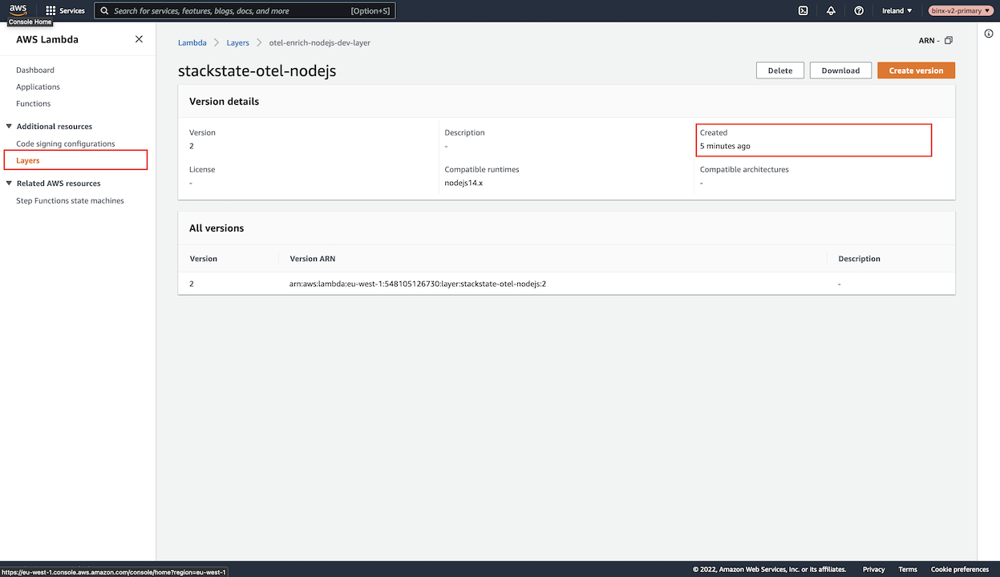
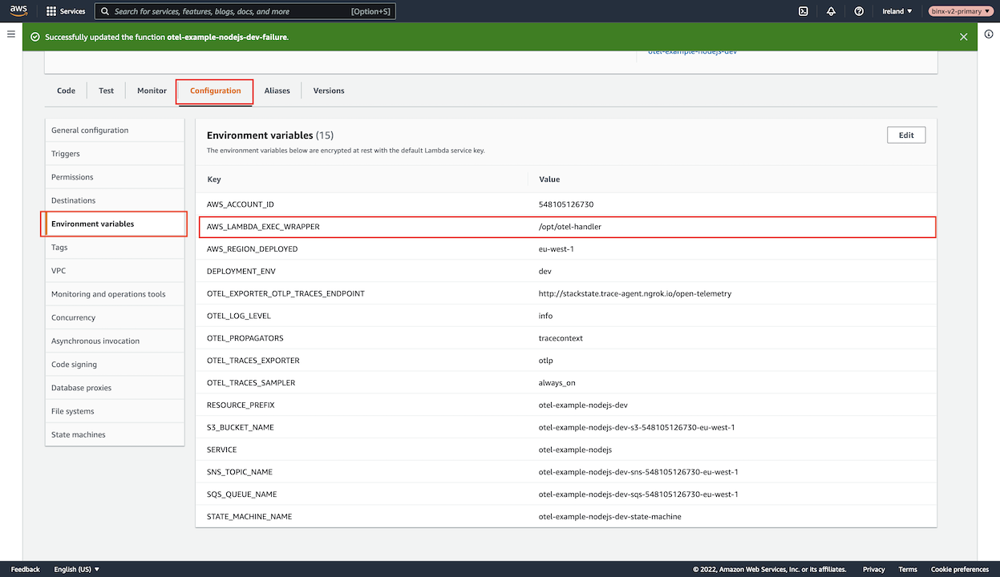

# OpenTelemetry - AWS - NodeJS

## Overview

StackState provides an out-of-the-box OpenTelemetry solution by providing a modified OpenTelemetry Lambda Layer that gives a plug-and-play user experience (Based on the officially released [AWS Distro for OpenTelemetry Lambda](https://aws-otel.github.io/docs/getting-started/lambda)).

Your Lambda function can include this OpenTelemetry Lambda Layer solution to collect trace data without changing any code.

## Restrictions

### OpenTelemetry Tracing Service Support

We support the following AWS Services / External Services with AWS OpenTelemetry Tracing

- Communication from **AWS Lambda** to 
  - **AWS Lambda**
  - **AWS SQS**
  - **AWS SNS**
  - **AWS S3**
  - **AWS Step Function**
  - **Any HTTP Endpoint** using
    - Node HTTP
    - Node HTTPS
    - Axios

## Setup

### Prerequisites

To set up OpenTelemetry traces, you need to have:
* AWS Lambda scripts running `NodeJS 14.x (or later)`
  * These will be the Lambda functions you wish to add OpenTelemetry support to.
* [AWS v2 StackPack](../../../../stackpacks/integrations/aws/aws.md) installed. The AWS StackPack will deploy the latest supported OpenTelemetry Lambda Layer which is required for AWS OpenTelemetry functionality.
* [StackState Agent V2](../../../../setup/agent/about-stackstate-agent.md) installed on a machine, Your AWS lambda should be able to communicate with this Agent.


## Installation Step 1 - Adding the Lambda Layer

Head over to your [AWS Lambda Layers](https://console.aws.amazon.com/lambda/home#/layers) page listing all your available ***Lambda Layer*** functions.


Change the region in the top-right corner to the region where you deployed the [AWS StackPack](../../../../stackpacks/integrations/aws/aws.md) cloudformation template.


Verify that there's a **Lambda Layer** called `stackstate-otel-nodejs`.
  - If the Lambda Layer is not present, then the AWS v2 StackPack installed may not be the latest one containing the Lambda Layer.
  - Follow the [AWS v2 StackPack](../../../../stackpacks/integrations/aws/aws.md) documentation to verify the installation of this StackPack

OR

  - Lambda Layers are ***AWS REGION*** based meaning, if you deployed the [AWS StackPack](../../../../stackpacks/integrations/aws/aws.md) cloudformation template in another region other than where your targeted Lambda lives then you will also have to deploy the [AWS StackPack](../../../../stackpacks/integrations/aws/aws.md) cloudformation template inside the same region.
  
Head over to your [Lambda functions](https://console.aws.amazon.com/lambda/home#/functions) page and navigate to the Lambda you wish to add OpenTelemetry support to.

Underneath the `Code` tab, scroll down to the `Layers` section and click the `Add a layer` button on the right side.


Select the `Custom Layer` radio box under the `Choose a layer` section. This will show two dropdowns at the very bottom of the page.


In the first dropdown, select the Lambda Layer `stackstate-otel-nodejs`


In the second dropdown, select ***`THE LATEST VERSION`*** number, and click the `Add` button in the bottom right corner


## Installation Step 2 - Tracing

An ***REQUIREMENT*** to allow tracing to work is something called X-Ray headers.

To achieve this, you can do ***ONE*** of the following steps:

- Enable ***Active Pass-through*** on your Lambda Function. 
  - This means that the X-Ray headers are available, but X-Ray is still disabled; thus, ***NO EXTRA COSTS*** will be accumulated through using Pass-Through X-Ray
  - You can only achieve this through a CLI command

***OR***

- Enable X-Ray Active Tracing on the Lambda function. 
- This is the more expensive option as X-Ray will charge per Lambda execution.

### How to enable Active Pass-through

To enable Active Pass-through you need the [AWS CLI](https://docs.aws.amazon.com/cli/latest/userguide/getting-started-install.html) installed. You can follow the steps [on this link](https://docs.aws.amazon.com/cli/latest/userguide/getting-started-install.html) to set up AWS CLI on your machine.

After you install the AWS CLI run the following command in your terminal to set up your AWS Credentials

- `aws configure`

To verify if your Lambda function is running in Active Pass-Through run the following command:

```shell
aws lambda get-function-configuration \
--region <CHANGE TO THE REGION OF YOUR LAMBDA FUNCTION> \
--function-name <CHANGE TO THE NAME OF YOUR LAMBDA FUNCTION> \
--query 'TracingConfig.Mode'
```

You should be greeted with one of the following messages:
- `Disabled` or `None`
- `Active`
- `PassThrough`

If the outcome of the command is `Active` or `PassThrough` then there is no need for the following command.

Run this command if your `get-function-configuration` cli command was `Disabled` or `None`

```shell
aws lambda update-function-configuration \
--region <CHANGE TO THE REGION OF YOUR LAMBDA FUNCTION> \
--function-name <CHANGE TO THE NAME OF YOUR LAMBDA FUNCTION> \
--tracing-config "Mode=PassThrough"
```

This will now change your Lambda to Pass-Through. 

You can verify this by running the following command again
- Unfortunately there is no way to verify this on the Console only through a CLI command

```shell
aws lambda get-function-configuration \
--region <CHANGE TO THE REGION OF YOUR LAMBDA FUNCTION> \
--function-name <CHANGE TO THE NAME OF YOUR LAMBDA FUNCTION> \
--query 'TracingConfig.Mode'
```

### How to enable X-Ray Active Tracing

To enable Active X-Ray Tracing head over to your `Configuation` Tab inside your Lambda.

Then under the `Monitoring and operations tools` section click the `Edit` button


Check the radio box `Active tracing` to true and click the `Save` button in the bottom right corner


You can verify if Tracing is enabled by looking at the `Active tracing` block


## Installation Step 3 - Environment Variables

For OpenTelemetry to start capturing traces certain environment variables is required.

Please create all the following env variables under the `Configuration` tab under the `Environment variables` section. You can click the `Edit` button to add more


- Note that the env variable responsible for rooting information from your Lambda to the StackState Agent is `OTEL_EXPORTER_OTLP_TRACES_ENDPOINT`
- The StackState Agent has a built-in trace endpoint `/open-telemetry` which lives under the `8126` port

| Key                                | Description                                                                                                                                                                 | Value                                |
|------------------------------------|-----------------------------------------------------------------------------------------------------------------------------------------------------------------------------|--------------------------------------|
| AWS_LAMBDA_EXEC_WRAPPER            | This will allow the Lambda to root execution through OpenTelemetry allowing OpenTelemetry to setup everything required to capture traces when your Lambda function executes | /opt/otel-handler                    |
| OTEL_LOG_LEVEL                     | The amount of logging showed within your Lambda post-execution window                                                                                                       | info                                 |
| OTEL_PROPAGATORS                   | The OpenTelemetry propagator context                                                                                                                                        | tracecontext                         |
| OTEL_TRACES_EXPORTER               | What type of export are we using with OpenTelemetry                                                                                                                         | otlp                                 |
| OTEL_TRACES_SAMPLER                | When should we sample execution data                                                                                                                                        | always_on                            |
| OTEL_EXPORTER_OTLP_TRACES_ENDPOINT | This is the endpoint where your StackState Trace lives. Within your Agent there is a port `8126` and a path `/open-telemetry` that allows us to capture traces              | http://localhost:8126/open-telemetry |

## Installation Step 4 - Final Notes

After you have done the installation steps 1, 2 and 3 you should be ready to send traces yo your StackState Agent.

Please note that the above is required for every Lambda function you wish to add OpenTelemetry tracing to.

The Upgrade process requires far fewer steps as step 2 and 3 will not have to be repeated.

You can test your OpenTelemetry by executing your Lambda function, and you should see new Topology Relations (Within a minute or so) being created on your StackState UI 

Remember the only new Topology relations you will see is if your Lambda is communicating with any of the following services:
- SQS
- SNS
- S3
- Lambda
- Step Function
- HTTP Endpoint

## Upgrade OpenTelemetry

To upgrade your OpenTelemetry Lambda Layer to the latest version, including your Lambda function using the Lambda Layer follow these steps:

Make sure you installed the latest [AWS v2 StackPack](../../../../stackpacks/integrations/aws/aws.md)
  - The [AWS v2 StackPack](../../../../stackpacks/integrations/aws/aws.md) contains the latest OpenTelemetry Lambda Layer in the Cloudformation template

After you installed the latest StackPack there should be a new version for the `stackstate-otel-nodejs` lambda layer

This can be confirmed by heading over to your [AWS Lambda Layers](https://console.aws.amazon.com/lambda/home#/layers) page


Clicking on the `stackstate-otel-nodejs` layer to enter and view the details of the layer

The `Created` box on the right side should have a relative new time when it was created.



Alternatively you can head over to any of you current Lambda Functions that is currently using the `stackstate-otel-nodejs` layer and compare what version they are using against the version that is displayed under the `Version` block for the layer.

Head over to a Lambda function using the OpenTelemetry `stackstate-otel-nodejs` Lambda layer 

Scroll down to the `Layers` section, and click the `Edit` button on the right side


Change the version for the `stackstate-otel-nodejs` layer to the latest version.


and that should be it your Lambda will now use the latest OpenTelemetry Layer

## Disabling OpenTelemetry Traces

To disable OpenTelemetry tracing you can simply head over to your Lambda's `configuration` tab and under the `Environment variables` section remove the environment variable called `AWS_LAMBDA_EXEC_WRAPPER`.



This will disable the code routing through the OpenTelemetry Lambda Layer and restore your Lambda to the original running state

## See also


