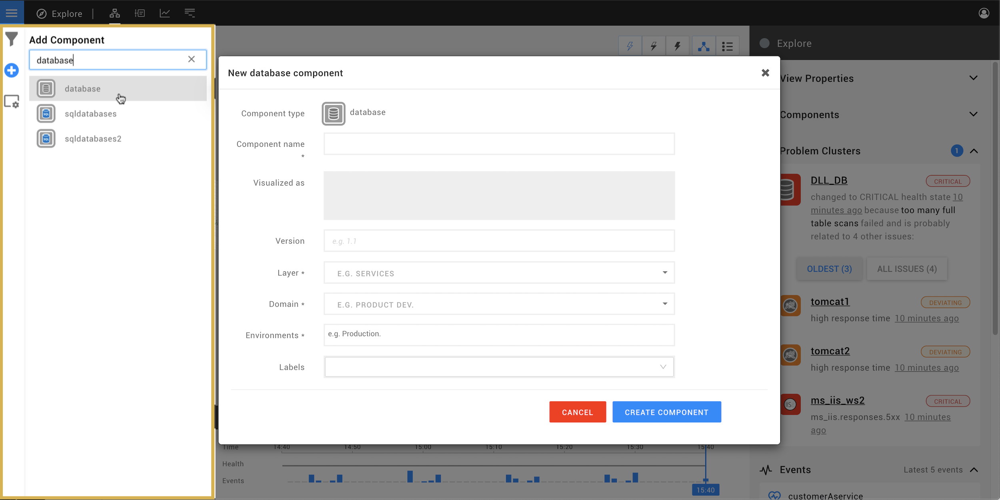

# How-to template

Start with a brief intro explaining:
- What is going to be done?
- Why would you do this?
  - background
  - benefits
  - problems that will be solved
- Are there any other ways to get to this outcome? (ie. are you sure you need to do this)
- Are there any known problems relating to this action?

## Before you begin

Pre-requisites for the action. Think environment requirements, StackState requirements, user permissions.

## The thing we are going to do

Short intro if it is relevant to break this into blocks of work. The example below is taken from the page [create a topology manually](/configure/how_to_create_manual_topology.md).

### Install the Manual Topology StackPack (optional)

If your StackState instance does not have an automated data source is available, the building blocks needed to create a manual topology may not be available. The [Manual Topology StackPack](/stackpacks/integrations/manualtopo.md) will add some default elements to work with (such as layers, domains, environments, component types and relation types). You can create these elements yourself, but the Manual Topology StackPack is a good starting point.

You can find the Manual Topology StackPack in the StackPacks section under the StackState menu. To install it, press the INSTALL button on a new instance of the StackPack.

### Create a new component type (optional)

All components in StackState have a component type. If your StackState instance has an automated data source available or if you [installed the Manual Topology StackPack](#install-the-manual-topology-stackpack-optional), some default component types will already be available. You can optionally add your own component types, for example ..., the granularity is up to you.

1. In the StackState UI, go to Settings -> Component Types -> Add Component Type.
2. Enter the component type details:
  - **Name** - The name of the component type. This will be visible in ...
  - **Description** (optional) - This will be used ... and is helpful to ...
  - **Icon** (optional) - This will be visible in ...
3. Click CREATE to save the new component type.

### Create a component

You can manually add a component in the StackState UI from the [Topology Perspective](/use/perspectives/topology-perspective.md).

1. In the StackState UI go to the Topology Perspective of a [view](/use/views.md) or explore mode.
2. Click on the big plus (+) sign on the left side of the screen (**Component Types**).
  - A full list of the available component types is displayed.
3. Select the type of component you want to create. If the component type you want to add is not include in the list you can [create a new component type](#create-a-component-type-optional).
4. Enter the component details:
  - **Component name** - ...  This will be visible in ...
  - **Visualized as** (optional) - This will be used ... and is helpful to ...
  - **Version** (optional) - This will be used ... and is helpful to ...
  - **Layer** - This will be used ... and is helpful to ...
  - **Domain** - This will be used ... and is helpful to ...

### Create a relation type (optional)

...

### Add relations between components

...

1.

### Work block n

Short intro.

1. Steps.
2. To.
3. Complete.

## See also

End the page with pointers to relevant, further info. This might just be a list with any links already included in the page. If the StackPack is used in a tutorial, include that here.

- link 1
- link 2
- link 3
