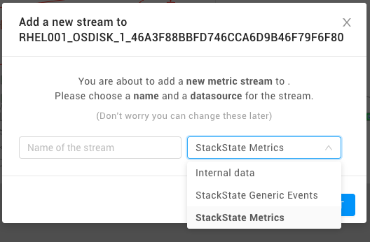
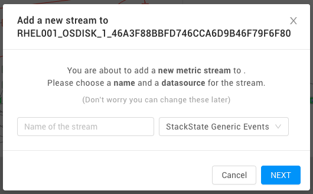

# How to develop Agent checks

This document covers how to create your first check with Agent V3 Check API. Following topics are covered in this document: the Agent directory structure, configuring your check, writing your first check, sending topology, metrics, events, and service checks as well as how to add external python dependencies and putting it all together.

## Installing Agent V2 StackPack

To install this StackPack navigate to StackState’s StackPacks page using left menu and locate the “StackState Agent V2” section. Click the Agent V2 icon and this opens the installation page. Click the **INSTALL** button and follow installation instructions provided by the StackPack.

## Directory Structure

Before starting your first check it's worth understanding the checks directory structure. There are two places that you will need to add files for your check. The first is the `checks.d` folder, which lives in your Agent root.

For all Linux systems, you should find it at:

```text
/etc/stackstate-agent/checks.d/
```

For Windows Server &gt;= 2008 you should find it at:

```text
C:\Program Files (x86)\StackState\StackState Agent\checks.d\

OR

C:\Program Files\StackState\StackState Agent\checks.d\
```

The configuration folder is `conf.d` which also lives in your Agent root.

For Linux, you should find it at:

```text
/etc/stackstate-agent/conf.d/
```

For Windows, you should find it at:

```text
C:\ProgramData\StackState\StackState Agent\conf.d\

OR

C:\Documents and Settings\All Users\Application Data\StackState\StackState Agent\conf.d\
```

You can also add additional checks to a single directory, and point to it in `StackState.yaml`:

```text
additional_checksd: /path/to/custom/checks.d/
```

For the remainder of this document these paths will be referred to as `checks.d` and `conf.d`.

## Check Configuration

Each check has a configuration directory and file that will be placed in the `conf.d` directory. Configuration is written using [YAML](https://yaml.org/). The folder name should match the name of the check \(for example,: `example.py` and `example.d` containing the `conf.yaml` configuration file\). We will be using the StackState "Skeleton" / bare essentials check and configuration as a starting point.

The configuration file for the "Skeleton" check has the following structure:

```text
init_config:

instances:
  - url: "some_url"
    authentication:
      username:
      password:
    # min_collection_interval: 30 # use in place of collection_interval for Agent V2.14.x or earlier 
    collection_interval: 30 # the collection interval in seconds. This check will run try to run every 30 seconds
```

YAML files must use spaces instead of tabs.

### init\_config

The _init\_config_ section allows you to have an arbitrary number of global configuration options that will be available on every run of the check in `self.init_config`.

### instances

The _instances_ section is a list of instances that this check will be run against. Your `check(...)` method is run once per instance each collection interval. This means that every check will support multiple instances out of the box. A check instance is an object that should contain all configuration items needed to monitor a specific instance. An instance is passed into the execution of the `check` method in the `instance` parameter. `collection_interval` can be added to define how often the check should be run. If the value is set to 30, it means that this check will be scheduled for collection every 30 seconds. If the check runtime exceeds the `collection_interval`, the Agent will warn in the Agent log with `Check <name> did not finish execution with the defined collection_interval time '<time>', skipping execution...`. The default is `40`, if no `collection_interval` is specified. The `collection_interval` setting has superseded the `min_collection_interval` setting that was used before. The Agent will still accept the `min_collection_interval` setting and interpret it as if the `collection_interval` was specified.

To synchronize multiple instances in StackState you have to create a multi-tenant StackPack.

➡️ [Learn more about developing StackPacks.](../stackpack/)

### Setting up your check configuration

Create a directory named `{your_check_name}.d` inside the `conf.d` directory. The YAML configuration below can be used as a starting point for your check configuration. Save it to a file called `conf.yaml` in the `conf.d/{your_check_name}.d/` directory.

```text
instances:
  - url: "some_url"
    authentication:
      username:
      password:
```

## First Check

Now you can start defining your first check. The following "Skeleton" check can be used as a good starting point:

```text
from stackstate_checks.base.checks.v2.base import AgentCheckV2
from stackstate_checks.base import ConfigurationError, AgentIntegrationInstance

class ExampleCheck(AgentCheckV2):

    # This method should also be overriden to uniquely identify your integration instance. The AgentIntegrationInstance is synchronized by the StackState Agent V2 StackPack. All topology elements produced by this check can be found by filtering on the `integration-type:{example}` and `integration-url:{instance_url}` tags in StackState for this example.
    def get_instance_key(self, instance):
        if 'url' not in instance:
            raise ConfigurationError('Missing url in topology instance configuration.')
        instance_url = instance['url']
        return AgentIntegrationInstance("example", instance_url)

    # check is the entry point of your Agent check, `instance` is a dictionary containing the instance that was read from conf.yaml  
    def check(self, instance):
        self.log.debug("starting check for instance: %s" % instance)
        ...
        self.log.debug("successfully ran check for instance: %s" % instance)
```

### Setting up your check

You can now take the "Skeleton" Check snippet given above and save inside a file named: `{your_check_name}.py` in the `checks.d` directory.

### Load values from the instance config

Values can be loaded from the instance config object in the following ways:

```text
# gets the value of the `url` property
url = instance['url']

# gets the value of the `default_timeout` global config from the init_config section of conf.yaml or defaults to 5
default_timeout = self.init_config.get('default_timeout', 5)

# gets the value of the `timeout` property or defaults `default_timeout` and casts it to a float data type. This can be done to override any global configuration on an instance basis.
timeout = float(instance.get('timeout', default_timeout))
```

### StackState Topology Snapshots

Components and relations can be sent as part of a snapshot. A snapshot represents the total state of some external topology. By putting components and relations in a snapshot, StackState will persist all the topology elements present in the snapshot, and remove everything else for the topology instance. Creating snapshots is facilitated by two functions, these are already in place in the StackState "Skeleton" check:

* `self.start_snapshot()` - used to start a snapshot. Internally, the `AgentCheck` interface uses the `get_instance_key` function to uniquely identify this topology instance.
* `self.stop_snapshot()` - used to stop a snapshot. This should be done at the end of the check, after all data has been submitted.

#### Disable snapshots

You can disable snapshots by setting `with_snapshots=False` when you define a `TopologyInstance`. This replaces the `start`/`stop_snapshot()` invocations described above.

### Send Topology

Topology data can be submitted using the `self.component()` and `self.relation()` functions in the `AgentCheck` interface. The example below shows how to submit two components with a relation between them:

```text
self.component("this-host-unique-identifier", "Host", {
    "name": "this-host",
    "domain": "Webshop",
    "layer": "Machines",
    "identifiers": ["urn:host:/this-host-fqdn"],
    "labels": ["host:this-host", "region:eu-west-1"],
    "environment": "Production"
})

self.component("some-application-unique-identifier", "Application", {
    "name": "some-application",
    "domain": "Webshop",
    "layer": "Applications",
    "identifiers": ["urn:application:/some-application"],
    "tags": ["application:some-application", "region:eu-west-1", "hosted_on:this-host"],
    "environment": "Production",
    "version": "0.2.0"
})

self.relation("some-application-unique-identifier", "this-host-unique-identifier", "IS_HOSTED_ON", {})
```

This creates two components in StackState. One for the host named `this-host` and one for an application named `some-application`. The `domain` value is used in the horizontal grouping of the components in StackState and `layer` is used for vertical grouping. The `labels`, `tags` and `environment` add some metadata to the component and can also be used for filtering in StackState. An `IS_HOSTED_ON` relation is created between `some-application` and `this-host`. The `labels` and `tags` fields can also be used on relations to add some metadata. The component types \(`Host`, `Application`\) and relation type \(`IS_HOSTED_ON`\) will be automatically created in StackState and can later be used in the synchronization to create mappings for the different types.

The identifiers and the external identifier, for example `some-application-unique-identifier` will be used as the StackState ID. The `external identifer` should be unique within this integration.

#### Merge Identifiers

StackState uses the `identifiers` to merge components across different integrations. If components have a matching identifier they will be merged.

Given the following example:

```text
# check1.py
self.component("this-host-unique-identifier-integration-a", "Host", {
    "name": "this-host",
    "identifiers": ["urn:host:/this-host-fqdn"],
})

# check2.py
self.component("this-host-unique-identifier-integration-b", "Host", {
    "name": "this-host",
    "identifiers": ["urn:host:/this-host-fqdn"],
})
```

These two components will be merged into a single component called `this-host` containing data from both integrations.

➡️ [Learn more about the Agent Check Topology API](agent-check-api.md)

### Send Metrics

The StackState Agent Check interface supports various types of metrics.

Metric data can be submitted using i.e. the `self.gauge()` function, or the `self.count()` function in the `AgentCheck` interface. All metrics data is stored in the `StackSate Metrics` data source that can be mapped to a metric telemetry stream for a component/relation in StackState:



The example below submits a gauge metric `system.cpu.usage` for our previously submitted `this-host` component:

```text
self.gauge("system.cpu.usage", 24.5, tags=["hostname:this-host"])
```

Note: It's important to have a tag or combination of tags that you can use to uniquely identify this metric and map it to the corresponding component within StackState.

➡️ [Learn more about the Agent Check Metric API](agent-check-api.md)

### Send Events

Events can be submitted using the `self.event()` function in the `AgentCheck` interface. Events data is stored in the `StackState Generic Events` data source that can be mapped to a telemetry stream on a component in StackState:



The example below submits an event to StackState when a call to the instance that is monitored exceeds some configured timeout:

```text
self.event({
    "timestamp": int(time.time()),
    "source_type_name": "HTTP_TIMEOUT",
    "msg_title": "URL timeout",
    "msg_text": "Http request to %s timed out after %s seconds." % (instance_url, timeout),
    "aggregation_key": "instance-request-%s" % instance_url
})
```

➡️ [Learn more about the Agent Check Event API](agent-check-api.md)

### Health Synchronization

StackState can ingest check states from external monitoring systems. Before getting started, you can read up on the core concepts of [health Synchronization](../../../configure/health/health-synchronization.md).

To set up a health synchronization stream within a check, the following function needs to be defined:

```text
from stackstate_checks.base import AgentCheck, ConfigurationError, HealthStreamUrn, HealthStream

...

class ExampleCheck(AgentCheck):

...

    def get_health_stream(self, instance):
        if 'url' not in instance:
            raise ConfigurationError('Missing url in topology instance configuration.')
        instance_url = instance['url']
        return HealthStream(HealthStreamUrn("example", instance_url))

...
```

This function specifies what health synchronization stream this Agent check will produce to. Having this function defined will enable the `self.health` api on the Agent Check.

### Health Synchronization Snapshots

Like with topology, health data is presented to StackState using snapshots. This allows for removal of health information \(check states\) when they no longer exist in the source monitoring system. Snapshots are created by two functions:

* `self.health.start_snapshot()` - used to start a health snapshot.
* `self.health.stop_snapshot()` - used to stop the snapshot, signaling that all submitted data is complete. This should be done at the end of the check, after all data has been submitted. If exceptions occur in the check, or for some other reason not all data can be produced, this function should not be called.

  **Send Check State**

Check states can be sent through the health synchronization API using the `self.health.check_state()` functions in the `AgentCheck` interface.

In the example below, a check state is created in StackState with the health value CRITICAL.

* The check is attached to the component or relation matching the `topology_element_identifier`.
* The `check_state_id` is used to distinguish check states within the current health stream.

Check states can be sent through the health synchronization api, using the `self.health.check_state()` functions in the `AgentCheck` interface. The example below shows how to submit the data:

```text
from stackstate_checks.base import Health

...

self.health.check_state(
  check_state_id="check_state_from_example_1",
  name="Example check state",
  health_value=Health.CRITICAL,
  topology_element_identifier="urn:component/the_component_to_attach_to",
  message="Optional clarifying message"
)
```

If after following the previous steps you health data doesn't show in StackState, there is a [troubleshooting guide](../../../configure/health/debug-health-sync.md) for the health synchronization.

### Send in Stream Definitions and Health Checks

Stream Definitions and Health Checks for StackState can be sent in with Topology. This allows you to map telemetry streams with health checks onto components in your integration, leaving no work to be done in StackState. This example below sets up a metric stream called `Host CPU Usage` with a `Maximum Average` check in StackState on the `this-host` component.

```text
# import
from stackstate_checks.base import AgentCheck, AgentIntegrationInstance, MetricStream, MetricHealthChecks# add this_host component with a metric stream and health check

this_host_cpu_usage = MetricStream("Host CPU Usage", "system.cpu.usage",
                                   conditions={"tags.hostname": "this-host", "tags.region": "eu-west-1"},
                                   unit_of_measure="Percentage",
                                   aggregation="MEAN",
                                   priority="HIGH")

cpu_max_average_check = MetricHealthChecks.maximum_average(this_host_cpu_usage.identifier, "Max CPU Usage (Average)", 75, 90)

self.component("this-host-unique-identifier", "Host",
    data={
        "name": "this-host",
        "domain": "Webshop",
        "layer": "Machines",
        "identifiers": ["urn:host:/this-host-fqdn"],
        "labels": ["host:this_host", "region:eu-west-1"],
        "environment": "Production"
    },
    streams=[this_host_cpu_usage],
    checks=[cpu_max_average_check]
)
```

We create a `MetricStream` on the `system.cpu.usage` metric with some conditions specific to our component. We then create a `maximum_average` check on our metric stream using `this_host_cpu_usage.identifier` . The stream and check are then added to the streams and checks list in our `this-host` component.

➡️ [Learn more about the Agent Check Telemetry API](agent-check-api.md#sending-streams-and-checks)

### Send Service Checks

Service Checks are used to submit the state of the Agent integration instance. Service checks can be submitted using the `self.service_check` method in the `AgentCheck` interface. Service check data is also stored in the `StackState Generic Events` data source.

The example below submits a service check to StackState when it's verified that the check was configured correctly and it can communicate with the instance that is monitored:

```text
# some logic here to test our connection and if successful:
self.service_check("example.can_connect", AgentCheck.OK, tags=["instance_url:%s" % instance_url])
```

The service check can produce the following states:

* AgentCheck.OK
* AgentCheck.WARNING
* AgentCheck.CRITICAL
* AgentCheck.UNKNOWN

➡️ [Learn more about the Agent Check Service Check API](agent-check-api.md)

### Add Python Dependencies

Sometimes your check may require some external dependencies. To solve this problem StackState Agent V2 is shipped with python and pip embedded. When installing the dependencies needed by your custom check you should use the embedded pip to do so. This executable for pip can be found here:

For Linux, you should find it at:

```text
/opt/stackstate-agent/embedded/bin/pip
```

For Windows, you should find it at:

```text
C:\Program Files\StackState\StackState Agent\embedded\bin\pip.exe
```

### Test your Check

Custom Agent checks need to be called by the Agent. To test this, run:

For Linux:

```text
sudo -u stackstate-agent -- stackstate-agent check <CHECK_NAME>
```

For Windows:

```text
C:\Program Files\StackState\StackState Agent\embedded\agent.exe check <CHECK_NAME>
```

This executes your check once and displays the results.

Once you are happy with the result of your check, you can restart the StackState Agent V2 service and your check will be scheduled alongside the other Agent checks.

For Linux:

```text
sudo service stackstate-agent restart
```

For Windows:

```text
"C:\Program Files\StackState\StackState Agent\embedded\agent.exe" restart-service
```

## Troubleshooting

To troubleshoot any issues in your custom check, you can run the following status command and find your check in the output:

For Linux:

```text
sudo -u stackstate-agent -- stackstate-agent status
```

For Windows:

```text
"C:\Program Files\StackState\StackState Agent\embedded\agent.exe" status
```

If your issue continues, contact Support with the help page that lists the paths it installs.

## See also

* [Agent check API](agent-check-api.md)
* [Connect an Agent check with StackState using the Custom Synchronization StackPack](connect_agent_check_with_stackstate.md)
* [Developer guide - Custom Synchronization StackPack](../custom_synchronization_stackpack/)

