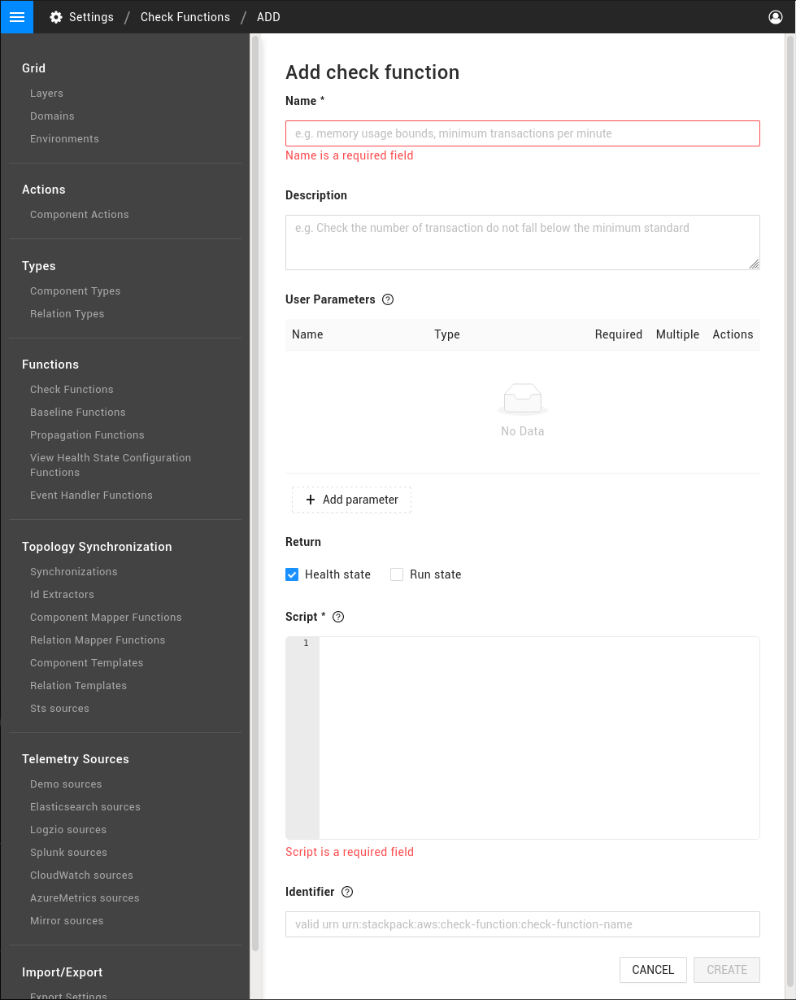

# Check functions

## Overview

Check functions are run by [health checks](../../../use/checks-and-monitors/add-a-health-check.md) in StackState. They can process metric data, logs or events to trigger a change in health status of a component or relation. A number of check functions are shipped together with StackState, or you can write your own check function as a groovy script.

## Create a custom check function

To add a custom check function:

1. In the StackState UI, go to **Settings** &gt; **Functions** &gt; **Check Functions**.
2. Click **ADD CHECK FUNCTION**.
3. Enter the required settings:
   * **Name** - A name to identify the check function.
   * **Description** - Optional. A description of the check function.
   * **User parameters** - These are parameters that must be entered by the user when a check is added to a component. For details, see the section on [parameters](check-functions.md#parameters).
   * **Return** - The type of state returned by the function. 
   * **Script** - The groovy script run by the function. Returns a [result](check-functions.md#result).
   * **Identifier** - Optional. A unique identifier \(URN\) for the check function. For details, see [identifiers](../../../configure/topology/identifiers.md#about-identifiers-in-stackstate).
4. Click **CREATE** to save the check function.
   * The check function will be listed in the StackState UI page **Settings** &gt; **Functions** &gt; **Check Functions**. It can be exported from here to add to a template and include in a custom StackPack.
   * If return type `Health state` was selected, the new check function will be available when you [add a StackState health check](../../../use/checks-and-monitors/add-a-health-check.md).



## Parameters

Check functions can work with a number of user parameters. These values of these parameters are specified by the user when the check function is used in a health check. Values and properties of the parameters can be accessed by the function script.

When defining parameters in the check function, these can optionally be set as **Required** \(parameters must always be specified by the user\) or **Multiple** \(parameters will be a list of the specified parameter type\).


If the check function will listen to anomaly events generated by the StackState Autonomous Anomaly detector, a number of parameters must be included, see [anomaly events](check-functions.md#anomaly-check-functions).


The following parameter types are available:

* **Primitive types** - A `Float`, `Integer`, `String` or `Boolean`.
* **State** - A health state. One of `CLEAR`, `DEVIATING`, `CRITICAL`, `DISABLED` or `UNKNOWN`.
* **Run state** - A run state. One of `UNKNOWN`, `STARTING`, `RUNNING`, `STOPPING` `STOPPED`, `DEPLOYED` or `DEPLOYING`.
* **Metric stream** - A metric stream providing data to derive a state from. See [metric stream](check-functions.md#metric-stream).
* **Log stream** - A log stream providing structured events to derive a state from. See [log stream](check-functions.md#log-stream).
* **StackState events** - Required for check functions that listen to anomaly events. The type of topology events that the check function should listen to \(always `Anomaly events`\). See [StackState events](check-functions.md#stackstate-events).
* **Anomaly direction** - Used by check functions that listen to anomaly events. The direction of deviation of metric telemetry that the check should respond to. See [anomaly direction](check-functions.md#anomaly-direction)
* **Metric stream ID** - Required for check functions that listen to anomaly events. The identifier of the metric stream for which a check is executed. See [metric stream ID](check-functions.md#metric-stream-id)

### Metric stream

A metric stream can be specified that provides data for a check function to derive a state from. The check function is invoked periodically with a list of recent telemetry metric points, each having the following properties:

| Property | Type | Returns |
| :--- | :--- | :--- |
| `metric.timestamp` | Long | Milliseconds since epoch. |
| `metric.point` | Double | The metric value. |

In the example below, the check function includes a metric stream parameter \(`metrics`\) and an Integer parameter \(`deviatingValue`\). The health state `DEVIATING` will be returned when the last metric point in the metrics stream a metric value higher than the specified deviating value.



```text
if (metrics[-1].point >= deviatingValue) return DEVIATING;
```



### Log stream

Log streams provide structured event data to check functions. The log stream includes a list of events, each having the following properties:

| Property | Type | Returns |
| :--- | :--- | :--- |
| `event.timestamp` | Long | Milliseconds since epoch. |
| `event.point` | StructType | Event data. |

In the example below, the check function has a log stream parameter \(`events`\). The check function will return the health state DEVIATING when the first event in the stream includes an event with value `bar` for the key `foo`:



```text
if (events[0].point.getString("foo") == "bar") return DEVIATING;
```



### StackState events

A StackState events parameter is used in check functions that respond to anomaly events. This specifies the type of topology events that the check function should receive - to listen to anomaly events, set to `Anomaly Events` when the check is configured.

The following properties return details of a received event:

| Property | Type | Returns |
| :--- | :--- | :--- |
| `event.getIdentifier()` | String | The event identifier. |
| `event.getElementIdentifiers()` | An array of String | The identifiers of topology components related to the event. |
| `event.getCategory()` | String | The event category. For example, "Anomalies" |
| `event.getType()` | String | The type of event. For anomaly events, the type is "Metric Stream Anomaly". |
| `event.getName()` | String | The event summary. For example, "Sudden Rise Detected". |
| `event.getDescription()` | Optional of String | The detailed description of the event. |
| `event.getEventTimestamp()` | Long | The time that the event was generated. For example, anomaly start time. |
| `event.getObservedTimestamp()` | Long | The time that the even was processed by StackState. |
| `event.getTags()` | An array of String | An array of event tags. For anomaly events, available tags are `anomalyDirection:RISE`, `anomalyDirection:DROP`, `severity:HIGH`, `severity:MEDIUM`, `severity:LOW`. |
| `event.getData()` | TopologyEventData | The type specific event data. See [metric stream anomaly data](check-functions.md#metric-stream-anomaly-data) and [metric stream no anomaly Data](check-functions.md#metric-stream-no-anomaly-data). |

#### Metric stream anomaly data

An anomaly event contains details on the anomaly that was detected in the metric stream.

| Property | Type | Returns |
| :--- | :--- | :--- |
| `event.data.getSeverity()` | String | Severity of the anomaly. Either one of `LOW`, `MEDIUM` or `HIGH`. |
| `event.data.getSeverityScore()` | Double | Score of the anomaly. Between `0` and `1`, a higher score means a stronger deviation. |
| `event.data.getExplanation()` | String | Human readable summary of the anomaly. |
| `event.data.getCheckedInterval()` | TimeRange | Time range that was checked by the anomaly detector. Properties `startTimestamp` and `endTimestamp`. |
| `event.data.getEventTimeInterval()` | TimeRange | Interval of the anomaly. |
| `event.data.getStreamName()` | String | Name of the stream on which the anomaly was found. |
| `event.data.getElementName()` | String | Element to which the stream is attached. |
| `event.data.getStreamId()` | Long | The ID of the MetricStream where the anomaly has been found. |

#### Metric stream no anomaly data

When the anomaly detector has checked a time range on a metrics stream and did not find an anomaly, a topology event with `event.type` equal to "Metric Stream No Anomaly" is emitted.

| Property | Type | Returns |
| :--- | :--- | :--- |
| `event.data.getExplanation()` | String | Human readable summary of the anomaly. |
| `event.data.getCheckedInterval()` | TimeRange | Time range that was checked by the anomaly detector. Properties `startTimestamp` and `endTimestamp`. |
| `event.data.getStreamName()` | String | Name of the stream on which the anomaly was found. |
| `event.data.getElementName()` | String | Element to which the stream is attached. |
| `event.data.getStreamId()` | Long | The ID of the MetricStream where the anomaly has been found. |

#### Generic topology event data

Other topology event types do not have a structured type associated with them, but can have additional \(unstructured\) data.

| Property | Type | Returns |
| :--- | :--- | :--- |
| `data.data` | StructType | Unstructured |

### Anomaly direction

The Anomaly direction parameter is used for check functions that listen to anomaly events and specifies the direction of deviation of metric telemetry that the check should respond to. It can be set as `RISE`, `DROP` or `ANY` \(either RISE or DROP\). The parameter gives fine-grained control over alerting on anomaly events. For example, the direction `RISE` may be interesting to track latency, while `DROP` might be useful to track request count.

The example below shows how the anomaly direction can be matched with parameters of an incoming anomaly event. The incoming event has a tags list containing an anomaly direction tag in the format `anomalyDirection:RISE` or `anomalyDirection:DROP`.



```text
    def tags = event.getTags()
    def anomalyDirectionMatch = tags.contains("anomalyDirection:" + anomalyDirection.toString())
```



### Metric stream id

The Metric stream ID parameter is used for check functions that listen to anomaly events. It specifies the identifier of the Metric Stream for which the anomaly check is executed. The anomaly check function should match this with the ID of the metric stream from an incoming anomaly event.



```text
    def metricStreamIdMatch = event.getData().getStreamId() == metricStream
```



## Result

Whenever a check function runs, it returns a result. This can be a **health state** \(with or without an expiration\) and/or a **run state**. Alternatively, a custom map can be returned containing a collection of data formatted as described below.

* **Health state** - A `HealthStateValue`. This will be the new health state of the component \(`CLEAR`, `DEVIATING`, `CRITICAL`, `DISABLED` or `UNKNOWN`\). A 
* **Expiration** - A `CheckStateExpiration`. Specifies how long a health state should remain valid and what it should change to after expiration.
* **Run state** - A `RunStateValue`. This will be the new run state of the component \(`UNKNOWN`, `STARTING`, `RUNNING`, `STOPPING` `STOPPED`, `DEPLOYED` or `DEPLOYING`\). \|
* **Custom map** - A custom map can contain a health state and/or run state as described above, as well as:
  * `detailedMessage` - Markdown formatted explanation of the reason behind a returned health state. `String`.
  * `shortMessage` - A short description of the state change. `String`.
  * `causingEvents` - The events that triggered the health state change. These are used in check functions that listen to [anomaly events](check-functions.md#anomaly-check-functions) to link changes to anomaly events. Provided as a map with the keys `title` \(`String`\), `eventId` \(`String`\), `eventTimestamp` \(`Long`\) and `eventType` \(`String`\).
  * `data` - Arbitrary additional data. `Map<String, Object>`.



```text
[
    runState: STOPPING,
    healthState: DEVIATING,
    shortMessage: "Something bad happened",
    detailedMessage: "Something **REALLY** bad happened.",
    expiration: [
        duration: 60000,
        expireTo: UNKNOWN
    ],
    causingEvents: [
         [
                 title: event.getName(),
                 eventId: event.getIdentifier(),
                 eventTimestamp: event.getEventTimestamp(),
                 eventType: event.getType()
         ]
    ],
    data: [
        "foo": "bar"
    ]
]
```



## Logging

You can add logging statements to check function scripts for debug purposes, for example, with `log.info("message")`. Logs will appear in `stackstate.log`. Read how to [enable logging for functions](../../../configure/logging/enable-logging.md).

## Anomaly check functions

Check functions can be written to listen to anomaly events generated by the StackState Autonomous Anomaly Detector. This allows a `DEVIATING` health status can then be triggered if an anomaly with certain parameters is found for a specified metric stream.

### Parameters

The relevant parameters to provide in order for a check function to listen to anomaly events are:

* [StackState events](check-functions.md#stackstate-events)
* [Anomaly direction](check-functions.md#anomaly-direction)
* [Metric stream id](check-functions.md#metric-stream-id)

### Identifier

The `identifier` of a custom anomaly check function must be recognized by the Autonomous Anomaly Detector. If you would you like to know more, contact [StackState support](https://support.stackstate.com/).

### Example anomaly check function

The example below shows a check function that listens to anomaly events. The function checks if an incoming `event` is a `Metric Stream Anomaly` event and if the metric stream ID of the event matches that provided by the user for the metric stream ID parameter \(`metricStream`\). If there is a match, the function will trigger a `DEVIATING` health state, hold it for 1 minute \(60000 milliseconds\) and then switch the health state to `UNKNOWN`. Additionally, the return value `causingEvents` will return details of the event that caused the state change.



```text
  if (event.getType() == "Metric Stream Anomaly" && event.getData().getStreamId() == metricStream) {
     return [
         healthState: DEVIATING,
         expiration: [
             duration: 60000,
             expireTo: UNKNOWN
         ],
         causingEvents: [
           [
               title: event.getName(),
               eventId: event.getIdentifier(),
               eventTimestamp: event.getEventTimestamp(),
               eventType: event.getType()
           ]            
         ]
     ];
  }
```



## See also

* [Send notifications in response to events](/use/stackstate-ui/views/manage-event-handlers.md)
* [Add a health check to a component or relation](../../../use/checks-and-monitors/add-a-health-check.md)
* [Telemetry streams](../../../use/metrics-and-events/telemetry_streams.md)
* [Autonomous Anomaly Detector](../../../stackpacks/add-ons/aad.md)
* [StackPack development](../stackpack/)

