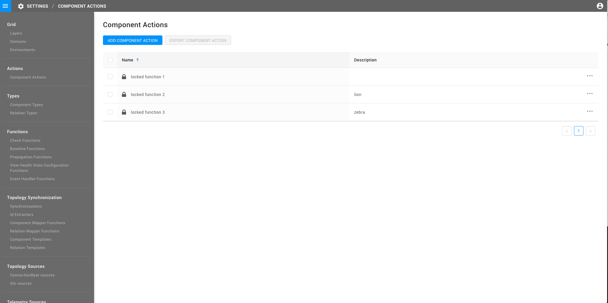

# Component actions

## Overview

This how to describes the steps to create a [component action](../../../configure/topology/component_actions.md) that is available for specific components. Component actions can be executed from the component context menu in the StackState Topology Perspective or the details pane on the right of the StackState UI.

## Add or edit a component action

The component actions available in StackState can be managed in the StackState UI from the page **Settings** &gt; **Actions** &gt; **Component Actions**.

* To add a new component action, click the **ADD COMPONENT ACTION** button.
* To edit an existing component action, click on the **...** menu to the right of its description and select **Edit**.



Each component action includes the following details:

* **Name** - The name displayed to users in the StackState UI when the component action is available for a component. The component action name is case-sensitive.
* **Description** - The text shown in the tooltip when a user hovers over the component action name in the StackState UI.
* **STQL Query** - An advanced topology query that returns all components for which this component action should be available. For details, see the [STQL Query](component-actions.md#stql-query) section below.
* **Script** - A script written in StackState Scripting Language that is run whenever the component action is executed in the StackState UI. For details, see the [script](component-actions.md#script) section and the [example scripts](component-actions.md#example-scripts) below.
* **Identifier** - Optional. A unique identifier for the component action. For details, see the [identifier](component-actions.md#identifier) section below.

### STQL query

The STQL query specified in a component action determines which components of the topology will be able to use this component action. This should be an advanced topology query that returns all of the components that should have access to this specific component action. For example, to bind a component action to all components in the "Production" domain that are present in the "databases" layer, you would use the STQL query:

```text
(domain IN ("Production") AND layer IN ("databases"))
```

You can find more information about writing advanced topology queries in StackState on the page [using STQL](../../reference/stql_reference.md).

### Script

The script determines behavior of the component action when it is executed by a user. YOu can use the [StackState Scripting Language](../../reference/scripting/scripting-in-stackstate.md) to script almost any action you need, such as redirecting a user to another view with a specific context, restarting remote components, or calling predictions for components. Some [example scripts](component-actions.md#example-scripts) are available below to help you get started.

Component action scripts always have access to a `component` variable, this represents the component for which the component action was invoked.

The properties in the table below can be accessed directly in the component action script:

| Property | Type | Returns |
| :--- | :--- | :--- |
| `component.id` | Long | The StackGraph ID of the component. |
| `component.lastUpdateTimestamp` | Long | The timestamp when the component was last updated. |
| `component.name` | String | The name of the component. |
| `component.description` | Option\[String\] | The description of the component. |
| `component.labels` | Set\[Label\] | Set of labels, each containing a `name` property. |
| `state.healthState` | HealthStateValue | The health state of the component. Can be `UNKNOWN`, `CLEAR`, `DEVIATING` or `CRITICAL`. |
| `state.propagatedHealthState` | HealthStateValue | The propagated health state of the component. Can be `UNKNOWN`, `CLEAR`, `DEVIATING` or `CRITICAL`. |
| `layer` | Long | The StackGraph ID of the layer that the component is in. |
| `domain` | Long | The StackGraph ID of the domain that the component is in. |
| `environments` | Set\[Long\] | The StackGraph IDs of all environments that the component is in. |

Other properties of the component can be accessed using the [component script API](../../reference/scripting/script-apis/component.md).

### Identifier

Providing an identifier is optional, but is necessary when you want to store your component action in a StackPack. A valid [identifier](../../../configure/identifiers.md) for a component action is a URN that follows the convention:

```text
urn:stackpack:{stackpack-name}:component-action:{component-action-name}
```

## Example scripts

### Show a topology query

The component action script below will direct the StackState UI to open a new topology query:

```text
def componentId = component.id.longValue()
UI.showTopologyByQuery("withNeighborsOf(direction = 'both', components = (id = '${componentId}'), levels = '15') and label = 'stackpack:openshift'")
```

### Navigate the user to an external URL

The component action script below will direct the StackState UI to navigate to a specific URL:

```text
def region = (component.labels.find {it -> it.name.startsWith("region") }).name.split(':')[1]
def url = "https://${region}.console.aws.amazon.com/ec2/home?region=${region}#Instances:sort=instanceId"

UI.redirectToURL(url)
```

### Make HTTP requests

The component action script below will invoke an HTTP request to a remote URL. This call is made from the StackState server:

```text
Http.post("https://postman-echo.com/post")
    .timeout("30s")
.jsonResponse()
```

## See also

* [StackState Query Language \(STQL\)](../../reference/stql_reference.md)    
* [Scripting in StackState](../../reference/scripting/scripting-in-stackstate.md)
* [Component script API](../../reference/scripting/script-apis/component.md)

