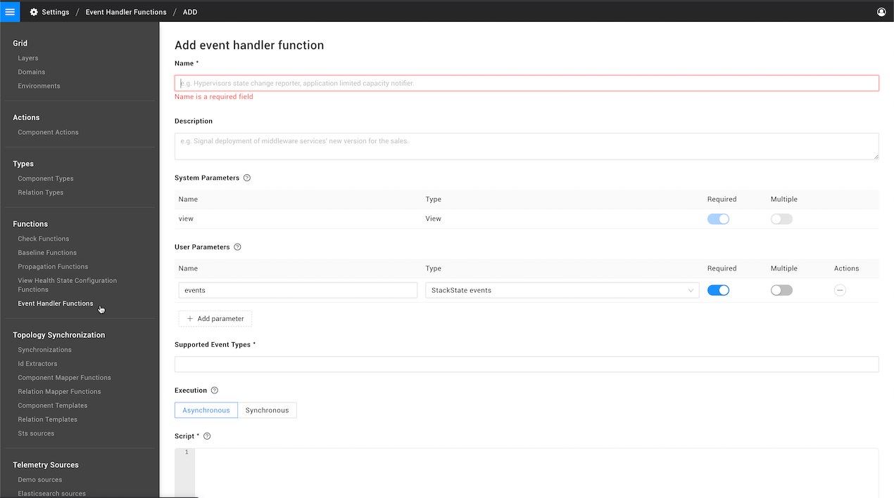

# Event handler functions

## Overview

Event handlers listen to events generated within a view. When the configured event type is generated, the event handler function is run to send an [event notification](/use/events/event-notifications.md) or trigger an action in a system outside of StackState. For example, an event handler function could send an email or make a POST to a webhook URL. A number of default event handler functions are included out of the box with StackState, or you can create your own custom event handler functions.

## Create a custom event handler function

Advanced StackState users can write their own custom event handler functions that react to state change events or problem events. Event handler functions can use the StackState HTTP script API or a plugin to send an event notification to a system outside of StackState. To add a custom event handler function:

1. In the StackState UI, go to **Settings** &gt; **Functions** &gt; **Event Handler Functions**.
2. Click **ADD EVENT HANDLER FUNCTION**. 
3. Enter the required settings:
   * **Name** - A name to identify the event handler function.
   * **Description** - Optional. A description of the event handler function. This will be displayed on the page **Settings** &gt; **Functions** &gt; **Event Handler Functions**.
   * **System parameters** - predefined parameters that are passed automatically to the event handler function script. For details, see the section on [parameters](event-handler-functions.md#parameters) below.
   * **User parameters** - parameters that must be entered by the user when an event handler is added to a view. Event handler functions also include the predefined user parameter **event**. For details, see the section on [parameters](event-handler-functions.md#parameters) below.
   * **Supported Event Types** - The type of event\(s\) that the event handler can respond to. For details, see the section on [supported event types](event-handler-functions.md#supported-event-types) below.
   * **Execution** - Event handler functions can be run as either Asynchronous \(default\) or Synchronous:
     * **Asynchronous** - use for Slack, SMS or HTTP webhook event handlers. The function script will have access to all functionality from the StackState script APIs and more functions will be allowed to run in parallel.
     * **Synchronous** - required for event handlers that generate email event notifications. The function will use a plugin to send notifications to external systems.
   * **Script** - The script run by the function. For details, see the sections below on:
     * [Functions with Asynchronous execution](event-handler-functions.md#asynchronous-execution-default).
     * [Functions with Synchronous execution](event-handler-functions.md#synchronous-execution).
     * How to [add logging to a function](event-handler-functions.md#logging).
   * **Identifier** - Optional. A unique identifier \(URN\) for the event handler function.
4. Click **CREATE** to save the event handler function. 
   * The new event handler function will be listed on the page **Settings** &gt; **Functions** &gt; **Event Handler Functions**.
   * The event handler will be available in the **Run event handler** drop-down when you [add an event handler](/use/events/manage-event-handlers.md#add-event-handler) that listens to one of the configured **Supported Event Types**.

## Parameters

An event handler function includes predefined system and user parameters that are passed automatically to the event handler function script.

* The **view** system parameter provides details of the view that the event handler has been added to. 
* The **event** user parameter provides the events that the event handler function will listen to.

You can also add your own user parameters, these can then be entered in the **Add event handler** dialogue when you add an event handler to a view.

For details of the properties that can be retrieved from the default **view** and **event** parameters, see [properties for asynchronous functions](event-handler-functions.md#properties-for-asynchronous-functions) and [properties for synchronous functions](event-handler-functions.md#properties-for-synchronous-functions) below.

## Supported event types

One or more supported event types can be added for each event handler function. The supported event types determine which event handler functions can be selected for each trigger event type when you [add an event handler](/use/events/manage-event-handlers.md#add-event-handler) to a view. For example, an event handler function with no supported event types will not be included in the **Run event handler** list of the **Add event handler** dialogue for any trigger event type.

One or more of the following events can be selected:

* **State change of entire view** - For functions that will react to a `ViewHealthStateChangedEvent`. These events are generated when the health state of the entire view changes.
* **State change of an element** - For functions that will react to a `HealthStateChangedEvent`. These events are generated when an element's own health state changes.
* **Propagated state change of an element** - For functions that will react to a `PropagatedHealthStateChangedEvent`. These events are generated when the propagated health state of an element changes.
* **Problem changed events** - For functions that will react to `ProblemCreated`, `ProblemUpdated`, `ProblemSubsumed` or `ProblemResolved`. These events are generated for changes to [problems](../../../use/problem-analysis/about-problems.md) in the view.

## Logging

You can add logging statements to an event handler function for debug purposes, for example, with `log.info("message")`. Logs will appear in `stackstate.log`. Read how to [enable logging for functions](../../../configure/logging/enable-logging.md).


Only available for Linux installations of StackState.


## Asynchronous execution \(default\)

When execution is set to **Asynchronous**, the event handler function will run as an asynchronous function.

An asynchronous event handler function has access to the [StackState script APIs](../../reference/scripting/script-apis/). This allows the function to make an HTTP request with a custom header using the [HTTP script API](../../reference/scripting/script-apis/http.md) and gives access to the whole topology/telemetry.

The **Slack** event handler function shipped with StackState will run as an asynchronous function. This allows the event notifications sent to Slack to include extensive details about the event that triggered it, such as links to relevant data and a possible root cause. You could also use the HTTP script API to send an SMS or webhook post.

### Properties for asynchronous functions

The properties described below can be retrieved from the default `view` and `event` parameters in an event handler function with asynchronous execution.

**View** properties return details of the view that the event handler is configured for. Note that parameter name `view` or `scope` can be used, or an alias.

* `view.name` - returns the view name.
* `view.description` - returns the view description.
* `view.query` -  returns an STQL query of the view.
* `view.identifier` - returns the globally unique URN value that identifies the view.

**Event** properties return details of a received event and vary for the different event types:

* Health state change events:
  * [HealthStateChangedEvent](event-handler-functions.md#healthstatechangedevent-properties-asynchronous)
  * [ViewHealthStateChangedEvent](event-handler-functions.md#viewhealthstatechangedevent-properties-asynchronous)
  * [PropagatedHealthStateChangedEvent](event-handler-functions.md#propagatedhealthstatechangedevent-properties-asynchronous)
* Problem events:
  * [ProblemCreatedEvent](event-handler-functions.md#problemcreatedevent-properties-asynchronous) 
  * [ProblemUpdatedEvent](event-handler-functions.md#problemupdatedevent-properties-asynchronous) 
  * [ProblemSubsumedEvent](event-handler-functions.md#problemsubsumedevent-properties-asynchronous) 
  * [ProblemResolvedEvent](event-handler-functions.md#problemresolvedevent-properties-asynchronous) 

#### HealthStateChangedEvent properties \(Asynchronous\)

The properties listed below return details of a `HealthStateChangedEvent` in functions with asynchronous execution. Note that the default parameter name is`event`, this can be modified if you choose.

* `event.triggeredTimestamp` - returns the time  \(epoch in ms\) at which the state change occurred. 
* `event.causeId` - returns the UUID of the event that triggered the health state change. 
* `event.newState` - returns the current state of the element.
* `event.oldState` - returns the previous state of the element.
* `event.stackElement` - returns the node ID of the element that has changed its state.

#### ViewHealthStateChangedEvent properties \(Asynchronous\)

The properties listed below return details of a `ViewHealthStateChangedEvent` in functions with asynchronous execution. Note that the default parameter name is`event`, this can be modified if you choose.

* `event.triggeredTimestamp` - returns the time  \(epoch in ms\) at which the state change occurred. 
* `event.causeId` - returns the UUID of the event that triggered the health state change. 
* `event.newState` - returns the current state of the element.
* `event.oldState` - returns the previous state of the element.
* `event.viewHealthState` - returns the node ID of the health state object for the view that changed its state.

#### PropagatedHealthStateChangedEvent properties \(Asynchronous\)

The properties listed below return details of a `PropagatedHealthStateChangedEvent` in functions with asynchronous execution. Note that the default parameter name is`event`, this can be modified if you choose.

* `event.triggeredTimestamp` - returns the time  \(epoch in ms\) at which the state change occurred. 
* `event.causeId` - returns the UUID of the event that triggered the health state change. 
* `event.stateChanges` -returns the chain of elements through which the health state change propagated.

#### ProblemCreatedEvent properties \(Asynchronous\)

The properties listed below return details of a `ProblemCreatedEvent` in functions with asynchronous execution. Note that the default parameter name is`event`, this can be modified if you choose.

* `event._type` - returns the event type \(`ProblemCreatedEvent`\).
* `event.triggeredTimestamp` - returns the time  \(epoch in ms\) at which the event was generated. 
* `event.identifier` - returns the unique event identifier.
* `event.problemId` - returns the \(node\) ID of the problem.
* `event.rootCause` - returns the node ID of the root cause component.
* `event.nodes` - returns the list of node IDs of all the components that were related to the problem when it was created.

#### ProblemUpdatedEvent properties \(Asynchronous\)

The properties listed below return details of a `ProblemUpdatedEvent` in functions with asynchronous execution. Note that the default parameter name is`event`, this can be modified if you choose.

* `event._type` - returns the event type \(`ProblemUpdatedEvent`\).
* `event.triggeredTimestamp` - returns the time  \(epoch in ms\) at which the event was generated.
* `event.identifier` - returns the unique event identifier.
* `event.problemId` - returns the \(node\) ID of the problem.
* `event.rootCause` - returns the node ID of the root cause component.
* `event.nodes` - returns the list of node IDs of all the components that were related to the problem after it was updated.

#### ProblemSubsumedEvent properties \(Asynchronous\)

The properties listed below return details of a `ProblemSubsumedEvent` in functions with asynchronous execution. Note that the default parameter name is`event`, this can be modified if you choose.

* `event._type` - returns the event type \(`ProblemSubsumedEvent`\).
* `event.triggeredTimestamp` - returns the time  \(epoch in ms\) at which the event was generated.
* `event.identifier` - returns the unique event identifier.
* `event.problemId` - returns the \(node\) ID of the problem.
* `event.rootCause` - returns the node ID of the root cause component.
* `event.superProblemIds` - returns the list of problem IDs that now contain the subsumed problem.
* `event.nodes` - returns the list of node IDs of all the components that were related to the problem before it was subsumed.

#### ProblemResolvedEvent properties \(Asynchronous\)

The properties listed below return details of a `ProblemResolvedEvent` in functions with asynchronous execution. Note that the default parameter name is`event`, this can be modified if you choose.

* `event._type` - returns the event type \(`ProblemResolvedEvent`\).
* `event.triggeredTimestamp` - returns the time  \(epoch in ms\) at which the event was generated.
* `event.identifier` - returns the unique event identifier.
* `event.problemId` - returns the \(node\) ID of the problem.
* `event.rootCause` - returns the node ID of the root cause component.
* `event.nodes` - returns the list of node IDs of all the components that were related to the problem before it was resolved.

## Synchronous execution


Synchronous functions will be deprecated in a future release of StackState. It is advised to choose the [default asynchronous execution](event-handler-functions.md#asynchronous-execution-default) type when writing a new event handler function.


When execution is set to **Synchronous**, the event handler function will run as a synchronous function.

Event handler functions developed prior to StackState v4.2 and email event handler functions run as synchronous functions. Compared to asynchronous functions, synchronous functions are limited in both the capability of what they can achieve and the number of functions that can run in parallel.

Synchronous event handler functions use plugins to interact with external systems, see [plugins](event-handler-functions.md#plugins-for-synchronous-functions) below for further details.

### Properties for synchronous functions

The properties described below can be retrieved from the default synchronous event handler function parameters.

**View** properties return details of the view the event handler is in. Note that parameter name `view` or `scope` can be used, or an alias.

* `view.getName` - returns the name of the view.
* `view.getDescription` - returns the view description.
* `view.getQuery` - returns an STQL query of the view.
* `view.getIdentifier` - returns the globally unique URN value that identifies the view.

**Event** properties return details of a received event and vary for the different event types:

* Health state change events:
  * [HealthStateChangedEvent](event-handler-functions.md#healthstatechangedevent-properties-synchronous)
  * [ViewHealthStateChangedEvent](event-handler-functions.md#viewhealthstatechangedevent-properties-synchronous)
  * [PropagatedHealthStateChangedEvent](event-handler-functions.md#propagatedhealthstatechangedevent-properties-synchronous)
* Problem events:
  * [ProblemCreated](event-handler-functions.md#problemcreated-properties-synchronous) 
  * [ProblemUpdated](event-handler-functions.md#problemupdated-properties-synchronous) 
  * [ProblemSubsumed](event-handler-functions.md#problemsubsumed-properties-synchronous) 
  * [ProblemResolved](event-handler-functions.md#problemresolved-properties-synchronous) 

#### HealthStateChangedEvent properties \(Synchronous\)

The properties listed below return details of a `HealthStateChangedEvent` in functions with synchronous execution. Note that the default parameter name is`event`, this can be modified if you choose.

* `event.getTriggeredTimestamp` - returns the time  \(epoch in ms\) at which the state change occurred. 
* `event.getCauseId` - returns the UUID of the event that triggered the health state change. 
* `event.getNewStateRef` - returns the current state of the element.
* `event.getOldStateRef` - returns the previous state of the element.

#### ViewHealthStateChangedEvent properties \(Synchronous\)

The properties listed below return details of a `ViewHealthStateChangedEvent` in functions with synchronous execution. Note that the default parameter name is`event`, this can be modified if you choose.

* `event.getTriggeredTimestamp` - returns the time  \(epoch in ms\) at which the state change occurred. 
* `event.getCauseId` - returns the UUID of the event that triggered the health state change. 
* `event.getNewStateRef` - returns the current state of the element.
* `event.getOldStateRef` - returns the previous state of the element.

#### PropagatedHealthStateChangedEvent properties \(Synchronous\)

The properties listed below return details of a `PropagatedHealthStateChangedEvent` in functions with synchronous execution. Note that the default parameter name is`event`, this can be modified if you choose.

* `event.getTriggeredTimestamp` - returns the time  \(epoch in ms\) at which the state change occurred. 
* `event.getCauseId` - returns the UUID of the event that triggered the health state change. 
* `event.getStateChanges` -returns the chain of elements through which the health state change propagated.

#### ProblemCreated properties \(Synchronous\)

The properties listed below return details of a `ProblemCreated` event in functions with synchronous execution. Note that the default parameter name is`event`, this can be modified if you choose.

* `event._type` - returns the event type \(`ProblemCreated`\).
* `event.triggeredTimestamp` - returns the time  \(epoch in ms\) at which the event was generated. 
* `event.identifier` - returns the unique event identifier.
* `event.problemId` - returns the \(node\) ID of the problem.
* `event.rootCauseNodeId` - returns the node ID of the root cause component.
* `event.nodes` - returns the list of node IDs of all the components that were related to the problem when it was created.

#### ProblemUpdated properties \(Synchronous\)

The properties listed below return details of a `ProblemUpdated` event in functions with synchronous execution. Note that the default parameter name is`event`, this can be modified if you choose.

* `event._type` - returns the event type \(`ProblemUpdated`\).
* `event.triggeredTimestamp` - returns the time  \(epoch in ms\) at which the event was generated.
* `event.identifier` - returns the unique event identifier.
* `event.problemId` - returns the \(node\) ID of the problem.
* `event.rootCauseNodeId` - returns the node ID of the root cause component.
* `event.nodes` - returns the list of node IDs of all the components that were related to the problem after it was updated.

#### ProblemSubsumed properties \(Synchronous\)

The properties listed below return details of a `ProblemSubsumed` event in functions with synchronous execution. Note that the default parameter name is`event`, this can be modified if you choose.

* `event._type` - returns the event type \(`ProblemSubsumed`\).
* `event.triggeredTimestamp` - returns the time  \(epoch in ms\) at which the event was generated.
* `event.identifier` - returns the unique event identifier.
* `event.problemId` - returns the \(node\) ID of the problem.
* `event.rootCauseNodeId` - returns the node ID of the root cause component.
* `event.superProblemIds` - returns the list of problem IDs that now contain the subsumed problem.
* `event.nodes` - returns the list of node IDs of all the components that were related to the problem before it was subsumed.

#### ProblemResolved properties \(Synchronous\)

The properties listed below return details of a `ProblemResolved` event in functions with synchronous execution. Note that the default parameter name is`event`, this can be modified if you choose.

* `event._type` - returns the event type \(`ProblemResolved`\).
* `event.triggeredTimestamp` - returns the time  \(epoch in ms\) at which the event was generated.
* `event.identifier` - returns the unique event identifier.
* `event.problemId` - returns the \(node\) ID of the problem.
* `event.rootCauseNodeId` - returns the node ID of the root cause component.
* `event.nodes` - returns the list of node IDs of all the components that were related to the problem before it was resolved.

### Plugins for synchronous functions

Synchronous event handler functions use plugins to send notifications to external systems. The following plugins are available for use in custom event handler functions:

| Plugin | Description |
| :--- | :--- |
| email | Sends an email using the [configured SMTP server](../../../configure/topology/configure-email-event-notifications.md). `emailPlugin.sendEmail(to, subject, "body")` |  
| HTTP webhook | Sends an HTTP POST request with the specified content to a URL. `webhookPlugin.sendMessage(url, "json")` |  
| SMS | Sends an SMS using MessageBird with the specified token. `smsPlugin.sendSMSMessage(token, "to", "message")` |  

## See also

* [Enable logging for functions](../../../configure/logging/enable-logging.md)
* [Send event notifications using an event handler function](/use/events/manage-event-handlers.md#add-event-handler)
* [Configure an SMTP server to send email event notifications](../../../configure/topology/configure-email-event-notifications.md)  
* [StackState script APIs](../../reference/scripting/script-apis/)
* [How to create a Slack webhook \(slack.com\)](https://api.slack.com/messaging/webhooks)

