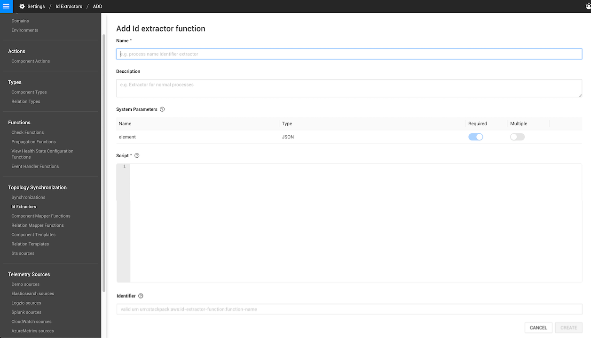

# ID extractor functions


**This page describes StackState version 4.5.**

Go to the [documentation for the latest StackState release](https://docs.stackstate.com/develop/developer-guides/custom-functions/id-extractor-functions).


## Overview

ID extraction is used in the topology synchronization process to turn external data into External Topology. It extracts the unique identity and identifiers for components and relations. 

## Data extracted

## ID extractor function

ID extractor functions are powered by a Groovy script, which is executed on each to be processed topology element. The function is therefore stateless. There is a separate ID extractor for components and relations.

A list of all ID extractor functions in your StackState instance is available in the StackState UI, go to the page **Settings** > **Topology Synchronization** > **Id Extractors**. You can also create your own ID extractor here by clicking **ADD ID EXTRACTOR FUNCTION**.



An ID extractor function has parameters. Only one parameter is required - the system parameter `element` that is of type JSON. This is input to the script for execution. In topology synchronization, the `element` will contain the element payload. The ID Extractor can produce the following information from the external data in the `element` parameter:

* A `type` - for the component/relation. Used for differentiation in later steps.
* An `externalId` - the identifier with which the element can be identified in the external source.
* `identifiers` \(multiple\) - A set of identifiers that identify the object internally in StackState.

Most ID extractors are quite straight-forward. The `type` and `external ID` are read from the JSON payload are usually left unchanged. Occasionally, the types might be transformed to lower case to avoid case sensitivity issues in the next step of the Synchronization process. `identifiers` can also be extracted. Usually this is a process of parsing through the data payload and adding the identities to a HashSet. 
At the end of the id extractor function a Groovy method is called to pass the collected information to the next step in the synchronization.

Below is an example ID extractor function:

```text
map = struct.asReadonlyMap()

externalId = map["externalId"]
type = map["typeName"].toLowerCase()
identifiers = map["data"].get("identifiers", [])

return Sts.createId(externalId, new HashSet([externalId] + identifiers), type)
```

## See also

* [Identifiers](/configure/identifiers.md)
