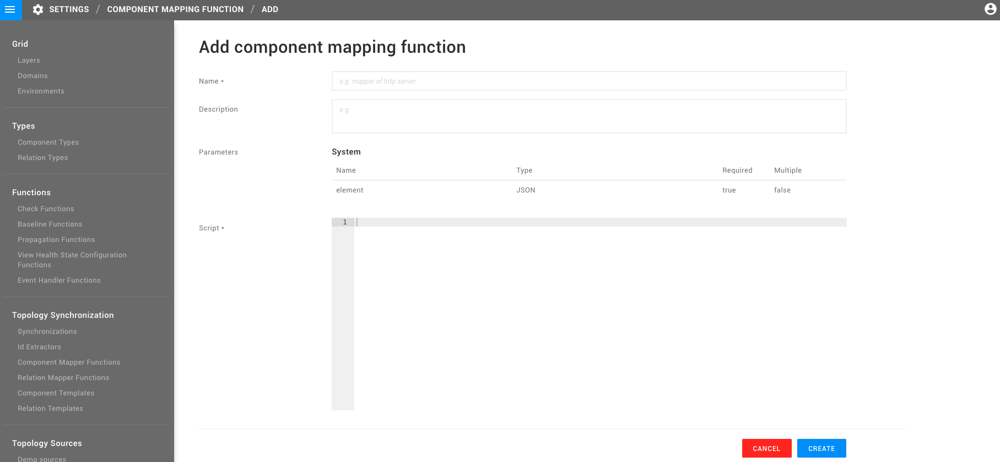

# Mapper functions


**This page describes StackState version 4.6.**

Go to the [documentation for the latest StackState release](https://docs.stackstate.com/develop/developer-guides/custom-functions/mapper-functions).


Mapper Functions are defined by a groovy script and input parameters that groovy script requires. The goal of a Mapper Function is to process topology data from an external system and prepare parameters for use by a template function.

Mapping functions can be created from the **Settings** page in the StackState UI.



There are two specific Mapper Function parameters:

* `ExtTopoComponent` / `ExtTopoRelation` - these are the required system parameters. Every Mapper Function must define one of these. They are used internally by StackState and cannot be changed using the API. They indicate the type of element - component or relation - that the Mapper Function supports.
* `TemplateLambda` - this is an optional parameter that specifies which template functions must be used with the Mapper Function.

An example of a simple Mapper Function:

```text
def params = [
    'name': element.getExternalId(),
    'description': element.getData().getString("description").get()
];

context.runTemplate(template, params)
```

