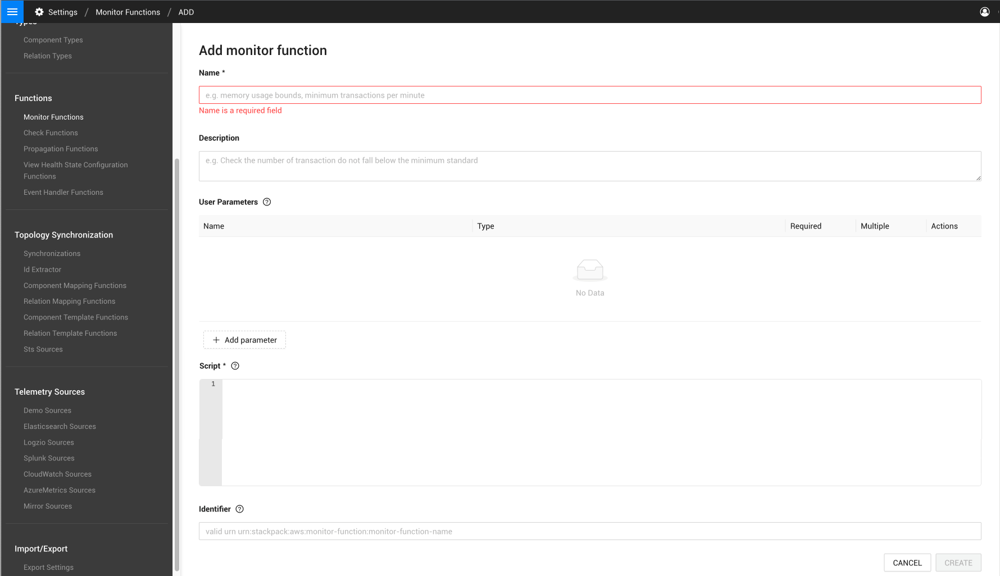

# Monitor functions

## Overview

Monitor functions are run by [monitors](/use/checks-and-monitors/monitors.md) in StackState. They can process 4T data to trigger a change in health status of a component or relation. A number of monitor functions are shipped together with StackState, or you can write your own monitor function as a groovy script.

## Create a custom monitor function

To add a custom monitor function:

1. In the StackState UI, go to **Settings** >  **Functions** > **Monitor Functions**.
2. Click **ADD MONITOR FUNCTION**.
3. Enter the required settings:
   * **Name** - A name to identify the monitor function.
   * **Description** - Optional. A description of the monitor function.
   * **User parameters** - These are parameters that must be specified in the monitor definition that runs the monitor function. For more details see the section [parameters](#parameters).
   * **Script** - The groovy script run by the function. For more details see the section [script](#script).
   * **Identifier** - a StackState-URN-formatted value that uniquely identifies the monitor function. The identifier is used by the monitor definition during the invocation of this function.
4. Click **CREATE** to save the monitor function.
   * The monitor function will be listed in the StackState UI page **Settings** >  **Functions** > **Monitor Functions**. It can be exported from here to use in a monitor or add to a template that is included in a custom StackPack.



## Parameters

Any number of user parameters can be defined in a monitor function. The values of the parameters must be passed to the monitor function by the monitor definition that runs it. Values and properties of the parameters can then be accessed by the monitor function script.

When defining parameters in the monitor function, these can optionally be set as:

- **Required** - parameters that must always be specified by the monitor definition.
- **Multiple** - parameters will be a list of the specified parameter type.

### Parameter types

The following parameter types are available for use in monitor functions:

* All parameter types available for [check functions](/develop/developer-guides/custom-functions/check-functions.md#parameter-types).
* **Telemetry query** - Unique to monitor functions. A telemetry query that supplies telemetry data to the function. For details, see the section [telemetry query](#telemetry-query).

### Telemetry query

A user parameter of type **Telemetry query** can be added to a monitor function. The monitor that invokes the monitor function can then specify a telemetry query expression as a value to the function. The query indicates the specific metric values to fetch, along with the aggregation method and the time window to use.

The telemetry query parameter type will ensure that the provided query is well-formed - in case of any syntactic or type errors, a suitable error will be reported. This will prevent execution of the monitor function with potentially bogus values.

➡️ [Learn how to specify a telemetry query in a monitor definition file](/develop/developer-guides/monitors/monitor-stj-file-format.md#telemetry-query)

### Values

Values for the defined user parameters are passed to the monitor function from the monitor. The monitor definition that invokes a monitor function must include `arguments` that set a `value` for each user parameter in the monitor function.

➡️ [Learn more about parameter values in a monitor definition file](/develop/developer-guides/monitors/monitor-stj-file-format.md#arguments)

Below is an example monitor function with one user parameter defined. The parameter is named `latest_metrics` and is of type **Telemetry query**. The **required** switch is set to **on**, meaning that the parameter must have a value set when the function is invoked. 


To successfully invoke this function, a monitor must set a `value` for the required `latest_metrics` parameter. This is done by adding an `arguments` block similar to the one shown below to the monitor definition file. The `value` shown here includes an example telemetry query, this would be run to provide telemetry to the monitor function.


```json
{
  "_version": "1.0.39",
  "timestamp": "2022-05-23T13:16:27.369269Z[GMT]",
  "nodes": [
    {
      ...
      "arguments": [{
        "_type": "ArgumentScriptMetricQueryVal",
        "parameter": {{ get "<identifier-of-the-function>" "Type=Parameter;Name=latest_metrics" }},
        "value": "Telemetry.query('StackState Metrics', '').groupBy('tags.pid', 'tags.createTime', 'host').metricField('cpu_systemPct').start('-1m').aggregation('mean', '15s')"
      }],
      ...
    }
  ]
}
  
```


## Script

The monitor function script is a Groovy script that will be run whenever the monitor function is invoked by a monitor. The script has access to all defined user parameters and can use the StackState [Telemetry script API](/develop/reference/scripting/script-apis/telemetry.md) to fetch Metric and Log data.

The script should return a result of type `MonitorHealthState` with the following details:

* `id` - An identifier for the monitor health state. This uniquely identifies a monitor health state between monitor runs.
* `state` - A `HealthStateValue`. This will be the new health state of the monitor (`CLEAR`, `DEVIATING`, `CRITICAL`, `DISABLED` or `UNKNOWN`).
* `topologyIdentifier` - The identifier of a component or relation that the monitor health state will bind to.
* `displayTimeSeries` - Description of a timeseries that will be shown as a chart in the StackState UI.

Example monitor function script:


```commandline
def checkThreshold(points, threshold) {
   points.any { point -> point.last() >= threshold }
}

metrics.then { result ->
  def timeSeries = result.timeSeries
  def state;
  def topologyIdentifier = StringTemplate.runForTimeSeriesId(topologyMapping, timeSeries.id)
  def displayTimeSeries = [[ _type: "DisplayTimeSeries", name: "Metric Chart", timeSeriesId: timeSeries.id, query: result.query]]

  if (checkThreshold(timeSeries.points, criticalValue)) {
    state = "CRITICAL";
  } else if (checkThreshold(timeSeries.points, deviatingValue)) {
    state = "DEVIATING";
  } else {
    state = "CLEAR"
  }

  return [ _type: "MonitorHealthState", id: timeSeries.id.toIdentifierString(), state: state, topologyIdentifier: topologyIdentifier, displayTimeSeries: displayTimeSeries ]
}
```


## See also 

* [About monitors](/use/checks-and-monitors/monitors.md)
* [Manage monitors](/use/checks-and-monitors/manage-monitors.md)
* [Create monitors](/develop/developer-guides/monitors/create-custom-monitors.md)
