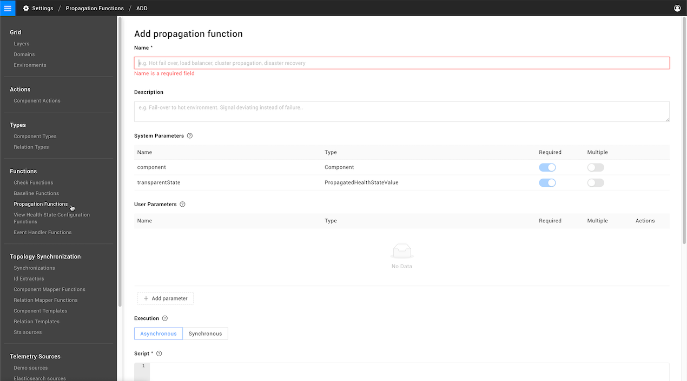

# Propagation functions

## Overview

Propagation defines how a propagated state flows from one component to the next. Propagation always flows from dependencies to dependent components and relations. Note that this is the opposite direction of the relation arrows in the graph.

A propagated state is returned as one of the following health states:

* `CRITICAL`
* `FLAPPING`
* `DEVIATING`
* `UNKNOWN`

A component's propagated state is calculated using a propagation function, which is set during synchronization.

## Propagation type

### Auto propagation \(default\)

Returns the transparent state. This is the maximum of the component's own state and the propagated state of all dependencies. For example:

| Dependency state | Component state | Transparent state |
| :--- | :--- | :--- |
| `CRITICAL` | `DEVIATING` | `CRITICAL` |
| `CLEAR` | `CRITICAL` | `CRITICAL` |
| `DEVIATING` | `CLEAR` | `DEVIATING` |

### Propagation functions

Propagation functions can be defined and used to calculate the propagated state of a component. Some propagation functions are installed as part of a StackPack. For example, Quorum based cluster propagation, which will propagate a `DEVIATING` state when the cluster quorum agrees on deviating and a `CRITICAL` state when the cluster quorum is in danger. You can also write your own [custom propagation functions](propagation-functions.md#create-a-custom-propagation-function). A full list of the propagation functions available in your StackState instance can be found in the StackState UI, go to **Settings** &gt; **Functions** &gt; **Propagation Functions**


To specify a propagation function that should be used to calculate the propagated state a component, add the [`propagation` block](#edit-template) to the template used in topology synchronization.


## Custom propagation functions

### Create a custom propagation function

You can write custom propagation functions to determine the new propagated state of an element \(component or relation\). The propagation function can then be [specified in the template](#edit-template) used to synchronize topology.

A propagation function can take multiple parameters as input and produces a new propagated state as output. To calculate a propagated state, a propagation function has access to the element itself, the element's dependencies and the transparent state that has already been calculated for the element.



The simplest possible function that can be written is given below. This function will always return a `DEVIATING` propagated state:

```text
    return DEVIATING
```

You can also use a propagation function to implement more complicated logic. For example, the script below will return a `DEVIATING` state in case a component is not running:

```text
Component
  .withId(componentId)
  .fullComponent()
  .then { component ->
    if (component.runState.runState != "RUNNING") {
      return DEVIATING
    } else {    
      return transparentState
    }
  }
```

This code works as follows:

| Code | Description |
| :--- | :--- |
| `.withId(componentId)` | The `componentId` is passed as long and resolved |
| `.fullComponent()` | Returns a JSON-style representation of the component. This is the same format as is obtained from the `Show Json` properties menu for a component, or by using a [topology query](../../reference/scripting/script-apis/topology.md) in analytics. |
| `then { component -> ... }` | An async lambda function where the main logic for the propagation function resides. `component` is the component variable, which has properties that can be accessed using `.<property name>`. For example, `.type` returns component type id. |
|  |  |

### System parameters

System parameters are predefined parameters passed automatically to the propagation function script at run time.

| System parameter | Description |
| :--- | :--- |
| `transparentState` | The precomputed transparent state if returned from the script will lead to transparent propagation |
| `component` | The id of the current component |

### User parameters

User parameters can optionally be defined and used in the propagation function script. The value must be provided as an argument when the function is [configured in the template](#edit-template).

### Execution

Two types of execution are available for propagation functions:

* [Asynchronous execution](propagation-functions.md#asynchronous-execution) \(recommended\)
* [Synchronous execution](propagation-functions.md#synchronous-execution)

#### Asynchronous execution

Functions that run with asynchronous execution can make an HTTP request and use [StackState script APIs](../../reference/scripting/script-apis/) in the function body. This gives you access to parts of the topology/telemetry not available in the context of the propagation itself. You can also use the available [element properties and methods](propagation-functions.md#script-properties-and-methods).


**Keep performance aspects in mind when developing functions with asynchronous execution**  
The script APIs provide super-human levels of flexibility and even allow querying standalone services. Consider extreme cases where the function is executed on all components and properly assess system impact. StackState comes with a number of StackPacks that include tuned propagating functions. Changes to those functions are possible, but may impact the stability of the system.


#### Synchronous execution

Running a propagation function with synchronous execution places limitations on both the capability of what it can achieve, and the number of functions that can be run in parallel. Synchronous propagation functions do, however, have access to `stateChangesRepository` information that is not available if the function runs with asynchronous execution.

`stateChangesRepository` can be used to return:

* The propagating state of an element
* The number of elements with a particular propagating state
* The highest state of a given set of elements

See available [properties and methods](propagation-functions.md#script-properties-and-methods).

### Script - properties and methods

The properties and methods described below are available for use in a propagation function script. 

* [Element properties and methods](#element-properties-and-methods) - functions with either **asynchronous or synchronous execution**
* [`stateChangesRepository` methods](#statechangesrepository-methods) - functions with **synchronous execution only**

#### Element properties and methods

The `element` properties and methods listed below can be used in propagation functions with either **asynchronous or synchronous execution**. Functions with synchronous execution also have access to [stateChangesRepository methods](propagation-functions.md#statechangesrepository-methods).

* `element.name` - Returns the name of the current element.
* `element.type` - Returns type of the current element.
* `element.version` - Returns the component version \(optional\).
* `element.runState()` - Returns the run state of the current element.
* `element.isComponent()` - Returns True if element is a component and False if element is a relation.
* `element.getDependencies().size()` - Returns the number of dependencies.
* `element.getDependencies()` - Returns a set of the outgoing relations \(for components\) or a set of components \(for relations\).

#### StateChangesRepository methods


The `stateChangesRepository` methods listed below are **only available in synchronous** propagation functions.


* `stateChangesRepository.getPropagatedHealthStateCount(<set_of_elements>, <health_state>)` Returns the number of elements in the set that have a certain health state, for example CRITICAL.
* `stateChangesRepository.getHighestPropagatedHealthStateFromElements(<set_of_elements>)` Returns the highest propagated health state based on the given set of elements.
* `stateChangesRepository.getState(element).getHealthState().intValue` Returns the health state of the element.
* `stateChangesRepository.getState(element).getPropagatedHealthState().getIntValue()` Returns the propagated health state of the element.

### Script - logging

You can add logging statements to a propagation function script for debug purposes, for example, with `log.info("message")`. Logs will appear in `stackstate.log`. Read how to [enable logging for functions](../../../configure/logging/).

## Edit template

### Specify a propagation function

The default propagation used in StackState is [Auto propagation](#auto-propagation-default). If another type of propagation should be applied to a component, this must be specified in the template and applied during topology synchronization. In most cases this will be handled by the StackPack responsible for synchronization of the component. 

To manually specify a non-default propagation function, a `"propagation"` block should be added to the template used for topology synchronization. If the `"propagation"` block is omitted, the default Auto propagation will be used. 

```yaml
"propagation": {
  "_type": "Propagation",
  "function": <id-of-the-function-to-use>,
  "arguments": []
  },
```

The propagation block requires the following keys:
- **_type** - specifies that the JSON block defines a Propagation.
- **function** the node ID of the propagation function to use. This can be obtained using a `get` helper.
- **arguments** - a list of arguments to match any user parameters that the propagation function requires. Arguments for system parameters are automatically provided during run time and do not need to be specified here. For further details, see the [examples](#example-templates) of adding a propagation function to a template.
  - **_type** - the type of the argument. This must match the **type** specified for the user parameter in the [propagation function](#create-a-custom-propagation-function).
  - **parameter** - the node ID of the propagation function’s user parameter. This can be obtained using a `get` helper.
  - Any values required for the specified argument **_type**.

### Example templates

Examples of adding a propagation function to a template can be found below:

* **Function with system parameters only:** [Active/active failover](#active-active-failover-propagation-function)
* **Function with system and user parameters:** [Stop propagation for relation type](#stop-propagation-for-relation-type)

#### Active/active failover propagation function

The example template below uses a `get` helper to obtain the ID of the **Active/active failover** propagation function with the identifier `urn:stackpack:common:propagationfunction:active-failover`. No `"arguments"` are specified as the propagation function does not include any user parameters. Arguments for system parameters are automatically provided during run time and do not need to be specified.



```bash
...
"propagation": {
  "_type": "Propagation",
  "function": {{ get "urn:stackpack:common:propagationfunction:active-failover" }},
  "arguments": [],
  },
...
```






#### Stop propagation for relation type

The template example below includes an argument that will be passed to the propagation function as a user parameter together with the standard system parameters. The `"arguments"` list contains one argument that matches the user parameter `relationType` from the **Stop propagation for relation type** propagation function. Arguments for system parameters are automatically provided during run time and do not need to be specified.



```bash
...
"propagation": {
  "_type": "Propagation",
  "function": {{ get "urn:stackpack:common:propagationfunction:stop-propagation-for-relation-type" }},
  "arguments": [{
    "_type": "ArgumentRelationTypeRef",
    "parameter": {{ get "urn:stackpack:common:propagationfunction:stop-propagation-for-relation-type" "Type=Parameter;Name=relationType" }},
    "relationType": {{ get "urn:stackpack:common:relationtype:is-hosted-on" }}
    }],
  },
...
```







## See also

* [StackState script APIs](../../reference/scripting/script-apis/)
* [Enable logging for functions](../../../configure/logging/)

