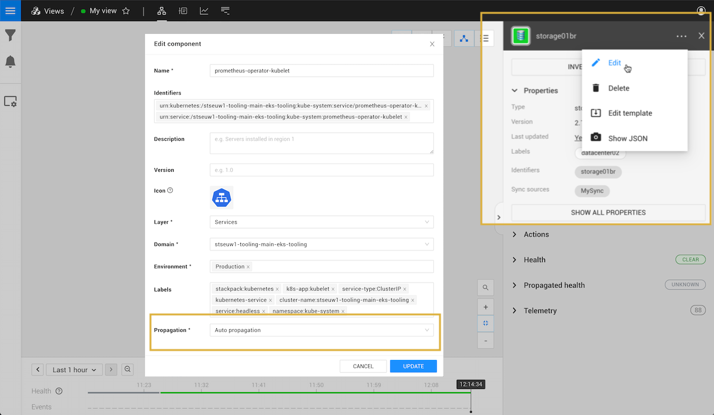

# Propagation functions

## Overview

Propagation defines how a propagated state flows from one component to the next. Propagation always flows from dependencies to dependent components and relations. Note that this is the opposite direction of the relation arrows in the graph.

A propagated state is returned as one of the following health states:

* `CRITICAL`
* `FLAPPING`
* `DEVIATING`
* `UNKNOWN`

A component's propagated state is calculated using a propagation function. This can be set as **Propagation** in the component's edit dialogue in the StackState UI.



## Propagation functions

Propagation functions are used to calculate the propagated state of a component.

### Auto propagation \(default\)

Returns the transparent state. This is the maximum of the component's own state and the propagated state of all dependencies. For example:

| Dependency state | Component state | Transparent state |
| :--- | :--- | :--- |
| `CRITICAL` | `DEVIATING` | `CRITICAL` |
| `CLEAR` | `CRITICAL` | `CRITICAL` |
| `DEVIATING` | `CLEAR` | `DEVIATING` |

### Other propagation functions

Some propagation functions are installed as part of a StackPack. For example, Quorum based cluster propagation, which will propagate a `DEVIATING` state when the cluster quorum agrees on deviating and a `CRITICAL` state when the cluster quorum is in danger. You can also write your own [custom propagation functions](propagation-functions.md#create-a-custom-propagation-function).


A full list of the propagation functions available in your StackState instance can be found in the StackState UI, go to **Settings** &gt; **Functions** &gt; **Propagation Functions**


## Create a custom propagation function

You can write custom propagation functions to determine the new propagated state of an element \(component or relation\). A propagation function can take multiple parameters as input and produces a new propagated state as output. To calculate a propagated state, a propagation function has access to the element itself, the element's dependencies and the transparent state that has already been calculated for the element.


The simplest possible function that can be written is given below. This function will always return a `DEVIATING` propagated state:

```text
    return DEVIATING
```

You can also use a propagation function to implement more complicated logic. For example, the script below will return a `DEVIATING` state in case a component is not running:

```text
Component
  .withId(componentId)
  .fullComponent()
  .then { component ->
    if (component.runState.runState != "RUNNING") {
      return DEVIATING
    } else {    
      return transparentState
    }
  }
```

This code works as follows:

| Code | Description |
| :--- | :--- |
| `.withId(componentId)` | The `componentId` is passed as long and resolved |
| `.fullComponent()` | Returns a JSON-style representation of the component. This is the same format as is obtained from the `Show Json` properties menu for a component, or by using a [topology query](../../reference/scripting/script-apis/topology.md) in analytics. |
| `then { component -> ... }` | An async lambda function where the main logic for the propagation function resides. `component` is the component variable, which has properties that can be accessed using `.<property name>`. For example, `.type` returns component type id. |
|  |  |

### Parameters

A propagation function script takes system and user defined parameters. System parameters are predefined parameters passed automatically to the script:

| System parameter | Description |
| :--- | :--- |
| `transparentState` | The precomputed transparent state if returned from the script will lead to transparent propagation |
| `component` | The id of the current component |

### Execution

Propagation functions can be run with execution set to either [Asynchronous](propagation-functions.md#asynchronous-execution) \(recommended\) or [Synchronous](propagation-functions.md#synchronous-execution).

#### Asynchronous execution

Functions that run with asynchronous execution can make an HTTP request and use [StackState script APIs](../../reference/scripting/script-apis/) in the function body. This gives you access to parts of the topology/telemetry not available in the context of the propagation itself. You can also use the available [element properties and methods](propagation-functions.md#available-properties-and-methods).


**Keep performance aspects in mind when developing functions with asynchronous execution**  
The script APIs provide super-human levels of flexibility and even allow querying standalone services. Consider extreme cases where the function is executed on all components and properly assess system impact. StackState comes with a number of StackPacks that include tuned propagating functions. Changes to those functions are possible, but may impact the stability of the system.


#### Synchronous execution

Running a propagation function with synchronous execution places limitations on both the capability of what it can achieve, and the number of functions that can be run in parallel. Synchronous propagation functions do, however, have access to `stateChangesRepository` information that is not available if the function runs with asynchronous execution.

`stateChangesRepository` can be used to return:

* The propagating state of an element
* The number of elements with a particular propagating state
* The highest state of a given set of elements

See available [properties and methods](propagation-functions.md#available-properties-and-methods).

### Available properties and methods

Several element properties and methods are available for use in propagation functions. Functions with synchronous execution also have access to stateChangesRepository methods.

#### Element properties and methods

The `element` properties and methods listed below can be used in propagation functions with either **asynchronous and synchronous execution**. Functions with synchronous execution also have access to [stateChangesRepository methods](propagation-functions.md#statechangesrepository-methods).

* `element.name` - Returns the name of the current element.
* `element.type` - Returns type of the current element.
* `element.version` - Returns the component version \(optional\).
* `element.runState()` - Returns the run state of the current element.
* `element.isComponent()` - Returns True if element is a component and False if element is a relation.
* `element.getDependencies().size()` - Returns the number of dependencies.
* `element.getDependencies()` - Returns a set of the outgoing relations \(for components\) or a set of components \(for relations\).

#### StateChangesRepository methods


The `stateChangesRepository` methods listed below are **only available in synchronous** propagation functions.


* `stateChangesRepository.getPropagatedHealthStateCount(<set_of_elements>, <health_state>)` Returns the number of elements in the set that have a certain health state, for example CRITICAL.
* `stateChangesRepository.getHighestPropagatedHealthStateFromElements(<set_of_elements>)` Returns the highest propagated health state based on the given set of elements.
* `stateChangesRepository.getState(element).getHealthState().intValue` Returns the health state of the element.
* `stateChangesRepository.getState(element).getPropagatedHealthState().getIntValue()` Returns the propagated health state of the element.

### Logging

You can add logging statements to a propagation function for debug purposes, for example, with `log.info("message")`. Logs will appear in `stackstate.log`. Read how to [enable logging for functions](../../../configure/logging/).

## See also

* [StackState script APIs](../../reference/scripting/script-apis/)
* [Enable logging for functions](../../../configure/logging/)

