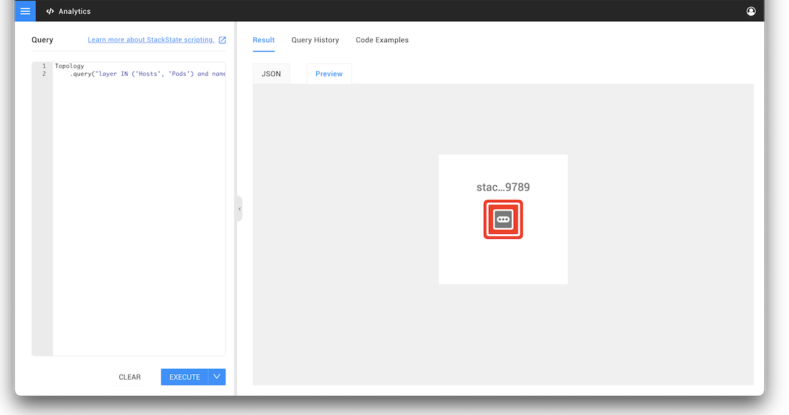

# Scripting in StackState

StackState uses scripting in many places to:

* Transform incoming data
* Query 4T data
* Describe state changes of the 4T data model 
* Control the StackState UI
* Create reports
* Connect to external services

StackState scripts are written using the StackState Scripting Language \(STSL\), which is based on [Groovy](https://groovy-lang.org/). The choice of Groovy is motivated by the fact that StackState is written in Scala and runs on JVM. Currently Groovy is the best and most performant script language for JVM. You are not stuck to using Groovy though, you can use the [HTTP script API](script-apis/http.md) to develop logic in any language.


All scripts have a default \(configurable\) timeout of 15 seconds.


## Running Scripts

StackState scripts can be executed in the [Analytics environment](../../../use/stackstate-ui/analytics.md). This can be accessed from the main menu of the StackState UI. The Analytics Environment interface consists of a scripting panel on the left and the results panel on the right.

Write a script in the **Query** panel and click **EXECUTE** to run it. The script output is displayed in the **Result** panel. Results can be viewed as a raw JSON string or as a preview generated by StackState automatically depending on the JSON object's type and content.

## Script APIs

All StackState functionality exposed via scripting is available via so-called script APIs. These are singleton objects starting with a capital case letter that contain a number of callable functions. Commonly used script APIs are:

* [Topology script API](script-apis/topology.md) for querying the topology 
* [HTTP script API](script-apis/http.md) for calling out to external services
* [View script API](script-apis/view.md) to get view definitions.

  Please have a look at the full list of [script APIs](script-apis/).

## Asynchronous programming

Most functions available through the StackState script APIs need some time to return a result. For efficiency reasons, StackState will suspend script execution while waiting for a result and continue other work on other background threads. When a function has an async return value, the word `async` is written before the return type in the script API documentation. This has implications for how to work with results. Please [read about async script results](async_script_result.md) to understand how this works.

## See also

* [Analytics environment](../../../use/stackstate-ui/analytics.md)
* [Async script results](async_script_result.md)
* [Script APIs](script-apis/)

