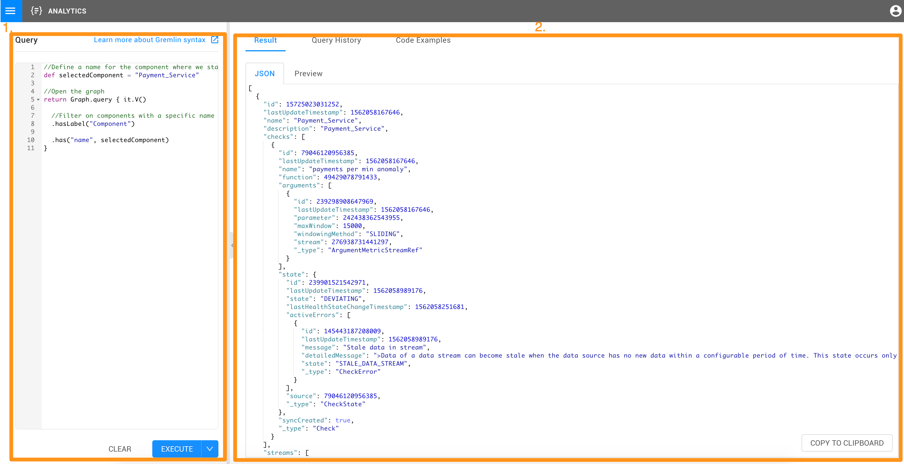

# StackState Scripting Language \(STSL\)

StackState uses scripting in many places to:

* Transform incoming data
* Query 4T data
* Describe how the state changes of the 4T data model 
* Control the UI
* Create reports
* And connect to external services

The StackState Scripting Language scripting language is based on [Groovy](https://groovy-lang.org/). The choice of Groovy is motivated by the fact that StackState is written in Scala and runs on the JVM. Currently Groovy is the best and most performant script language for the JVM. _You are not stuck to using Groovy though_, but can use the [Http script API](script-apis/http.md) to develop any logic in any language.

All scripts have a default \(configurable\) timeout of 15 seconds.

## Running Scripts

StackState scripting can be executed in the Analytics environment that can be accessed from the main menu. The Analytics Environment interface consists of two components: the scripting panel on the left \[1. see the screenshot below\] and the results panel \[2.\] on the right. The user writes a script in the scripting panel and commands SackState to execute it using the "Execute Button" and receives the results of the execution in the results panel. The results can be viewed as a raw JSON string or in the form of preview generated by StackState automatically depending on the JSON objects type and content.

## Script APIs

All StackState functionality exposed via scripting is available via so-called script API's. These are singleton objects starting with a capital case letter that contain a number of functions that can be called. Commonly used script APIs are the [Topology script API](script-apis/topology.md) for querying the topology and the [Http script API](script-apis/http.md) for calling out to external services. Please have a look at the full list of [script APIs](script-apis/).

## Asynchronous programming

Most available functions on the script APIs can not immediately produce a result, but need some time to return. For efficiency reasons StackState will then suspend script execution and continue other work on other background threads. When a function has a async return value you the word `async` is written before the return type in the documentation. This has implications for how to work with StackState results. Please [read about async script results](async_script_result.md) to understand how this work.

