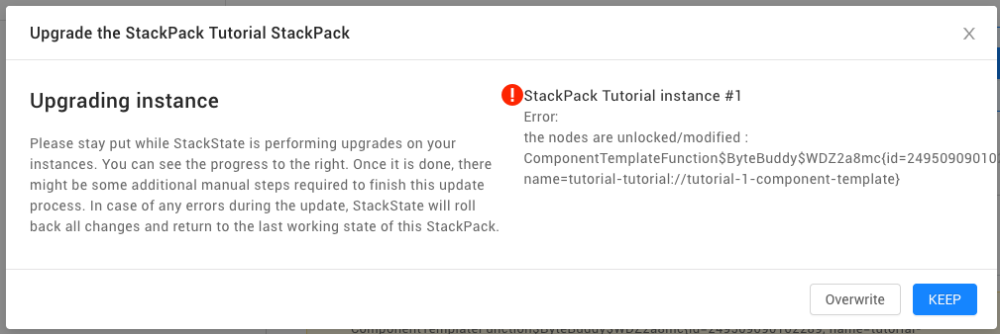

# Create a simple StackPack

This tutorial shows you how to create a basic StackPack to configure StackState. See the [StackPacks documentation](../../stackpacks/about-stackpacks.md) for more information.

## Setup

[This GitHub repository](https://github.com/StackVista/stackpack-tutorial) contains a sample project that containing a very basic StackPack. Clone the repository to your laptop to get started.

The repository contains a StackPack that configures StackState to receive external data and turn that into topology. The main configuration of the StackPack is in the `src` folder.

## What's in the StackPack?

The tutorial StackPack is fairly basic. It contains configuration information that configure StackState to receive a specific data format and turn this into topology.

Specifically, the StackPack contains:

* A [Groovy](https://groovy-lang.org/) provisioning script that installs the components of the StackPack \(`TutorialProvision.groovy`\)
* A component and relation template that tell StackState how to process incoming data into components and relations \(`tutorial-component-template.json.handlebars` and `tutorial-relation-template.json.handlebars`\)
* [Groovy](https://groovy-lang.org/) component and relation id extractor scripts that tell StackState how to extract the identifiers from the incoming data \(`Tutorial component id extractor.groovy` and `Tutorial relation id extractor.groovy`\)
* [Markdown](https://en.wikipedia.org/wiki/Markdown) files and images that are shown in the StackState GUI when users interact with the StackPack \(in the `resources` directory\)
* A configuration file that describes all components of the StackPack \(`stackpack.conf`\)

Take a moment to locate these files in the `src/main/stackpack` folder of the project.

## Building the StackPack

The first step is to build the StackPack into a binary file with extension `.sts` that we can send to StackState. Since the `.sts` file is essentially a ZIP archive, you can build the StackPack from the directory `stackpack-tutorial/src/main/stackpack` in the sample repository using the command:

```text
zip -r ./tutorial-stackpack-0.0.1.sts stackpack.conf provisioning resources
```

## Importing the StackPack

The StackPack must be imported into StackState before it can be installed. This can be done using the [StackState CLI](../../setup/cli-install.md). Please make sure it is installed and configured to connect with your StackState instance.

The following command installs our new tutorial StackPack in StackState:

```text
sts stackpack upload tutorial-stackpack-0.0.1.sts
```


The StackState CLI requires a `conf.d` configuration folder in the directory it is running from. This may require you to run the CLI from a different location. If so, remember to use an absolute path to refer to the StackPack binary.


We are now ready to install our tutorial StackPack.

## Installing the StackPack

Open the StackState application in your browser and log in. Navigate to the **StackPacks** page that lists all available StackPacks. You should see our Tutorial StackPack in the list of StackPacks.


If you don't see the Tutorial StackPack, or you see an older version of the StackPack than you uploaded, try refreshing the page.


Open the Tutorial StackPack page. Here you see the installation instructions that are part of the StackPack \(in the `src/main/stackpack/resources` directory\). Install the StackPack with the **Install** button.

If all goes well, your StackPack should be installed and in the _Waiting for data_ stage. This means the StackPack is ready to receive data, but hasn't yet received any. The StackState GUI tells you how to send data into the StackPack.

If you want to use the manual approach, copy the JSON listed in the StackPack page to your laptop and use the supplied `curl` command to send it to StackState.


The JSON and `curl` command shown in StackState contain data fields specific to your StackState installation, such as your API key and StackState URL.


When the StackPack has received your data, it will show a message indicating success and allowing you to explore your data.

## Seeing the topology in StackState

When you log into your StackState instance, go to the **Explore Mode**. Using the topology filter, select all topology with the `tutorial` label. This should result in a topology similar to the following:


Note that the components you see are constructed from the JSON data you sent in. The components appear in the **Tutorial Domain** domain and **Tutorial Components** layers.

Click on the component to open the **Component Details pane**. You'll see the component's labels and other meta-data you sent.

## Making a change to the StackPack

Now we are going to make a change to the tutorial StackPack. Let's say you want to add a telemetry stream to all of the components that the StackPack creates. This requires a change to the StackPack's component template. We are going to make this change in StackState and then update the StackPack with our changes.

Select the **myDummyApp** component and in the Component Details pane, find the triple dots menu in the top-right corner. There, select the **Edit template** option. This brings up the **Template Editor**.

In the Template Editor you can edit the template used to create components based on data coming in from your sample check. It shows the following information:

* **Input parameters** - The data sent by our `curl` command that is processed by StackState
* **Template function** - The template that uses the input parameters to create a component
* **Component preview** - A preview of the component produced by applying the input parameters to the template function


Check out the **Template Examples** tab in the Template Editor to learn how to create templates.


In the Template function, replace the `streams` part with the following code:

```text
"streams": [{
  "_type": "MetricStream",
  "dataSource": {{ get "urn:stackpack:common:data-source:stackstate-metrics"  }},
  "dataType": "METRICS",
  "id": -11,
  "name": "test",
  "query": {
    "_type": "MetricTelemetryQuery",
    "aggregation": "MEAN",
    "conditions": [{
      "key": "tags.related",
      "value": "{{ element.externalId }}"
    }],
    "id": -13,
    "metricField": "example.gauge"
  },
  "syncCreated": false
}],
```


The [Push Integration tutorial](push_integration_tutorial.md) describes in more detail how to create this check.


Use the **Preview** button to see what the resulting component will look like.


Go ahead and save the template. Be aware that you may need to [_unlock_](../../stackpacks/about-stackpacks.md#locked-configuration-items) it before this succeeds.

## Exporting the changed template

Now we are going to export the changed component template so we can include it in our StackPack.

Navigate to the **Settings** page and find the **Topology Synchronization** section. In that section, find the **Component Templates** page. Here you will find all component templates that StackState has loaded.

Locate the tutorial StackPack template \(`tutorial-tutorial://tutorial-1-component-template`\) among the templates. Check the checkbox in front of the template and use the **Export Component Template Function** button to export it.

## Updating the StackPack

The exported component template will replace the `tutorial-component-template.json.handlebars`file in your StackPack. The export has a different structure than the file in our StackPack so we need to edit the file before updating the original. Specifically, the file in our StackPack contains only the `handlebarsTemplate` property in the export.

Open the exported file in an editor and make the following changes:

* Replace the entire file with the contents of the `handlebarsTemplate` property
* Replace escaped newlines \(`\n`\) with newline characters
* Replace escaped quotes \(`\"`\) with quote characters \(`"`\)

After your edits, the exported file should look like this:

```text
{
    "_type": "Component",
    "checks": [],
"streams": [{
  "_type": "MetricStream",
  "dataSource": \{{ get "urn:stackpack:common:data-source:stackstate-metrics"  \}},
  "dataType": "METRICS",
  "id": -11,
  "name": "test",
  "query": {
    "_type": "MetricTelemetryQuery",
    "aggregation": "MEAN",
    "conditions": [{
      "key": "tags.related",
      "value": "\{{ element.externalId \}}"
    }],
    "id": -13,
    "metricField": "example.gauge"
  },
  "syncCreated": false
}],
    "labels": [
        \{{#if element.data.labels \}}
            \{{# join element.data.labels "," "" "," \}}
            {
            "_type": "Label",
            "name": "\{{ this \}}"
            }
            \{{/ join \}}
        \{{/if\}}
        {
            "_type": "Label",
            "name": "tutorial:tutorial://tutorial-1"
        }
        \{{#if element.data.tags \}}
            \{{# join element.data.tags "," "," "" \}}
            {
              "_type": "Label",
              "name": "\{{ this \}}"
            }
            \{{/ join \}}
        \{{/if\}}
    ],
    "name": "\{{#if element.data.name\}}\{{ element.data.name \}}\{{else\}}\{{ element.externalId \}}\{{/if\}}",
    \{{#if element.data.description\}}
    "description": "\{{ element.data.description \}}",
    \{{/if\}}
    "type" : \{{ resolveOrCreate "ComponentType" element.type.name "Tutorial Component" \}},
    "version": "\{{ element.data.version \}}",
    "layer": \{{ resolveOrCreate "Layer" element.data.layer "Tutorial Components" \}},
    "domain": \{{ resolveOrCreate "Domain" element.data.domain "Tutorial Domain" \}},
    "environments": [
        \{{ resolveOrCreate "Environment" element.data.environment "Tutorial Environment" \}}
    ]
}
```

Now replace the file in your StackPack with the above JSON.


If you want to change the Groovy scripts, beware that the Groovy script files contain only the Groovy code and no JSON wrappers.

The `tutorial-template.stj` contains a `DataSource` and `Synchronization` and includes the contents of the separate templates and Groovy script files into a single JSON


## Building a new version of the StackPack

We are going to build a new version of our StackPack with our changed template.

```text
zip -r ./stackpack-0.0.2.sts stackpack.conf provisioning resources
```

This should produce a `0.0.2` version of the StackPack. Upload the StackPack to StackState using the CLI.

## Upgrading the StackPack

Navigate to the **StackPacks** page in StackState and find the **Tutorial** StackPack. If the StackPack is still installed, you should see that there is a new version available. This is what that message looks like:



If you don't see the Tutorial StackPack, or you see an older version of the StackPack than you uploaded, try refreshing the page.


You can use the **Upgrade now** button to upgrade the StackPack to the new version. StackState will perform the upgrade, but because you have unlocked a template earlier, you will see the following warning:



Push the **Overwrite** button to overwrite your local modifications with those in the new version of the StackPack. The component template will be locked again after the upgrade.

Pass the **Waiting for data** stage again with the `curl` command we used earlier and your upgrade is complete.


It is also possible to install and upgrade a StackPack via the CLI, see the [CLI documentation](../../setup/cli-install.md) for more information.


If you navigate to your **myDummyApp** component, you should now see the stream you added to the template:


## Cleaning your StackState instance

When you are done with this tutorial, you can remove the configuration from your StackState instance as follows:

* Uninstall the **Tutorial StackPack**. This will remove the configuration and data received \(topology\) from StackState.

