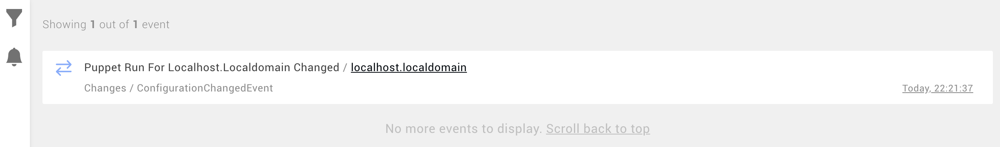

# Send events to Rancher Observability from an external system

This tutorial shows you how to send events from external systems to Rancher Observability.

Rancher Observability creates a real-time map over your IT landscape and tracks all changes that occur. These changes are visible as events in the [Events Perspective](../../use/stackstate-ui/perspectives/events_perspective.md).

This tutorial shows how you can submit external events to Rancher Observability.

## Setup

[This repository](https://github.com/StackVista/events-tutorial) contains a sample project with a [Puppet report processor \(puppet.com\)](https://puppet.com/docs/puppet/7.0/reporting_about.html) that will process a report of a Puppet configuration run and send events to Rancher Observability.

In Rancher Observability, the events visible in the Events Perspective are related to elements \(components or relations\). In our example, the events sent to Rancher Observability by the report processor will be related to the host that Puppet runs on.

The sample project uses [Vagrant \(vagrantup.com\)](https://www.vagrantup.com/) to provision a virtual machine with Puppet and the sample report processor installed. If you don't have access to Vagrant, read how you can [submit events directly](events_tutorial.md#submitting-external-events-directly).

Clone the repository to your laptop to get started.

## Preparing Rancher Observability

Before you get started, Rancher Observability must be configured to handle the data that will be sent from the sample project. The project uses a Rancher Observability Agent installed on the virtual machine to send data in a format that's consumed by the Rancher Observability **Agent V2 StackPack**.

The sample project will handle installation of a Rancher Observability Agent on the virtual machine. You will need to install the **Agent V2 StackPack** in Rancher Observability to interpret the data it sends. If you're running the tutorial on an existing instance of Rancher Observability, we advise you to install a dedicated instance of the Agent V2 StackPack for the tutorial. This will allow you to easily clean up and remove all configuration and topology imported during the tutorial when you're finished.

## Preparing the tutorial

First, boot the virtual machine using Vagrant:

```text
vagrant up
```

Vagrant will download a virtual machine image and provision a virtual machine. When it's finished, you can log into the machine using the command:

```text
vagrant ssh
```

The rest of this tutorial assumes you are running as the `root` user. Use the following command to change to `root` in your virtual machine:

```text
sudo su -
```

Before running the example, you need to configure the sample project with your Rancher Observability instance URL and API key.

```text
export STS_API_KEY=your-api-key
export STS_STS_URL=https://stackstate.acme.com/stsAgent
```

That's it, you are now ready to run the example.

## Running the example

The sample project is shipped with a single `run.sh` script that does the following:

1. Check for the presence of the `STS_STS_URL` and `STS_API_KEY` environment variables.
2. Place the environment variables in the correct configuration files.
3. Install Rancher Observability Agent V2 if it isn't already installed.
4. Start Rancher Observability Agent V2 if it isn't already started.
5. Invoke Puppet to make some configuration changes to the virtual machine.

Now, go ahead and trigger the script:

```text
./run.sh
```

Once the Puppet run is finished, the report processor is invoked and formats a JSON message that it sends to Rancher Observability. You can see the [report processor code on GitHub](https://github.com/StackVista/events-tutorial/blob/main/puppet/modules/stackstate/lib/puppet/reports/stackstate.rb).

The event will be visible in the Rancher Observability Events Perspective:



## Submitting external events directly

If you don't have access to Vagrant, you can also submit the JSON to Rancher Observability directly using the command below.


If you execute this command locally instead of on the virtual machine, make sure that you have the environment variables set properly.


```text
TS=`date +%s`; cat event.json | \
    sed -e "s/##TIMESTAMP##/$TS/" | \
    curl -H "Content-Type: application/json" -X POST \
    -d @- ${STS_STS_URL}/intake/\?api_key\=${STS_API_KEY}
```

For these events to appear in Rancher Observability, the component representing the virtual machine must be present with the identifier `urn:host:/localhost.localdomain`. See how to [manually add a component](../../configure/topology/how_to_create_manual_topology.md#how-to-create-components).

## Terminating the virtual machine

When you are done running the example, exit the shell and use the following command to terminate the virtual machine:

```text
vagrant destroy
```

## Cleaning your Rancher Observability instance

When you are done with this tutorial, you can remove the configuration from your Rancher Observability instance as follows:

* Uninstall the **Agent V2 StackPack**. This will remove the configuration and data received \(topology\) from Rancher Observability.

## See also

* [Rancher Observability Events Perspective](../../use/stackstate-ui/perspectives/events_perspective.md)
* [Send events to Rancher Observability over HTTP](../../configure/telemetry/send_metrics.md#send-telemetry-over-http)
* [Automate event notifications and actions based on events](../developer-guides/custom-functions/event-handler-functions.md)

