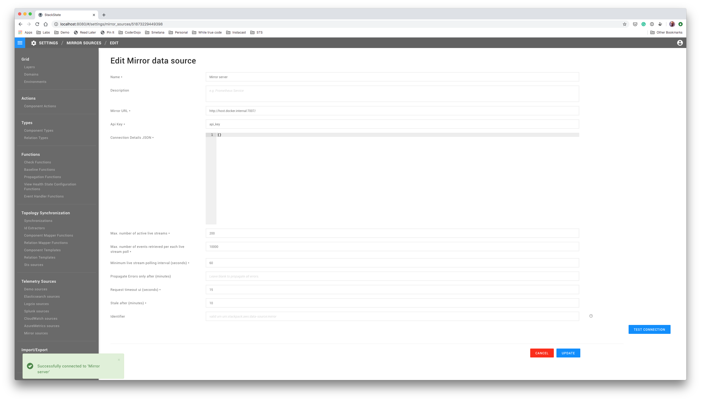
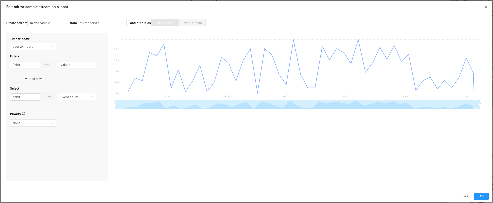

# Mirror integration tutorial


**This page describes StackState version 4.2.**

The StackState 4.2 version range is End of Life (EOL) and no longer supported. We encourage customers still running the 4.2 version range to upgrade to a more recent release.

Go to the [documentation for the latest StackState release](https://docs.stackstate.com/).


StackState supports fetching external telemetry and mapping this onto components as metric streams, for instance with the AWS StackPack and CloudWatch. In this scenario, StackState pulls telemetry data from CloudWatch on-demand when required for StackState server processes or the StackState GUI. The telemetry data from CloudWatch is not copied into StackState, but retrieved and used when needed. This concept is called _mirroring_ and is further described [in the StackState documentation](/develop/developer-guides/mirroring.md).

Mirror integrations can be built in any language and run as a separate process. A mirror can:

* retrieve telemetry data from external systems on-demand
* aggregate this data in various ways
* send the data in a standard format to StackState

## Mirror architecture

To integrate StackState with an external telemetry source using mirroring, the mirror integration sits in between StackState and the telemetry source. The mirror offers a standard interface \(the mirror API\) to StackState so that StackState can use multiple different mirror data sources out of the box. The mirror integration translates calls to the mirror API to calls to a telemetry datasource, allowing StackState to access telemetry data in a standard way.

## Setup

[This repository](https://github.com/StackVista/mirror-integration-tutorial) contains a sample mirror that serves telemetry data to StackState. The mirror is built in Python and stored in the `mirror_server.py` file.

Clone the repository to your laptop to get started.

## Running the sample mirror

For this demo, your StackState instance needs to be able to connect with the mirror running on your local laptop. This can be done by running StackState on your laptop as well, or by exposing your laptop to the internet using `ngrok`.

Start by running the sample mirror. This directory contains a Python mirror server:

```text
python3 mirror_server.py
```

The sample mirror server listens for requests on port `7007`.

## Configuring the mirror in StackState

In StackState, navigate to the **Settings** page and find **Mirror sources** in the **Telemetry Sources** section. Create a new mirror data source with the following parameters:

* Name: Mirror server
* Mirror URL: URL to connect to the mirror, use `host.docker.internal` if you are running everything on your laptop, or the `ngrok` URL if you are using it to expose your laptop to the internet
* Api Key: `api_key`
* Connection details JSON: a JSON datastructure that specifies how the mirror can connect to the external source. In our example, you can use an empty JSON object:

```text
{}
```

Use the **Test Connection** button to verify connectivity from StackState to the mirror.

Here is what that looks like:



## Adding a mirror stream to a component

Now let's add a telemetry stream from the mirror to the **a-host** component we added in the [push integration tutorial](push_integration_tutorial.md). Navigate to the component and open the Component Details pane.

In the **Telemetry streams** section, click on the **Add** button. This opens the Stream Wizard and allows you to add a new stream. Enter **mirror sample** as the name for the stream and select the **Mirror server** datasource.

In the Stream Creation screen, you should see random data right away. You can play around with the filter fields and values but they won't affect the returned data.

Here is what that looks like:



Click on the **Save** button to permanently add the stream to the **a-host** component.

## Cleaning your StackState instance

When you are done with this tutorial, you can remove the configuration from your StackState instance as follows:

* Remove the mirror data source you added

