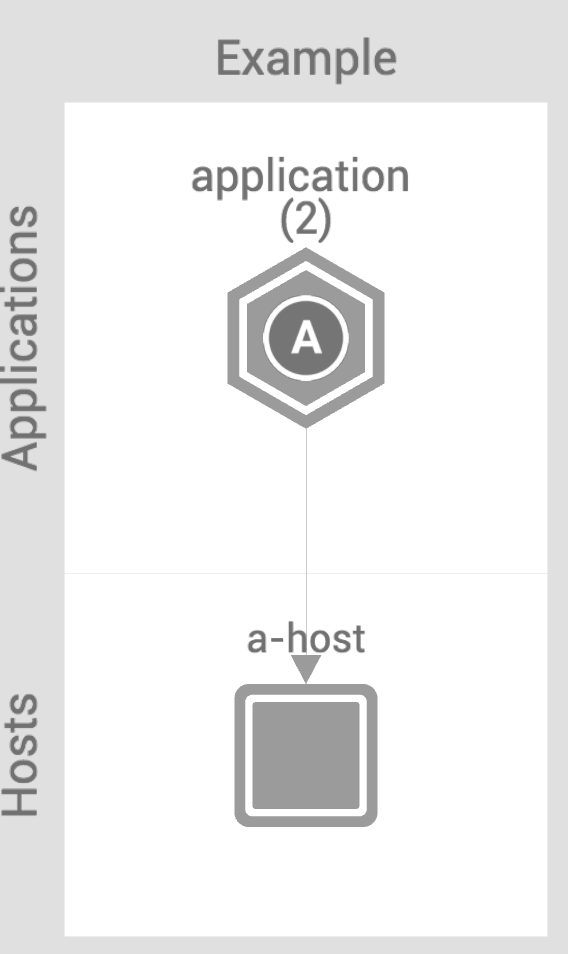
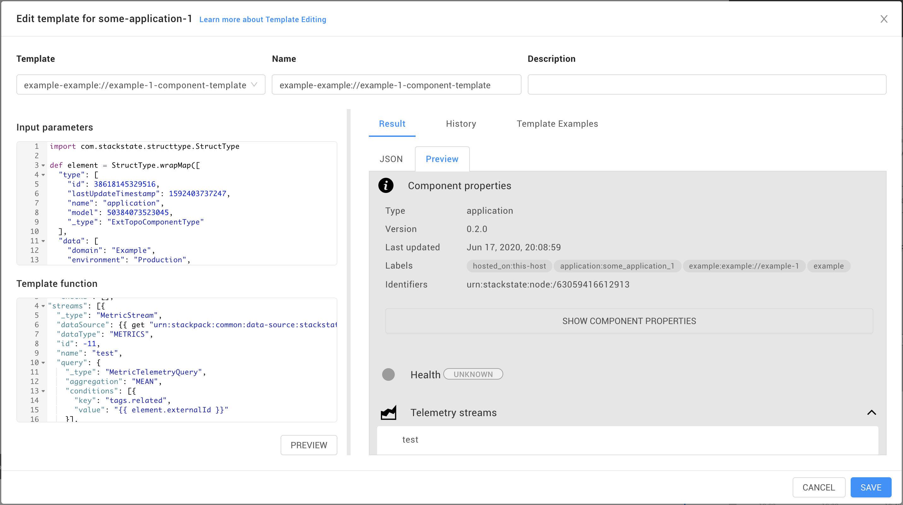
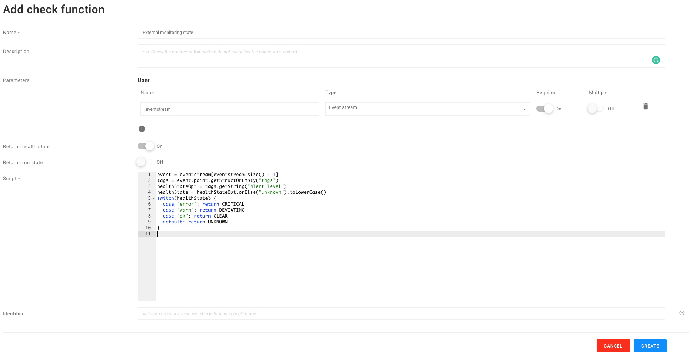
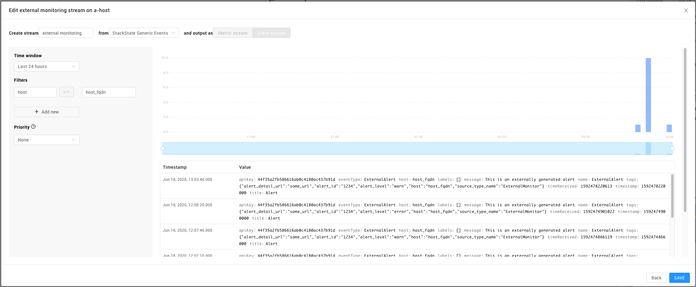
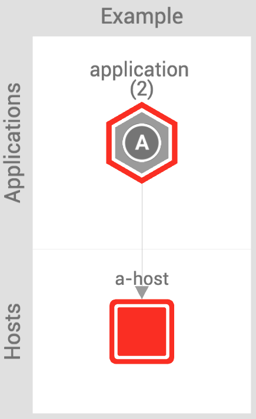

# Push-integration tutorial

This tutorial shows you how to create push-based integrations for StackState.

Push-based integrations are built in python and run as part of the StackState agent. Each python integration is called a `check` and it can:

* retrieve information from external systems
* convert the information into topology
* convert the information into telemetry
* send the data to StackState

## Setup

[This repository](https://github.com/StackVista/push-integration-tutorial) contains a sample project that sets up an agent check called `example` that sends topology into StackState. It uses docker to run the StackState agent to execute the check.

Clone the repository to your laptop to get started.

The `stackstate.yaml` file is the main agent configuration file. It tells the agent where to find StackState and what API key to use.

The `example` check consists of two files:

* `conf.d/example.d/conf.yaml` -- the check configuration file
* `checks.d/example.py` -- the check Python code

## Preparing StackState

Before you get started, StackState must be configured to handle the data we will be sending from the sample check. The sample check sends data in a format that is consumed by the built-in **Custom Synchronization StackPack**. After installing this StackPack, StackState will know how to interpret the sample check data and turn it into topology.

Configure the StackPack with the following values so they match with the data the check sends:

```text
Instance type (source identifier): example
Instance URL: example://example-1
```

## Preparing the tutorial

The StackState agent container uses the root directory of this repository for it's configuration files.

Before running the example, you need to configure the sample project with your StackState instance URL and API key.

```text
export STS_API_KEY=my-api-key
export STS_STS_URL=https://stackstate.acme.com/stsAgent
```

If you are running the agent from a container and StackState on your local machine \(eg via our Kubernetes helm charts\) you can refer the agent in the docker container to your local StackState:

```text
export STS_STS_URL=https://host.docker.internal/stsAgent
```

That's it, you are now ready to run the agent.

## Running the sample check using the agent

The sample project contains a `run.sh` shell script that runs the StackState agent in a docker container. It reads the configuration from this sample project and executes the `example` check.

When you run the agent, it writes logging to its standard output. The agent has debugging turned on by default \(check the `stackstate.yaml` file\) so it is fairly verbose.

Once the check has run successfully, the topology data produced by the `example` check will be sent to StackState.

Press `ctrl-c` to stop the agent.

## Seeing the topology in StackState

When you log into your StackState instance, go to the **Explore Mode**. Using the topology filter, select all topology with the `example` label. This should result in a topology similar to the following:



Note that the components you see are hardcoded in the `example` agent check. The components appear in the **Example** domain and **Applications** and **Hosts** layers. The check produces two application components that StackState has grouped together. This is shown as a hexagon icon. Click on the group to access the individual components that make up the group.

Click on one of the components to open the **Component Details pane**. You'll see the component's labels and other meta-data the check sent.

## Merging topology

StackState creates a single, unified picture of your IT landscape by ingesting and merging data from multiple sources. If the data your check delivers should be merged with data from other StackPacks, you'll need to configure the components with the correct extra identifiers.

In our sample check, this code defines the extra identifiers:

```text
    ...
    "identifiers": ["urn:host:/host_fqdn"],
    ...
```

Our documentation contains a description of the [identifiers used by various StackPacks](../../configure/identifiers.md).

## Adding a custom telemetry stream to a component

The sample check we are running also sends telemetry \(metrics\) to StackState, one metric stream for each of the application components. Let's find that telemetry data and map it to one of our applications.

Find the sample check's components in StackState and click on the **some-application-1** component. The Component Details pane opens on the right, showing the metadata of this component.

In the **Telemetry streams** section, click on the **Add** button. This opens the Stream Wizard and allows you to add a new stream. Enter **Gauge** as the name for the stream and select the **StackState Metrics** datasource.

In the Stream Creation screen, fill in the following parameters:

* Time window: Last hour
* Filters: `tags.related` = `application_id_1`
* Select: `example.gauge` by `Mean`

The stream preview on the right should show the incoming metric values. Here is what that looks like:


Click on the **Save** button to permanently add the stream to the **some-application-1** component.

## Adding a custom telemetry stream to all components of a type

The **some-application-1** component now has our telemetry stream. The sample check, however, also produces telemetry for the second application component. To map a stream to all components of a certain type, we need to update the component's _template_.

Select the **some-application-1** component again and in the Component Details pane, find the triple dots menu in the top-right corner. There, select the **Edit template** option. This brings up the **Template Editor**.

In the Template Editor you can edit the template used to create components based on data coming in from your sample check. It shows the following information:

* Input parameters -- this is the data sent by our example check that is processed by StackState
* Template function -- this is the template that uses the input parameters to create a component
* Component preview -- this is a preview of the component produced by applying the input parameters to the template function


Check out the **Template Examples** tab in the Template Editor to learn how to create templates.


The easiest way to add a stream to the component is to select **New template** from the Template dropdown. This will render a new template for your current component.

Find the `streams` property in the Template function text area and copy it to your clipboard.

Now switch back to the `example-example://example-1-component-template` in the Template dropdown.

In the Template function, replace the `streams` part with the code you copied earlier.

Notice that the telemetry query we are using is selecting the `tags.related` key and `some-application-1` for the value. This is correct for one of our components, but not for the other. We need to make this value dynamic.

Using the double curly notation, we can use dynamic values from our input data. Go ahead and replace the `some-application-1` with a reference to the component's external id:

```text
{{ element.externalId }}
```

The end result should look something like this:

```text
"streams": [{
  "_type": "MetricStream",
  "dataSource": {{ get "urn:stackpack:common:data-source:stackstate-metrics"  }},
  "dataType": "METRICS",
  "id": -11,
  "name": "test",
  "query": {
    "_type": "MetricTelemetryQuery",
    "aggregation": "MEAN",
    "conditions": [{
      "key": "tags.related",
      "value": "{{ element.externalId }}"
    }],
    "id": -13,
    "metricField": "example.gauge"
  },
  "syncCreated": false
}],
```



Go ahead and save the template. Be aware that you may need to _unlock_ it before this succeeds.

Now, we need to reset the synchronization so it will reprocess the incoming data. Go to the **Settings** area and find the **Synchronizations** page. There, use the kebab menu to reset the `Synchronization example example://example-1` synchronization.

If you go back to the topology, you'll see that both application components \(and any you might add in the future\) will have the stream there.

## Setting a component's health state from an external source

StackState calculates the health state of a component using a metric stream and one of the many check functions it ships with. It is also possible to create your own check function that interprets events from an external source, such as another monitoring tool, and use it to set the component's health state. Let's try that out on our **a-host** component.

Let's start by creating the check function that takes the incoming data and translates it to a health state. Go to the **Settings** area and find the **Check functions** page. Click the **Add Check function** button to create a new check function. Name the function **External monitor state**.

Our check functions will work on an event stream, so add a parameter to the function using the **plus** button. The parameter name is `eventstream` and it's type is, indeed, `Event stream`.

Use the following code for the check function:

```text
event = eventstream[eventstream.size() - 1]
tags = event.point.getStructOrEmpty("tags")
healthStateOpt = tags.getString("alert_level")
healthState = healthStateOpt.orElse("unknown").toLowerCase()
switch(healthState) {
  case "error": return CRITICAL
  case "warn": return DEVIATING
  case "ok": return CLEAR
  default: return UNKNOWN
}
```

Here is what that looks like:



Finally save the check function.

Now, let's create some test events for the component. Provided you have set the correct environment variables, the following command sends events into StackState:

```text
TS=`date +%s`; cat custom-event.json | sed -e "s/##TIMESTAMP##/$TS/" | curl -H "Content-Type: application/json" -X POST -d @- ${STS_STS_URL}/intake/\?api_key\=${STS_API_KEY}
```

Just execute a few of these so we have a few datapoints to work with.

Next, let's create an _event stream_ for the component. Find the **a-host** component and open the Component Details pane. In the **Telemetry streams** section, click on the **Add** button. This opens the Stream Wizard and allows you to add a new stream. Enter **External monitor** as the name for the stream and select the **StackState Generic Events** datasource.

In the Stream Creation screen, select the **Event stream** type at the top. Then fill in the following parameters:

* Time window: Last hour
* Filters: `host` = `host_fqdn`

Here is what that looks like:



You should already see the test events you sent. Go ahead and save the stream.

The last thing to do is to add a health check to the **a-host** component. In the **Health** section, click on the **Add** button. This opens the Check Wizard and allows you to add a new check. Enter **External monitor** as the name for the check and, under the **Check function**, select our **External monitoring state** check. StackState should automatically select the **External Monitoring** event stream. Save the check by clicking the **Create** button.

Now, sending in the events using the command below should set the health state to `CRITICAL`:

```text
TS=`date +%s`; cat custom-event.json | sed -e "s/##TIMESTAMP##/$TS/" | curl -H "Content-Type: application/json" -X POST -d @- ${STS_STS_URL}/intake/\?api_key\=${STS_API_KEY}
```

You can change the `alert_level` field in the `custom-event.json` file to try out different values, such as `error`, `warning` and `ok`. The component should change it's state a few seconds after receiving the event.

When the component turns `CRITICAL`, this is what you should see:



## Cleaning your StackState instance

When you are done with this tutorial, you can remove the configuration from your StackState instance as follows:

* Uninstall the **Custom Synchronization StackPack**. This will remove the configuration and data received \(topology\) from StackState.
* Remove any check functions you added

