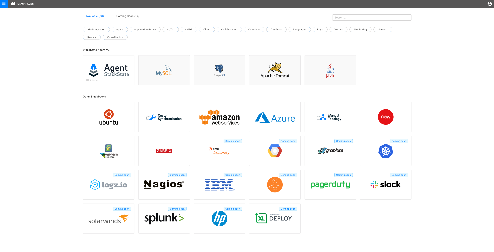
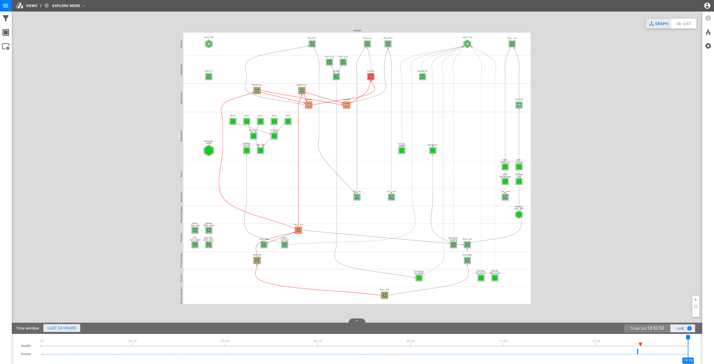
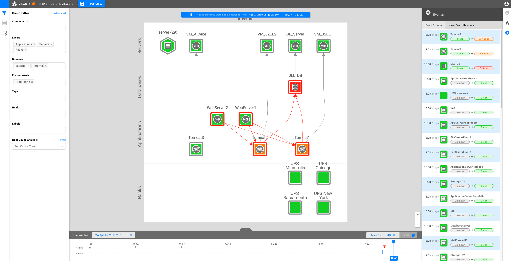
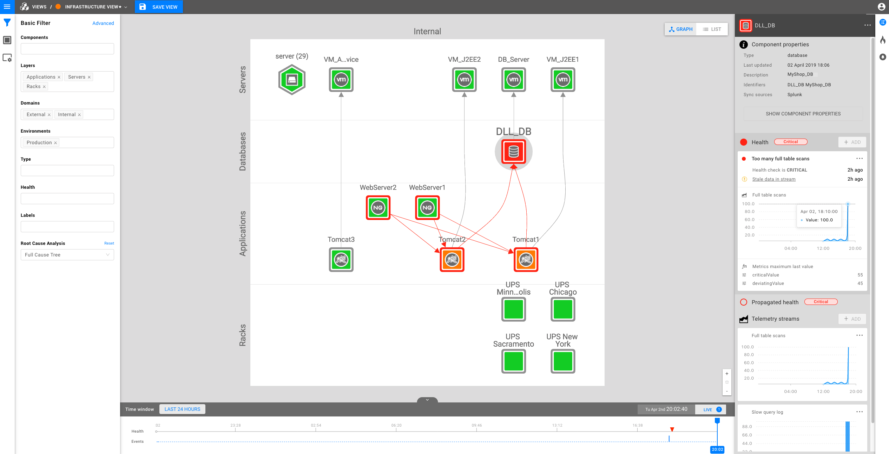
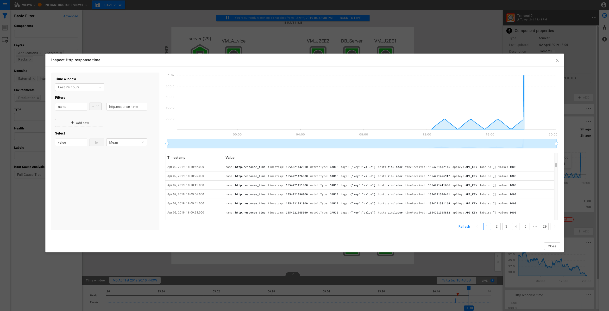
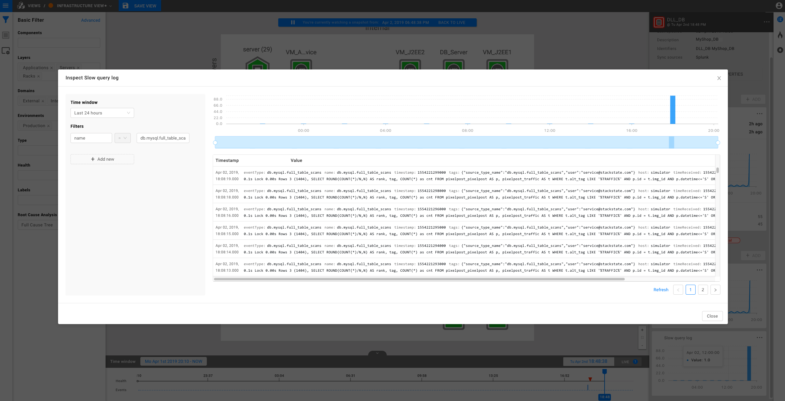
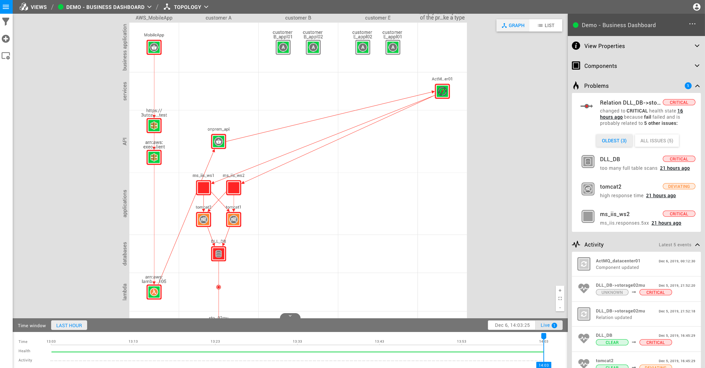
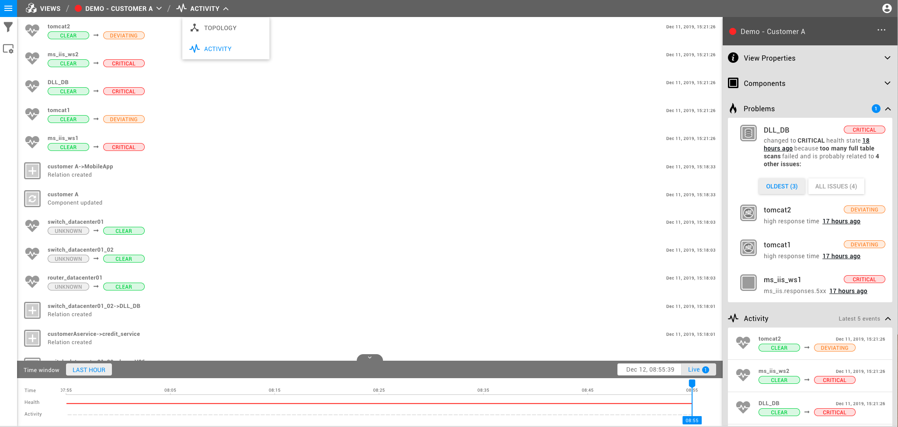
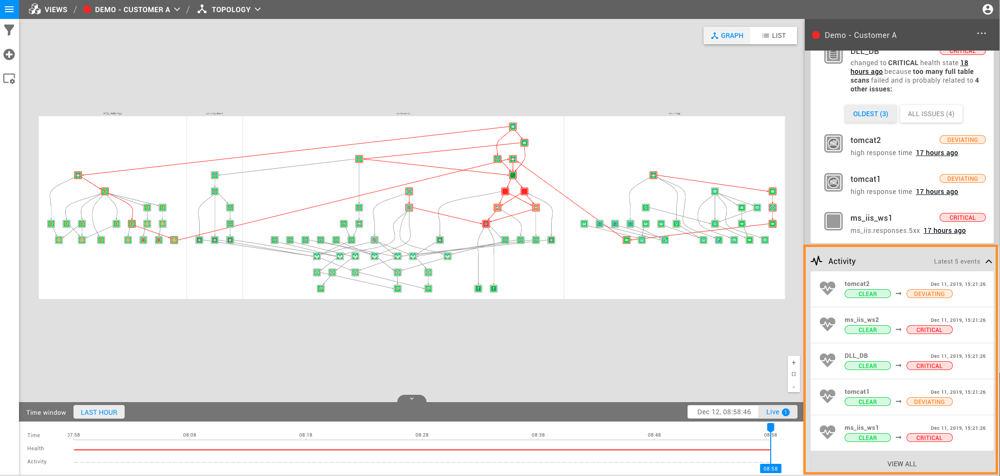

# Getting Started

Hi! So, you've just installed StackState and you are ready to get started.

## StackPacks

The first step to take is integrating StackState with your IT systems. This can be done by installing one or more [StackPacks](integrations/).

## Explore topology

After installing one or more StackPacks you can go to the Explore Mode to explore your IT landscape or visit a specific [view](use/views.md) from your installed StackPacks.

StackState visualizes components by the layer and domain they are placed in. These are logical groupings of components. Layers are displayed on the vertical axis. Domains are displayed on the horizontal axis.

You can change what part of the landscape \(e.g. layers and domains\) you are viewing with the filter options on the left side bar or by right clicking on a component.

## Topology elements

A topology consists of components and relations combined with their health state. Because topologies can get very large StackState automatically groups the components.

The health state of a component is indicated by two colors: the outer color and the inner color. The inner color of a component indicates the health state that is calculated for the component itself. The outer color indicates the potential impact of components that this component depends on.

The direction of a relation's arrow indicates dependency. For example, `app -> db` means: `app` depends on `db`. Health propagates in the opposite direction. So if the `db` component turns red, the `app` component will turn red too.

## Timeline

The timeline gives you the ability to go to any point in time. All the information that you see \(e.g. component details, metric streams, etc.\) depends on the time that is currently selected. Normally, StackState is in the live mode, meaning StackState will fully automatically display the latest state of the stack.

## Component / relation details

To see the details of a component or a relation you can click on it. Click on "Show component properties" to see all the details of a component.

## Metric inspector

Both components and relations can have one or multiple telemetry streams. The most common type is a metric stream also known as time series. If you click on a metric stream you can see the metric stream in a popup.

If you click on an event stream you can see the event/log stream in a popup. Again, there are a number of drill-down capabilities available on the left side of the popup.

## Problem clusters

To quickly find the cause of any deviating component, head to the right-hand pane in the selected view where you can find the Problems section of the sidebar. It reduces the cognitive flow and provides immediate understanding of ongoing problems. The Problems pane will show you the cause of problems in your view. This summary is based on the components impacted in your current view combined with all \(potential\) causes. Problems are automatically clustered by their root cause.

Order of displayed problems and issues is as follows:

* Problems are prioritized by the number of issues related to the specific problem. More affected components means higher priority on the list.
* In case of multiple problems having the same number of issues, StackState prioritizes the most recent one and presents the rest from the newest on the top to the oldest on the bottom.
* Component-specific issues grouped inside problems are displayed from the oldest ones at the top to the most recent issue at the bottom of the list.

Not all components displayed in the problem pane are necessarily also visible in the current topology view. To make the root cause of a problem visible, hover a mouse pointer over the component and select `show -> root cause` from the `Quick Actions` menu.

## Activity

To show all activity/events for the selected Topology, head to the breadcrumbs at the top of your Topology View, where you can find the dropdown menu that allows switching between Topology and Activity Perspectives. Examples of important events that may appear here are health state changes and changes to the components themselves, like version changes. With [event handlers](use/alerting.md), you can configure StackState to react to any events, for example, by automatically creating a ticket or triggering some automation.

However, the Activity Perspective is not the only place you can find events; you can find up to 5 latest events in the Activity section of the right-hand pane that presents information about the selected Topology View.

