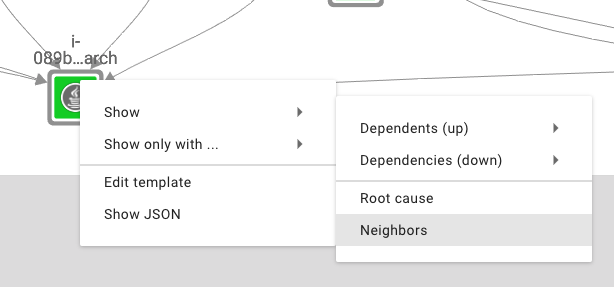

# topology\_selection

The topology in StackState is likely much bigger than what you care about at any given time. StackState allows you to filter the topology to locate the part of the topology you are interested in.

## Basic topology selection

The main way of filtering the topology is by using the basic filter panel, accessed using the _filter_ icon.

When you open StackState's topology view initially, it will show you all of the topology it can, provided it doesn't go over the configured topology limit. If there is more topology than can be shown while still keeping the system usable, StackState shows you a warning message and suggest you apply more filters to your topology selection.

From here, you can use the basic filter panel to filter the topology on certain properties. If you select a particular property, the topology view will be updated to show only the topology that matches the selected value. Selecting multiple properties narrows down your search \(ie it combines them using an `AND` operator\). Selecting multiple values for a single property expands your search \(ie it combines them using an `OR` operator\).

Using the basic filter panel you can select a subset of your topology based on the following properties:

* layers
* domains
* environments
* types
* health state
* tags / labels

[Layers, domains and environments](https://github.com/mpvvliet/stackstate-docs/tree/0f69067c340456b272cfe50e249f4f4ee680f8d9/basic_concepts/README.md#layers) are a way to organize your topology. The [health state](https://github.com/mpvvliet/stackstate-docs/tree/0f69067c340456b272cfe50e249f4f4ee680f8d9/basic_concepts/README.md#health-states) reflects how the component is functioning. Use labels to make it easy to navigate your topology.

## Filter settings

In addition to specifying which components to show, the basic filter panel also allows you to specify two settings.

**Root Cause Analysis** automatically expands the topology selection to display the root cause of an issue. There are three settings:

* None -- don't expand the topology selection
* Cause Only -- automatically add only the root cause to the topology selection
* Full Cause Tree -- automatically add the full cause tree to the topology selection

**Show Components** adds one or more specific components to the topology selection. You can **search** for the component by name.

## Basic filtering example

Here is an example of using the basic filtering capabilities. This example shows how to filter for a particular layer \(`Applications`\) and a tag \(`stackstate:agent`\).

The same topology selection can also be shown in list format:

## Interactive navigation

It is also possible to interactively navigate the topology. Right-click on a component to bring up the component navigation menu:

Selecting an action from the menu allows you to change your view, respective to the selected component.

**Show** expands the topology selection in one of the following ways:

* Dependents \(up\) -- adds the components depending on the selected component
* Dependencies \(down\) -- adds the components that the selected component depends on
* Root Cause -- if the selected component is in a non-clear state, adds the root cause tree
* Neighbors -- adds the selected component's neighbors \(1st level dependencies and dependents\)

**Show only with ...** isolates the selected component \(shows only that component\) and expands the topology selection in one of the following ways:

* Root Cause -- if the selected component is in a non-clear state, shows the root cause tree
* Neighbors -- shows the selected component's neighbors \(1st level dependencies and dependents\)

## Advanced topology selection

If you require more flexibility in selecting topology, check out our [guide to Advanced topology selection](https://github.com/mpvvliet/stackstate-docs/tree/0f69067c340456b272cfe50e249f4f4ee680f8d9/guides/topology_selection_advanced/README.md).

