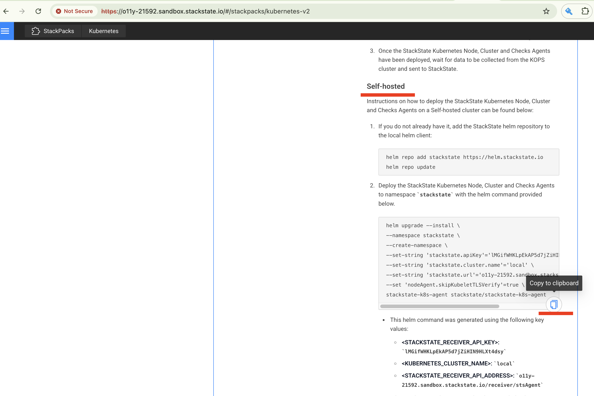

# Installing SUSE Observability Agent in Air-Gapped Mode

This document provides a step-by-step guide for installing the SUSE Observability Agent using Helm charts in an air-gapped environment. The installation process involves preparing the necessary Docker images and Helm chart on a host with internet access, transferring them to a host within a private network, uploading Docker images to a private registry, and deploying the Helm charts.

## Prerequisites

### On the Local Host (Internet Access)

- **Operating System**: Linux or MacOS
- **Tools Installed**:
  - [Docker](https://www.docker.com/products/docker-desktop/)
  - [Helm cli](https://helm.sh/docs/intro/install/)
  - Scripts for downloading Docker images from the source registry (links will be provided later in the guide).
- **Internet Access**: Required to pull Docker images from Quay.io and Helm charts from ChartMuseum.

### On the Private Network Host

- **Access**: SSH access to the host.
- **Tools Installed**:
  - [Docker](https://www.docker.com/products/docker-desktop/)
  - [Helm cli](https://helm.sh/docs/intro/install/)
  - Scripts for downloading Docker images from the source registry (links will be provided later in the guide).
  - Network access and credentials to upload images to a private Docker registry.
  - A configured Kubeconfig to install the Helm charts on the target clusters.

## Preparing the Docker Images and Helm Chart

Run the following commands on the local host to obtain the necessary Docker images and Helm charts:

**Adding Helm Repositories to the Local Helm Cache:**

```bash
# Adding the Helm repository for the SUSE Observability Agent
helm repo add suse-observability https://charts.rancher.com/server-charts/prime/suse-observability
helm repo update
```

**Fetching the Latest Version of the Chart**

The following command will download a TGZ archive of the chart from the Helm repository:

```bash
# Downloading the chart for the SUSE Observability Agent
# The file will be named stackstate-agent-X.Y.Z.tgz
helm fetch suse-observability/suse-observability-agent
```

**Getting the Bash scripts to save Docker images.**

```bash
# o11y-agent-get-images.sh
curl -LO https://raw.githubusercontent.com/StackVista/helm-charts/master/stable/suse-observability-agent/installation/o11y-agent-get-images.sh
# o11y-agent-save-images.sh
curl -LO https://raw.githubusercontent.com/StackVista/helm-charts/master/stable/suse-observability-agent/installation/o11y-agent-save-images.sh

# Make the scripts executable
chmod a+x o11y-agent-get-images.sh o11y-agent-save-images.sh
```

**Extracting and Saving Docker Images**

```bash
# Extract the list of images from the Helm chart and save it to a file.
./o11y-agent-get-images.sh -f suse-observability-agent-X.Y.Z.tgz > o11y-agent-images.txt
```

Replace `suse-observability-agent-X.Y.Z.tgz` with the actual filename of the chart archive downloaded earlier.*


```bash
# Save Docker images to an archive.
# The script expects the file o11y-agent-images.txt to contain the list of images used by the SUSE Observability Agent.
# The Docker images will be saved to o11y-agent-images.tar.gz.
./o11y-agent-save-images.sh -i o11y-agent-images.txt -f o11y-agent-images.tar.gz
```

## Copying the Required Files to the Remote Host

The following files have to be copied from the local host to the host in the private network:
- o11y-agent-images.txt (List of images required by the SUSE Observability Agent chart)
- o11y-agent-images.tar.gz (An archive with the SUSE Observability Agent's Docker images)
- [o11y-agent-load-images.sh](https://raw.githubusercontent.com/StackVista/helm-charts/master/stable/suse-observability-agent/installation/o11y-agent-load-images.sh) (Bash script to upload Docker images to a registry)
- Helm charts downloaded earlier:
  - suse-observability-agent-X.Y.Z.tgz

## Restoring Docker Images from the Archive to the Private Registry

**Uploading the images to the private registry:**

```bash
# Load Docker images from the archive and push them to the private registry.
# Replace <private-registry> with your private registry's URL.
export DST_REGISTRY_USERNAME="..."
export DST_REGISTRY_PASSWORD="..."
./o11y-agent-load-images.sh -d registry.example.com:5043 -i o11y-agent-images.txt -f o11y-agent-images.tar.gz
```


*Note: if the destination registry doesn't use authentication the environment variables, `DST_REGISTRY_USERNAME` and `DST_REGISTRY_PASSWORD` must not be configured or have to be set to empty values.*


## Installing SUSE Observability Agent

The command to install the SUSE Observability Agent has to be received from SUSE Observability UI.
Log in to your instance and in the left-side menu choose the `Stackpacks`. Press `ADD NEW INSTANCE` and fill in the name of the cluster. For correct integration with Rancher it has to be the same as the cluster name in the Rancher UI.


When an instance is added, the UI will provide the instructions how the Helm chart can be deployed. Scroll down to the `Self-hosted` section and copy `helm upgrade ...` command



The command has to be updated for the air-gapped installation:
- Overriding the image registry with `all.image.registry` value.
- Using the arhive with the Helm chart instead of the Helm repository. `suse-observability/suse-observability-agent` -> `./suse-observability-agent-X.Y.Z.tgz`

Run the command to install the SUSE Observability Agent

```bash
helm upgrade --install \
--namespace suse-observability \
--create-namespace \
--set-string 'stackstate.apiKey'='<api-key>' \
--set-string 'stackstate.cluster.name'='<cluster-name>' \
--set-string 'stackstate.url'='https://...' \
--set 'nodeAgent.skipKubeletTLSVerify'=true \
--set-string 'all.image.registry'='registry.acme.com:5000' \
--set-string 'global.imageRegistry'='registry.acme.com:5000' \
--set-string 'global.skipSslValidation'=true \
suse-observability-agent ./suse-observability-agent-X.Y.Z.tgz
```

**Validating the Deployment**

```bash
kubectl get pod -n stackstate
```
