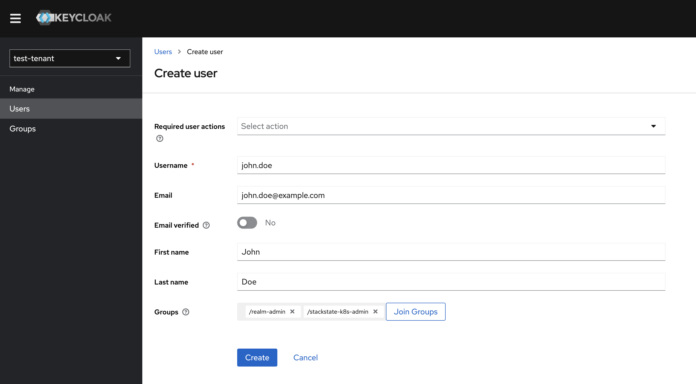
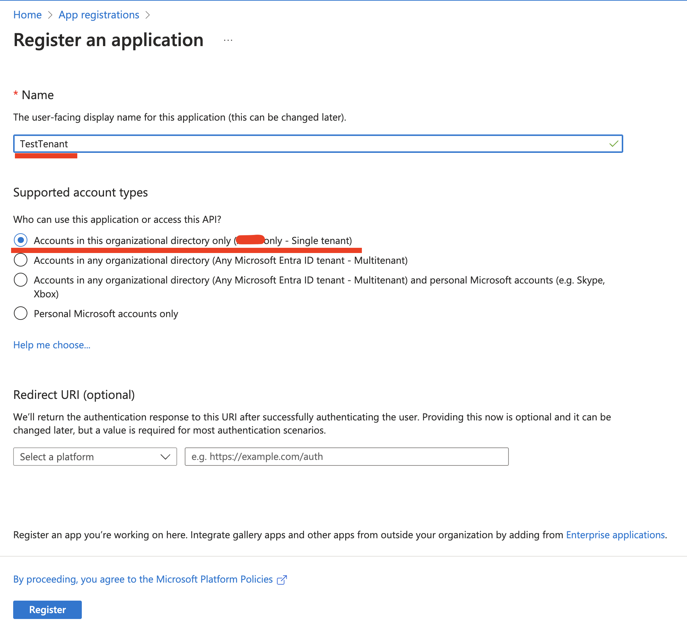
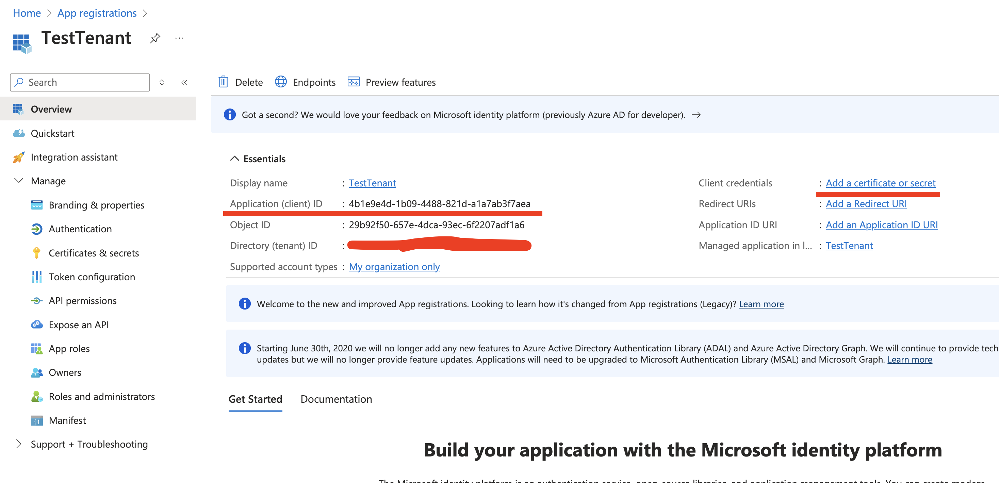
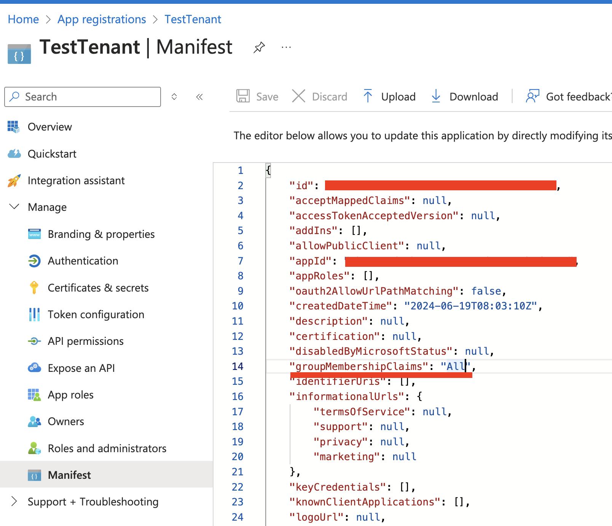
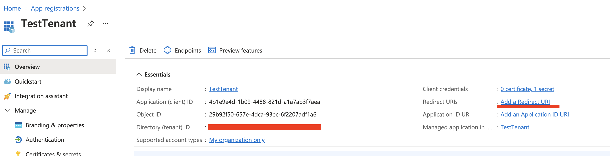
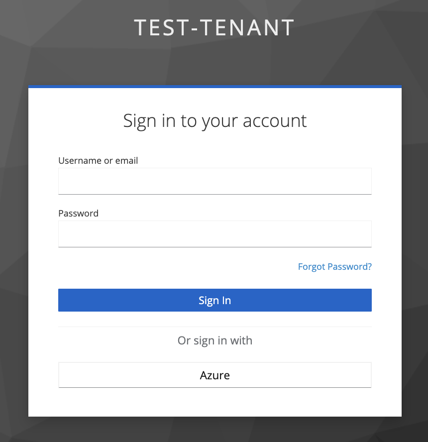
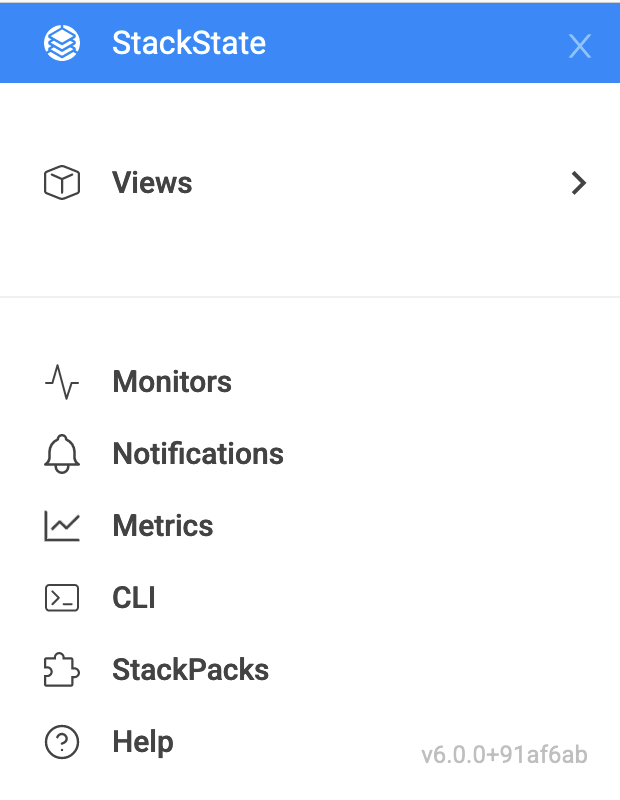

# User management

Users of the SaaS tenants (StackState instances) are managed with [Keycloak](https://www.keycloak.org/). Each customer (tenant) has a dedicated Keycloak realm. A link to the Keycloak console is sent in the welcome message when a user is created.

There are two levels of user management permissions: **Basic** and **Advanced**.

- **Basic**: Allows users to add new users and add them to Keycloak groups.
- **Advanced**: Allows users to manage an entire Keycloak realm (configuring Identity Providers, Authentication/Authorization options, etc.).  **Available to the paid users only.**

All SaaS tenants start with **Basic** mode. Paid customers can request an upgrade to **Advanced** mode by filing a support ticket to [help@stackstate.zendesk.com](mailto:help@stackstate.zendesk.com).
Users who are members of the `realm-admin` Keycloak group receive a link to the Keycloak Admin Console in the welcome message. 

StackState redirects users to Keycloak for authentication. Users are expected to be members of one or more Keycloak groups.

The predefined Keycloak groups:

- **realm-admin**: Members of this group can log in to the Keycloak realm console and perform operations allowed by their user management mode (Basic or Advanced).

- **stackstate-k8s-troubleshooter**: Users in this group are assigned the `stackstate-k8s-troubleshooter` Keycloak client role, which maps to the StackState role with the same name.

## Basic User Management

- Log in to Keycloak Admin Console.

### Manage users
- In the left-hand menu, select `Users` under the `Manage` section.

#### Adding a new user
To **add a new user** click the `Add user` button. Enter the necessary user information (Username, Email, First Name, Last Name).
- Leave `Required users actions` empty.
- Add the user to the required groups.
- Click Save. The welcome message with the sign-up link and the links to the Saas tenant, Keycloak Admin and Account consoles are emailed to the user.
- **To activate the account, which includes email confirmation and the password reset, the user must follow the sign-up link.**

#### Editing user's details

To **edit user details**, select the user by clicking on Username.
  - Change the details as needed.
  - Set one or more `Required user actions`, for example, to force the user to update password or configure OTP.
  - Press "Save" button when done.

#### Deleting a user
To **delete one or more users**, select the required users and press `Delete user` button.

### Change Group Membership

- Log in to the Keycloak Admin Console.
- In the `Groups` section, search for the group you want to manage.
- Click on the group name to open group details and go to the `Members` tab.
- To add a new group member, press the `Add Member` button and select the required users.
- To delete users from the group, select the users from the list, then from the menu that at the same line as the `Add member` button marked as "⋮", select `Leave group`.

## Advanced User Management

In Advanced User Management, users have full administrative permissions within their Keycloak realm. They can configure authentication, authorization, external identity providers, and more.

Refer to [the official Keycloak documentation](https://www.keycloak.org/docs/22.0.5/server_admin/index.html) for more details.

A Keycloak realm comes with the initial configuration:

- An OIDC client integrated with a Saas tenant.
  - A set of Keycloak client roles that map to StackState built-in roles.
    - `stackstate-k8s-troubleshooter`
- A realm role to manage the Keycloak realm, `realm-admin`.
- A set of Keycloak Groups with corresponding Keycloak client and realm roles assigned:
  - `realm-admin`
  - `stackstate-k8s-troubleshooter`
- SMTP server configuration to send email notifications generated by Keycloak.
- A custom eventListener, `stackstate-user-creation`, which is responsible for generating a welcome message to new users.

Please avoid modifying the mentioned resources, as well as the default realm's clients, since it might require resetting the Keycloak realm configuration.

### Example: Using Azure Active Directory as an IdentityProvider

⚠️ This guide is applicable for the Advanced User Management only.

#### Prerequisites

- The user must be a member of the `realm-admin` Keycloak group.
- Permissions to create `App registrations` in [the Azure portal](https://portal.azure.com/#view/Microsoft_AAD_RegisteredApps/ApplicationsListBlade).
- An ID of the Active Directory group to grant permissions to Stackstate. (found in the [Groups section of the Azure portal](https://portal.azure.com/#view/Microsoft_AAD_IAM/GroupsManagementMenuBlade/~/AllGroups)).

#### Creating an App Registration in Azure

- Log in to [the Azure portal](https://portal.azure.com) and proceed to [App registrations](https://portal.azure.com/#view/Microsoft_AAD_RegisteredApps/ApplicationsListBlade)
- Press `New registration`, fill in the name of the registration, select `Accounts in this organizational directory only` and leave all other fields as is.

- Note the `Application (client) ID` for the created app registration; it will be used later to configure a Keycloak Identity Provider. *The value of the secret is shown only once just after creation.*
- Press `Add a certificate or secret` and create a client secret. Note the value for the created secret; it will be used later to configure a Keycloak Identity Provider.

- From the `App registration` page go to `Endpoints` and note the `OpenID Connect metadata document` link; it will be used later to configure a Keycloak Identity Provider.

- Go to the Manifest section and ensure that the `groupMembershipClaims` setting of the App registration is set to `All`. This is required to map Active Directory Groups to the Keycloak Groups/Roles.

#### Adding an Identity Provider to Keycloak

- Log in to the Keycloak Admin console.
- In the left-hand menu, select `Identity providers` under the `Configure` section.
- Choose `OpenID Connect v1.0`.
- Fill in the `Display name` as required, and input the `Client ID`, `Client Secret`, and `Discovery endpoint` with the data from the App registration notes.

- Note `Redirect URI`, which is needed to complete the App registration.
- Press `Add`.
- Scroll to the bottom the page and set `Sync mode` to `Force`.
- Click Save to finalize the provider configuration.

#### Finalizing App registration

- Return to the `App Registration` section of the Azure portal and click `Add a Redirect URI`

- Click `Add a platform` and select `Web` from the right-hand frame.
- Enter the Redirect URI from the Keycloak Identity Provider's configuration and click `Configure`.

#### Verifying Keycloak Identity Provider

- Open your tenant URL in a browser. The Login page should now include an option to sign in with the configured IdentityProvider. *If you have already logged into the tenant you must log out first.*

- If everything is configured correctly you should be logged into the tenant with the default StackState role, `stackstate-guest`.

#### Mapping Azure Active Directory role to Stackstate role

This guide assumes an Azure Identity Provider was added as described earlier.

- Log in to the Keycloak Admin console.
- In the left-hand menu, select `Identity providers` under the `Configure` section and choose the `Azure` Identity Provider.
- Navigate to the  `Mappers` tab and press `Add mapper`.
- Fill in the details as shown in the screenshot. For the Claim Value use the ID (⚠️ not a name) of the Active Directory Group.

- Click `Save` to store the mapper settings.
- Log in to the StackState tenant to verify if the stackstate-k8s-troubleshooter StackState role has been granted to your user. You should see additional items in the menu such as Monitors, Stackpacks, etc.

