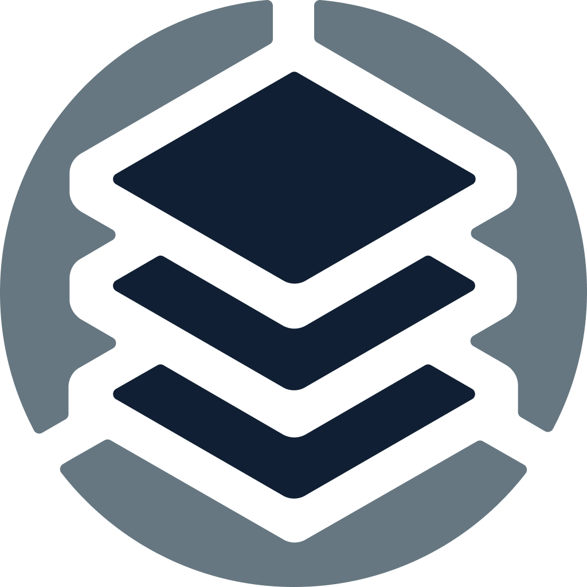

# Configuring Rancher Observability for Slack notifications


SaaS users of Rancher Observability can use Slack notifications without extra configuration. This guide is only applicable for self-hosted Rancher Observability installations, that are planning to use the Slack notification channel.


Before you can use the Slack notification channel in Rancher Observability, you first need to follow the following steps to set up both Slack and Rancher Observability:

1. Create a Slack app for Rancher Observability in your workspace
2. Configure Rancher Observability with the credentials for that Slack app.

## Creating a Slack app for Rancher Observability


You need to have the permissions in Slack to manage Slack apps for your workspace.


Go to the [Slack API page](https://api.slack.com/apps) and click on the **Create New App** button. 

* Select the "From an app manifest" option in the dialog that opens.
* Select the workspace you want to send notifications to and click next.
* Copy the contents of the Slack app manifest below and paste it into the text area. Make sure to replace the values in `redirect_urls` with the URL(s) of your Rancher Observability instance. Click next.
* Verify that the URL is correct and that the "bot scopes" listed are `channels:join, channels:read, chat:write, groups:read` and click the create button to create the app.
* On the "Basic information" page of the App it's possible to change the icon (in the Display information section), you can replace it with, for example, the Rancher Observability logo .


```json
{
    "display_information": {
        "name": "Rancher Observability",
        "description": "Receive notification messages from Rancher Observability",
        "background_color": "#000000"
    },
    "features": {
        "bot_user": {
            "display_name": "Rancher Observability",
            "always_online": true
        }
    },
    "oauth_config": {
        "redirect_urls": [
            "https://the.url.of.your.stackstate.installation"
        ],
        "scopes": {
            "bot": [
                "channels:join",
                "channels:read",
                "chat:write",
                "groups:read"
            ]
        }
    },
    "settings": {
        "org_deploy_enabled": false,
        "socket_mode_enabled": false,
        "token_rotation_enabled": false
    }
}
```


## Configure Rancher Observability with the credentials for that Slack app

Rancher Observability needs to be configured with the credentials for the Slack app that you created. You can do this by adding the following to the `values.yaml` file of your Rancher Observability installation:

```yaml
stackstate:
  components:
    all:
      extraEnv:
        open:
          CONFIG_FORCE_stackstate_notifications_channels_slack_authentication_clientId: "<app client id>"
        secret:
          CONFIG_FORCE_stackstate_notifications_channels_slack_authentication_clientSecret: "<app client secret>"
```

The `<app client id>` and `<app client secret>` values can be found in the "App credentials" section on the "Basic Information" page of the Slack app you created. Apply these configuration changes by running the same Helm command used during installation of Rancher Observability ([for Kubernetes](/setup/install-stackstate/kubernetes_openshift/kubernetes_install.md#deploy-stackstate-with-helm) or [OpenShift](/setup/install-stackstate/kubernetes_openshift/openshift_install.md#deploy-stackstate-with-helm)).

You're now ready to use the Slack notification channel!
