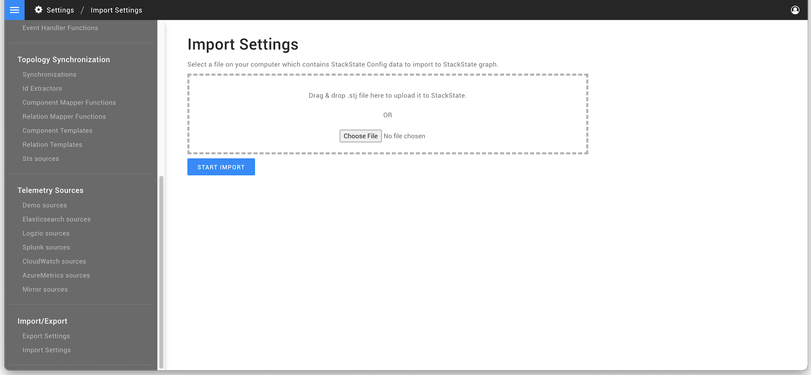

# Configuration backup

## Overview

StackState configuration can be exported and imported. The import/export functionality can be used to automate the installation process and/or for backup purposes. An export and import can be made in the settings page of StackState's user interface by using the buttons 'Export Model' and 'Import Model'.

## Export configuration

An export of the StackState configuration can be obtained from the StackState UI, the [StackState CLI](../../cli/README.md) or using curl commands. 

### StackState CLI


Note that the [lock status](../../../stackpacks/about-stackpacks.md#locked-configuration-items) of configuration items installed by a StackPack configuration will not be included in the export.





To export configuration using the `sts` CLI, run the command:

```text
# Output in terminal window
sts settings describe

# Export to file
sts settings describe --file <PATH_TO_FILE.sty>
```

From StackState v5.0, the old `sts` CLI has been renamed to `stac` and there is a new `sts` CLI. The command(s) provided here are for use with the new `sts` CLI.

➡️ [Check which version of the `sts` CLI you are running](/setup/cli/cli-comparison.md#which-version-of-the-cli-am-i-running "StackState Self-Hosted only")



To export configuration using the `stac` CLI (deprecated), run the command:

```text
# Output in terminal window
stac graph export

# Export to file
stac graph export > export.sty
```

⚠️ **From StackState v5.0, the old `sts` CLI is called `stac`. The old CLI is now deprecated.**

The new `sts` CLI replaces the `stac` CLI. It is advised to install the new `sts` CLI and upgrade any installed instance of the old `sts` CLI to `stac`. For details see:

* [Which version of the `sts` CLI am I running?](/setup/cli/cli-comparison.md#which-version-of-the-cli-am-i-running "StackState Self-Hosted only")
* [Install the new `sts` CLI and upgrade the old `sts` CLI to `stac`](/setup/cli/cli-sts.md#install-the-new-sts-cli "StackState Self-Hosted only")
* [Comparison between the CLIs](/setup/cli/cli-comparison.md "StackState Self-Hosted only")




### curl


Note that the [lock status](../../../stackpacks/about-stackpacks.md#locked-configuration-items) of configuration items installed by a StackPack configuration will not be included in the export.


To export configuration using curl, follow the steps below (with or without authentication):



StackState server can be configured to authenticate users when they access the application. In this case, an export curl script is required to first obtain a token before making the export request. This is not necessary when using the StackState CLI as authentication details are configured during installation.

Here is a sample sequence of curl commands to achieve this. The `<api-token>` used for authorization is available on the **CLI** page in the StackState UI main menu:

```text
# Obtain session from cookie AkkaHttpPac4jSession
# Obtain CSRF token from cookie pac4jCsrfToken
curl --fail -v \
  -H "Authorization: ApiToken <api-token>" \
  -H "Content-Type: application/x-www-form-urlencoded" \
  "http://<HOST>:7070/loginCallback"

# Do actual request
export SESSION="<MY_SESSION>"; export CSRF_TOKEN="<MY_CSRF_TOKEN>"; \
  curl -v -X POST \
  -H 'Content-Type: application/json;charset=UTF-8' \
  -d '{}' \
  -H Cookie:AkkaHttpPac4jSession=$SESSION \
  -H X-Sts-Token:$CSRF_TOKEN \
  "http://<HOST>:7070/api/export?timeoutSeconds=300" > export.sty
```



```text
curl -X POST -H 'Content-Type: application/json;charset=UTF-8' \
  -d '{}' \
  "http://<host>:7070/api/export?timeoutSeconds=300" > export.sty
```



### StackState UI


Note that the [lock status](../../../stackpacks/about-stackpacks.md#locked-configuration-items) of configuration items installed by a StackPack configuration will not be included in the export.


To export configuration from the StackState UI:

1. Go to **Settings** &gt; **Import/Export** &gt; **Export Settings**
2. Click the button **STS-EXPORT-ALL**.


## Import configuration

### StackState CLI


* Import is intended to be a one-off action - importing multiple times might result in duplicate configuration entries. This behavior applies to importing nodes without any identifier. 
* Note that the [lock status](../../../stackpacks/about-stackpacks.md#locked-configuration-items) of configuration items installed by a StackPack will not be included in configuration export files - **all configuration items will be unlocked after import**.





To import StackState configuration using the `sts` CLI, follow the steps below.

Before import, clear the StackState configuration by following the instructions at [clear stored data](/setup/data-management/clear_stored_data.md). 

```text
sts settings apply --file <PATH_TO_FILE.sty>
```

From StackState v5.0, the old `sts` CLI has been renamed to `stac` and there is a new `sts` CLI. The command(s) provided here are for use with the new `sts` CLI.

➡️ [Check which version of the `sts` CLI you are running](/setup/cli/cli-comparison.md#which-version-of-the-cli-am-i-running "StackState Self-Hosted only")



To import StackState configuration using the `stac` CLI (deprecated), follow the steps below.

Before import, clear the StackState configuration by following the instructions at [clear stored data](/setup/data-management/clear_stored_data.md). 

```text
stac graph import < <PATH_TO_FILE.sty>
```

⚠️ **From StackState v5.0, the old `sts` CLI is called `stac`. The old CLI is now deprecated.**

The new `sts` CLI replaces the `stac` CLI. It is advised to install the new `sts` CLI and upgrade any installed instance of the old `sts` CLI to `stac`. For details see:

* [Which version of the `sts` CLI am I running?](/setup/cli/cli-comparison.md#which-version-of-the-cli-am-i-running "StackState Self-Hosted only")
* [Install the new `sts` CLI and upgrade the old `sts` CLI to `stac`](/setup/cli/cli-sts.md#install-the-new-sts-cli "StackState Self-Hosted only")
* [Comparison between the CLIs](/setup/cli/cli-comparison.md "StackState Self-Hosted only")




### curl


* Import is intended to be a one-off action - importing multiple times might result in duplicate configuration entries. This behavior applies to importing nodes without any identifier. 
* Note that the [lock status](../../../stackpacks/about-stackpacks.md#locked-configuration-items) of configuration items installed by a StackPack will not be included in configuration export files - **all configuration items will be unlocked after import**.





To import StackState configuration using curl with authentication, follow the steps below.

Before import, clear the StackState configuration by following the instructions at [clear stored data](/setup/data-management/clear_stored_data.md). 

The `<api-token>` can be found on the **CLI** page in the StackState UI main menu.

```text

# Obtain session from cookie AkkaHttpPac4jSession
# Obtain CSRF token from cookie pac4jCsrfToken
curl --fail -v \
  -H "Authorization: ApiToken <api-token>" \
  -H "Content-Type: application/x-www-form-urlencoded" \
  "http://<host>:7070/loginCallback"

# Do actual request
export SESSION="<MY_SESSION>"; export CSRF_TOKEN="<MY_CSRF_TOKEN>"; \
  curl -X POST -d @export.sty \
  -H 'Content-Type: application/json;charset=UTF-8' \
  -H Cookie:AkkaHttpPac4jSession=$SESSION \
  -H X-Sts-Token:$CSRF_TOKEN "http://<HOST>:7070/api/import?timeoutSeconds=15"
```



To import StackState configuration using curl without authentication, follow the steps below.

Before import, clear the StackState configuration by following the instructions at [clear stored data](/setup/data-management/clear_stored_data.md). 

```text

## Import without authentication
curl -X POST -d @./export.sty \
  -H 'Content-Type: application/json;charset=UTF-8' \
  "http://<host>:7070/api/import?timeoutSeconds=15"
  
```




### StackState UI


* Import is intended to be a one-off action - importing multiple times might result in duplicate configuration entries. This behavior applies to importing nodes without any identifier. 
* Note that the [lock status](../../../stackpacks/about-stackpacks.md#locked-configuration-items) of configuration items installed by a StackPack will not be included in configuration export files - **all configuration items will be unlocked after import**.


Before import, clear the StackState configuration by following the instructions at [clear stored data](/setup/data-management/clear_stored_data.md).

To import StackState configuration in the StackState UI:

1. Go to **Settings** &gt; **Import/Export** &gt; **Import Settings**.
2. Choose the `*.sty` file that you want to import configuration from.
3. Click the button **START IMPORT**.



## Advanced import/export

### Individual configuration items

It is possible to export and import individual configuration items through the StackState user interface. For example, to export or export a component type:

1. Go to the **Settings** page and click **Component Types**.
2. To export an individual component type, click **Export as config**.
3. To import a configuration item, click **Import Model**.

### Idempotent import/export

There is a way to use identifiers and namespaces that come with them to perform a configuration update of the specific sets of nodes idempotently. This approach does not lead to duplicates, but checks for the changes within a specified namespace and applies them to existing nodes, including removing nodes, as well as allow for creating the new ones.

Node identifiers are specified in a following pattern: `urn:stackpack:{stackpack_name}:{type_name}:{object_name}`. The namespace effectively used by this process is `urn:stackpack:{stackpack_name}:`. If every configuration node has an identifier and they are all in the same namespace, then you can perform an idempotent update using following STS CLI commands:

#### export




```sh
sts settings describe --namespace urn:stackpack:{stackpack_name}:
```

From StackState v5.0, the old `sts` CLI has been renamed to `stac` and there is a new `sts` CLI. The command(s) provided here are for use with the new `sts` CLI.

➡️ [Check which version of the `sts` CLI you are running](/setup/cli/cli-comparison.md#which-version-of-the-cli-am-i-running "StackState Self-Hosted only")


```text
stac graph export --namespace urn:stackpack:{stackpack_name}:
```

⚠️ **From StackState v5.0, the old `sts` CLI is called `stac`. The old CLI is now deprecated.**

The new `sts` CLI replaces the `stac` CLI. It is advised to install the new `sts` CLI and upgrade any installed instance of the old `sts` CLI to `stac`. For details see:

* [Which version of the `sts` CLI am I running?](/setup/cli/cli-comparison.md#which-version-of-the-cli-am-i-running "StackState Self-Hosted only")
* [Install the new `sts` CLI and upgrade the old `sts` CLI to `stac`](/setup/cli/cli-sts.md#install-the-new-sts-cli "StackState Self-Hosted only")
* [Comparison between the CLIs](/setup/cli/cli-comparison.md "StackState Self-Hosted only")




#### import



```
curl -XPOST http://yourInstance/api/import?namespace=urn:stackpack:{stackpack_name} \
    --data @./filename \
    -H 'Content-Type: application/json'
```



## Configuration Export Versioning

### Why versioning?

As StackState evolves, versioning of the exported Node elements is necessary. The export conf contains metadata stating the Node version \(`_version`\) which is useful in order to allow an autoupgrade to a more recent version of StackState and ensure compatibility.

```yaml
_version: 1.0.0
timestamp: 2018-12-06T12:30:44.148Z[Etc/UTC]
nodes:
  - _type: CheckFunction
    name: Metric fixed run state
    returnTypes:
      - RUN_STATE
    description: This check will always return the run state that is provided when a metric has been received.
    id: -196
    script: return metricFixedRunState;
    parameters:
      - _type: Parameter
        name: metrics
        system: false
        id: -194
        multiple: false
        type: METRIC_STREAM
        required: true
      - _type: Parameter
        name: metricFixedRunState
        system: false
        id: -195
        multiple: false
        type: RUN_STATE_VALUE
        required: true
```

### Supported versions

A configuration export is supported by versions of StackState that are equal or higher than the export's version and with the same major version \(see [semver](https://semver.org)\). The first configuration export version is _1.0.0_, and effectively any Node payload with a version below or missing the version field \(`_version`\) will be interpreted and auto-upgraded to version _1.0.0_.

**For example:**

Configuration export version _1.0.0_ was introduced in StackState version _1.14.0_
Later configuration export version _1.1.0_ was introduced in StackState version _1.14.1_
Later configuration export version _2.0.0_ was introduced in StackState version _1.15.0_

This means that Nodes with Configuration version _1.0.0_ will work on both StackState _1.14.0_ and _1.14.1_ but not in _1.15.0_ as a major configuration export version \(_2.0.0_\) was introduced. It also means that configuration export version _1.1.0_ can only be used from StackState version _1.14.1_ but not before as in _1.14.0_

### Available versions

The table below displays configuration export versions and on which StackState versions they were introduced.

| Configuration Export version | Introduced on StackState version |
| :--- | :--- |
| 1.0.0 | 1.14.0 |

