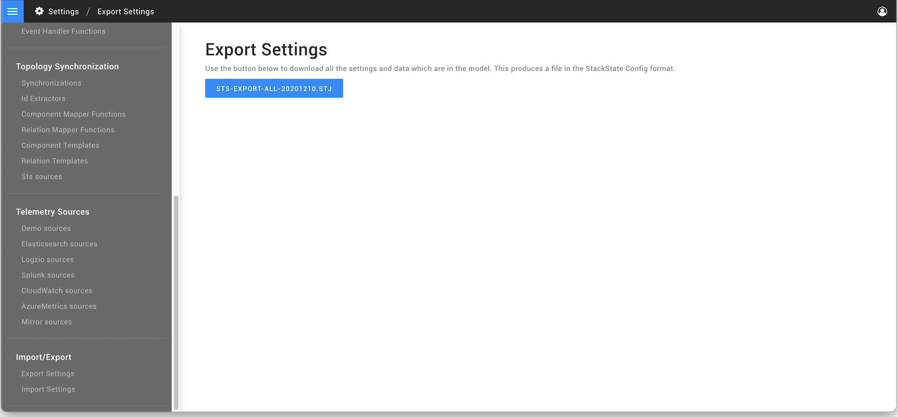
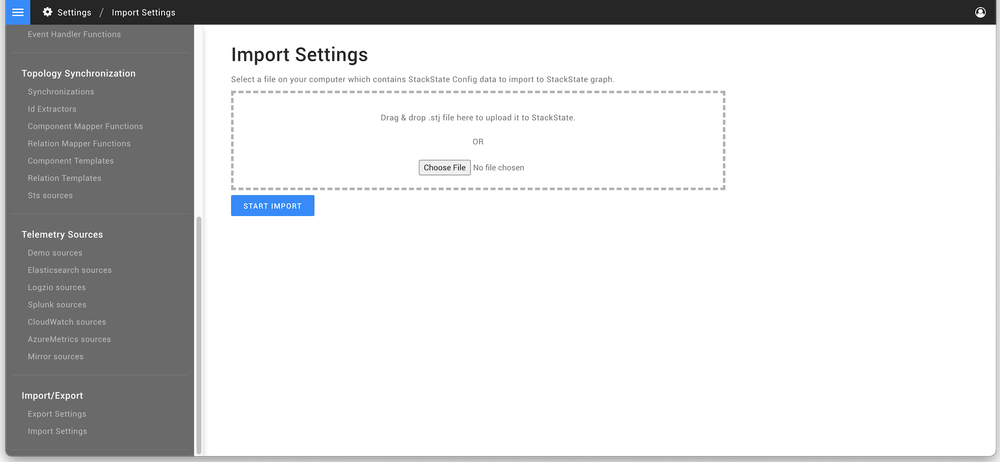

# Configuration backup


**This page describes StackState version 4.4.**

Go to the [documentation for the latest StackState release](https://docs.stackstate.com/setup/data-management/backup_restore/configuration_backup).


## Overview

StackState configuration can be exported and imported. The import/export functionality can be used to automate the installation process and/or for backup purposes. An export and import can be made in the settings page of StackState's user interface by using the buttons 'Export Model' and 'Import Model'.

## Export configuration

An export of the StackState configuration can be obtained from the StackState UI, the [StackState CLI](../../installation/cli-install.md) or using curl commands. Note that the [lock status](../../../stackpacks/about-stackpacks.md#locked-configuration-items) of configuration items installed by a StackPack configuration will not be included in the export.

To export configuration using the StackState CLI or curl:



```text
# Output in terminal window
sts graph export

# Export to file
sts graph export > export.stj
```



```text
curl -X POST -H 'Content-Type: application/json;charset=UTF-8' \
  -d '{}' \
  "http://<host>:7070/api/export?timeoutSeconds=300" > export.stj
```



To export configuration from the StackState UI:

1. Go to **Settings** &gt; **Import/Export** &gt; **Export Settings** 
2. Click on the button **STS-EXPORT-ALL**.



### Export configuration with authentication \(curl\)

StackState server can be configured to authenticate users when they access the application. In this case, an export curl script is required to first obtain a token before making the export request. This is not necessary when using the StackState CLI as authentication details are configured during installation.

Here is a sample sequence of curl commands to achieve this. The `<token>` used for authorization is available on the **CLI** page in the StackState UI main menu:



```text
# Obtain session from cookie AkkaHttpPac4jSession
# Obtain token from cookie pac4jCsrfToken
curl --fail -v \
  -H "Authorization: ApiToken <token>" <stackstate-api-endpoint> \
  -H "Content-Type: application/x-www-form-urlencoded" \
  "http://<HOST>:7070/loginCallback"

# Do actual request
export SESSION="<MY_SESSION>"; export TOKEN="<MY_TOKEN>"; \
  curl -v -X POST \
  -H 'Content-Type: application/json;charset=UTF-8' \
  -d '{}' \
  -H Cookie:AkkaHttpPac4jSession=$SESSION \
  -H X-Sts-Token:$TOKEN \
  "http://<HOST>:7070/api/export?timeoutSeconds=300" > export.stj
```



## Import configuration

Import is intended to be a one-off action - importing multiple times might result in duplicate configuration entries. This behavior applies to importing nodes without any identifier. It is possible to clear StackState's configuration before an import. Note that the [lock status](../../../stackpacks/about-stackpacks.md#locked-configuration-items) of configuration items installed by a StackPack will not be included in configuration export files - all configuration items will be unlocked after import.

To clear the StackState configuration and import from a file using the StackState CLI or curl. The `<token>` used for authorization with curl is available on the **CLI** page in the StackState UI main menu:



```text
sts graph import < export.stj
```



```text
## Clear StackState configuration
curl -X POST -f "http://<HOST>:7071/clear"


## Import without authentication
curl -X POST -d @./export.stj \
  -H 'Content-Type: application/json;charset=UTF-8' \
  "http://<host>:7070/api/import?timeoutSeconds=15"


## Import with authentication
# Obtain session from cookie AkkaHttpPac4jSession
# Obtain token from cookie pac4jCsrfToken
curl --fail -v \
  -H "Authorization: ApiToken <token>" <stackstate-api-endpoint> \
  -H "Content-Type: application/x-www-form-urlencoded" \
  "http://<host>:7070/loginCallback"

# Do actual request
export SESSION="<MY_SESSION>"; export TOKEN="<MY_TOKEN>"; \
  curl -X POST -d @export.stj \
  -H 'Content-Type: application/json;charset=UTF-8' \
  -H Cookie:AkkaHttpPac4jSession=$SESSION \
  -H X-Sts-Token:$TOKEN "http://<HOST>:7070/api/import?timeoutSeconds=15"
```



Alternatively, in the StackState UI:

1. Go to **Settings** &gt; **Import/Export** &gt; **Import Settings**. 
2. Choose the `*.stj` file that you want to import configuration from.
3. Click on the button **START IMPORT**.



## Import or export individual configuration items

It is possible to export and import individual configuration items through the StackState user interface. For example, to export or export a component type:

1. Go to the **Settings** page and click on **Component Types**.
2. To export an individual component type, click on **Export as config**.
3. To import a configuration item, click on **Import Model**.

## Idempotent import/export

There is a way to use identifiers and namespaces that come with them to perform a configuration update of the specific sets of nodes idempotently. This approach does not lead to duplicates, but checks for the changes within a specified namespace and applies them to existing nodes, including removing nodes, as well as allow for creating the new ones.

Node identifiers are specified in a following pattern: `urn:stackpack:{stackpack_name}:{type_name}:{object_name}`. The namespace effectively used by this process is `urn:stackpack:{stackpack_name}:`. If every configuration node has an identifier and they are all in the same namespace, then you can perform an idempotent update using following STS CLI commands:

For export: `sts graph export --namespace urn:stackpack:{stackpack_name}:`

For import currently we have a curl way: `curl -XPOST http://yourInstance/api/import?namespace=urn:stackpack:{stackpack_name} --data @./filename -H 'Content-Type: application/json'`

## Configuration Export Versioning

As StackState evolves versioning of the exported Node elements is necessary. The export conf contains metadata stating the Node version \(`_version`\) which is useful in order to allow an autoupgrade to a more recent version of StackState and ensure compatibility.

```text
{
  "_version": "1.0.0",
  "timestamp": "2018-12-06T12:30:44.148Z[Etc/UTC]",
  "nodes": [
    {
      "_type": "CheckFunction",
      "name": "Metric fixed run state",
      "returnTypes": [
        "RUN_STATE"
      ],
      "description": "This check will always return the run state that is provided when a metric has been received.",
      "id": -196,
      "script": "return metricFixedRunState;",
      "parameters": [
        {
          "_type": "Parameter",
          "name": "metrics",
          "system": false,
          "id": -194,
          "multiple": false,
          "type": "METRIC_STREAM",
          "required": true
        },
        {
          "_type": "Parameter",
          "name": "metricFixedRunState",
          "system": false,
          "id": -195,
          "multiple": false,
          "type": "RUN_STATE_VALUE",
          "required": true
        }
      ]
    }
  ]
}
```

## Supported Configuration Export version

A configuration export is supported by versions of StackState that are equal or higher than the export's version and with the same major version \(see [semver](https://semver.org)\). The first configuration export version is _1.0.0_, and effectively any Node payload with a version below or missing the version field \(`_version`\) will be interpreted and auto-upgraded to version _1.0.0_.

### For example:

Configuration export version _1.0.0_ was introduced in StackState version _1.14.0_  
Later configuration export version _1.1.0_ was introduced in StackState version _1.14.1_  
Later configuration export version _2.0.0_ was introduced in StackState version _1.15.0_

This means that Nodes with Configuration version _1.0.0_ will work on both StackState _1.14.0_ and _1.14.1_ but not in _1.15.0_ as a major configuration export version \(_2.0.0_\) was introduced. As well it means that configuration export version _1.1.0_ can only be used from StackState version _1.14.1_ but not before as in _1.14.0_

### Configuration export versions

The table below displays configuration export versions version and on which StackState versions they were introduced.

| Configuration Export version | Introduced on StackState version |
| :--- | :--- |
| 1.0.0 | 1.14.0 |

