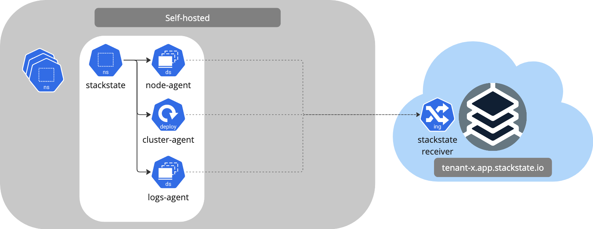

# Networking configuration

Rancher Observability is a SaaS offering that's hosted in the cloud. To be able to communicate from your premises/cloud to the Rancher Observability SaaS, the Rancher Observability Agent needs to be able to connect to the Rancher Observability SaaS Receiver API.
When your cluster is running in a private network, you might need to configure your network to allow the Rancher Observability Agent to connect to the Rancher Observability Receiver API, because your network configuration might disallow egress traffic to the internet. This page describes how to configure your network to allow to install the Rancher Observability Agent, as well as to allow the Rancher Observability Agent to communicate with the Rancher Observability Receiver API.


Traffic between the Rancher Observability Agent and the Rancher Observability Receiver API is always initiated by the Rancher Observability Agent. The Rancher Observability Receiver API doesn't initiate any traffic to the Rancher Observability Agent.


## Rancher Observability Agent installation

The installation of the Rancher Observability Agent is done through Helm. By default the Helm Chart is configured to pull the Rancher Observability Agent container images from the Quay.io docker registry. If your network configuration disallows egress traffic to the internet, you have a number of options to install the Rancher Observability Agent:

1. Configure your network to allow egress traffic to the Quay.io container registry from your Kubernetes cluster.
2. Proxy the Quay.io container registry through your own container registry.
3. Pull the Docker images into your own container registry.

For option 2 and 3, you need to configure the Helm Chart to pull the Rancher Observability Agent container images from your own container registry. A guide to configure the Rancher Observability Agent Helm Chart to pull images from your own container registry can be found [here](/setup/agent/k8s-custom-registry.md).


## Rancher Observability Agent communication

The Rancher Observability Agent communicates with the Rancher Observability Receiver API over HTTPS. The different parts of the Rancher Observability Agent connect to the Rancher Observability Receiver API, hosted in your tenant in, see the following diagram:



All communication is done over HTTPS, using the standard HTTPS port 443. The Rancher Observability Agent uses the following endpoints to communicate with the Rancher Observability Receiver API:

* **https://&lt;tenant&gt;.app.stackstate.io/receiver/stsAgent** - the Rancher Observability Agent sends metrics, events and topology data to the Rancher Observability Receiver API.

In order to allow the Rancher Observability Agent to communicate with the Rancher Observability Receiver API, you need to configure your network to allow egress traffic to the Rancher Observability Receiver API. The Rancher Observability Receiver API is hosted in the cloud and has an specific IP specific for your tenant. You need to allow egress traffic to the internet. In order to obtain the correct IP addresses to allow egress traffic to, you can use the following command:

```bash
$ dig +short <tenant>.app.stackstate.io
```

Alternatively, you can visit the following URL in your browser: `https://www.nslookup.io/domains/<tenant>.app.stackstate.io/dns-records/`
