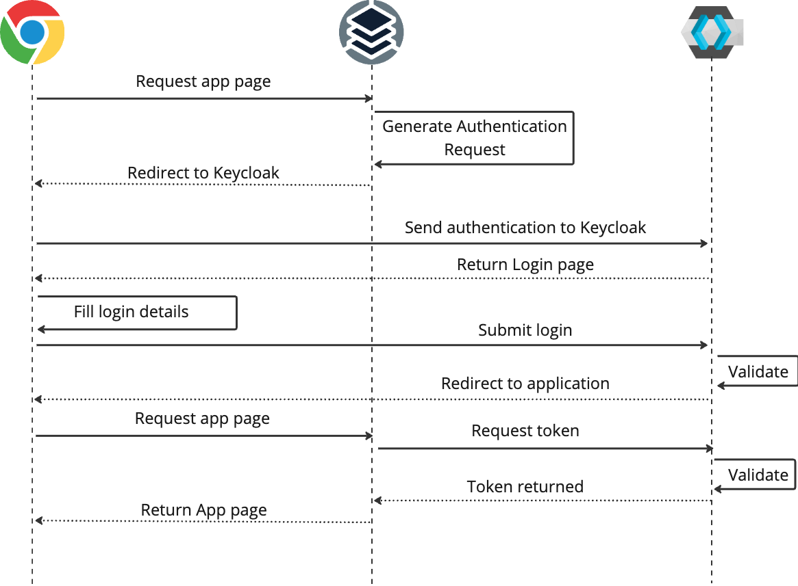

# KeyCloak

## Overview

Rancher Observability can authenticate using KeyCloak as an authentication provider, you will need to configure both Rancher Observability and KeyCloak to be able to talk to each other. The following sections describe the respective setups.

## Authentication flow

When using Keycloak as an authentication provider, Rancher Observability will use OIDC (OpenID Connect) to authenticate users. The following diagram describes the authentication flow.



## Configure KeyCloak

Before you can configure Rancher Observability to authenticate using KeyCloak, you need to add a new client configuration to the KeyCloak Authentication Server. The necessary settings for the client are:

* **Client ID** - The ID of the client that's connecting, we recommend naming this `stackstate`
* **Client Protocol** - Set to `openid-connect`
* **Access Type** - Set to `confidential`, so that a secret is used to establish the connection between KeyCloak and Rancher Observability
* **Standard Flow Enabled** - Set to `Enabled`
* **Implicit Flow Enabled** - Set to `Disabled`
* **Root URL** - The root location of Rancher Observability \(the same value configured in as base URL of the Rancher Observability configuration
* **Valid redirect URIs** - This should be `/loginCallback/*`
* **Base URL** - This should point to the root location of Rancher Observability

## Configure Rancher Observability

### Kubernetes

To configure Rancher Observability to authenticate using KeyCloak, KeyCloak details and user role mapping needs to be added to the file `authentication.yaml`. For example:

```yaml
stackstate:
  authentication:
    keycloak:
      url: "https://keycloak.acme.com/auth"
      realm: acme
      authenticationMethod: client_secret_basic
      clientId: stackstate
      secret: "8051a2e4-e367-4631-a0f5-98fc9cdc564d"
      jwsAlgorithm: RS256
      # scope is optional. By default `openid`, `profile` and `email` are requested
      # scope: ["openid", "profile", "email"] 
      # jwtClaims:
      #   usernameField: preferred_username
      #   groupsField: roles

    # map the roles from Keycloak to the
    # 4 standard subjects in Rancher Observability (guest, powerUser, admin and platformAdmin)
    roles:
      guest: ["keycloak-guest-role-for-stackstate"]
      powerUser: ["keycloak-power-user-role-for-stackstate"]
      admin: ["keycloak-admin-role-for-stackstate"]
      platformAdmin: ["keycloak-platformadmin-role-for-stackstate"]
```


**Note:**
By default when authenticating a user the request to KeyCloak specifies a default scope of `openid profile email` if a custom scope has not been specified on the configuration. Verify the `Client scopes` on your KeyCloak instance to be sure that the default scope is correct or you need a custom one.


Follow the steps below to configure Rancher Observability to authenticate using KeyCloak:

1. In `authentication.yaml` - add details of the KeyCloak authentication provider \(see the example above\). The KeyCloak specific values can be obtained from the client configuration in KeyCloak:
   * **url** - The base URI for the KeyCloak instance
   * **realm** - The KeyCloak realm to connect to
   * **authenticationMethod** - Set to `client_secret_basic`, this is currently the only supported value.
   * **clientId** - The ID of the KeyCloak client as configured in KeyCloak
   * **secret** - The secret attached to the KeyCloak client, which is used to authenticate this client to KeyCloak
   * **redirectUri** - Optional: The URI where the login callback endpoint of Rancher Observability is reachable. Populated by default using the `stackstate.baseUrl`, but can be overridden \(must be a fully qualified URL that points to the `/loginCallback` path\)
   * **jwsAlgorithm** - Set this to `RS256`, this is currently the only supported value.
   * **jwtClaims** - Optional: The roles or username can be retrieved from a different attribute than the Keycloak default behavior
     * **usernameField** - Optional: The field in the OIDC user profile that should be used as the username. By default, this will be the `preferred_username`.
     * **groupsField** - Optional: Rancher Observability will always, and by default only, use the `roles` Keycloak provides. But it can also add roles from the field specified here. This is mainly useful when Keycloak is mapping roles/groups from a third-party system.
2. In `authentication.yaml` - map user roles from KeyCloak to the correct Rancher Observability subjects using the `roles.guest`, `roles.powerUser`, `roles.platformAdmin` or `roles.admin` settings \(see the example above\). For details, see the [default Rancher Observability roles](../rbac/rbac_permissions.md#predefined-roles). More Rancher Observability roles can also be created, see the [RBAC documentation](../rbac/).
3. Store the file `authentication.yaml` together with the `values.yaml` file from the Rancher Observability installation instructions.
4. Run a Helm upgrade to apply the changes:

   ```text
    helm upgrade \
      --install \
      --namespace stackstate \
      --values values.yaml \
      --values authentication.yaml \
    stackstate \
    stackstate/stackstate-k8s
   ```


**Note:**

* The first run of the helm upgrade command will result in pods restarting, which may cause a short interruption of availability.
* Include `authentication.yaml` on every `helm upgrade` run.
* The authentication configuration is stored as a Kubernetes secret.


## See also

* [Authentication options](authentication_options.md)
* [Permissions for predefined Rancher Observability roles](../rbac/rbac_permissions.md#predefined-roles)
* [Create RBAC roles](../rbac/rbac_roles.md)

